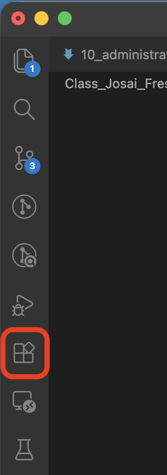

# 第11回　TeXによる文書作成2

### 前回の復習

- TeXではソースファイルに文章と命令を入力し，タイプセットしてPDFを作成する．
- TeXShopを使って `.tex` ファイルを作成し，upLaTeXとdvipdfmxでPDFを出力する．
- 文中の数式は `$...$`，独立行の数式は `\[...\]` または `\begin{equation}...\end{equation}` などで入力する．
- （分数，根号，べき乗，添字，総和，積分，行列の基本的な入力方法を確認する．）
- （エラーが出たときは直前の変更箇所と記号の対応を確認する．）

```{tip} 注意：ミスしやすいので編集するたびに確認すること
- 本文でない内容はプリアンブル（`\begin{document}`よりも上）に書く
- 本文の内容は`\begin{document}`と`\end{document}`の間に書く
```

### 概要

新しくTeXファイルを作成し，線形代数の教科書の指定範囲を写経する．

- 作業用フォルダとTeXファイルの新規作成
- 線形代数で使う数式の入力
- 教科書を写経する手順
- ソースとPDFの校正
- 進みが早い学生向け：VS CodeでのTeX編集

### 到達目標

1. 作業用フォルダとTeXファイルを新規作成できる．
2. upLaTeXとdvipdfmxでPDFを出力できる．
3. 行列，ベクトル，連立1次方程式などをTeXで入力できる．
4. 教科書の文章構造と数式を読み取り，TeXで再現できる．
5. 原文，ソース，PDFを見比べて入力ミスを修正できる．

### タイピング（20分）

- 指はホームポジションに置き，ここから各指で所望のキーをタイプする．


出典：[https://upload.wikimedia.org/wikipedia/commons/6/67/TouchTyping_HomePosition_QWERTY.png](https://upload.wikimedia.org/wikipedia/commons/6/67/TouchTyping_HomePosition_QWERTY.png)

```{note} タイピング練習
次のサイトなどでタイピング練習をすること（各自好きな方法で練習して良い）．

- 寿司打（スシダ）[https://sushida.net/](https://sushida.net/)
- e-typing [https://www.e-typing.ne.jp/](https://www.e-typing.ne.jp/)
```

---

## 準備

今回使う作業用フォルダとTeXファイルを作成する．
今回は前回作成した `.tex` ファイルを複製せず，新しい `.tex` ファイルを作成する．

1. `/Users/<ユーザ名>/fresh1`フォルダに`11`というフォルダを作成する．
2. TeXShopを起動する．
3. 新しいTeXファイルを作成する．
4. `11`フォルダ内に `第11回_<学籍番号>_<氏名>.tex` という名前で保存する．  
  ファイル名の `<学籍番号>` と `<氏名>` は，自分の学籍番号と氏名に置き換えること．
5. 新しく作成した `第11回_<学籍番号>_<氏名>.tex` に，次の内容をコピーして入力する．

  ```latex
  % !TEX encoding = UTF-8 Unicode
  \documentclass[uplatex,dvipdfmx,a4paper,12pt]{jsarticle}
  \usepackage{amsmath,amssymb}

  \title{線形代数の教科書の写経}
  \author{学籍番号　氏名}
  \date{\today}

  \begin{document}

  \maketitle

  \section{指定された見出し}

  ここに教科書の文章と数式を入力する．

  \end{document}
  ```

6. PDFを作成する．
   1. `第11回_<学籍番号>_<氏名>.tex` を保存する
   2. TeXShopのタイプセット設定が，第10回と同じくupLaTeXを使う設定になっていることを確認する
   3. タイプセットを実行する
   4.  PDFが作成されることを確認する

    ※ PDFを作成できない場合は次を実施してみる．

    - `第11回_<学籍番号>_<氏名>.tex` を保存しているか確認する．
    - `11`フォルダ内に保存しているか確認する．
    - TeXShopのタイプセット設定を再度`upTeX(ptex2pdf)`に設定してTeXShopを再起動する．
    - `\begin{document}` と `\end{document}` が対応しているかを確認する．

---

## 教科書の写経

- **写経**：教科書の指定範囲を見ながら，文章と数式をTeXで正確に入力する．

写経を通して身につくこと

- 数学の文章を読み，見出し・本文・定義・例・数式の構造を見分ける
- 数式を記号の集まりではなく，意味のある構造として読む
- TeXの命令と出力結果の対応を身につける
- 原文とPDFを比較し，誤字や記号の誤りを発見する
- 長い文書を少しずつ作成し，こまめに動作確認する習慣を身につける
- TeXでどのような文章を書けるのかの感覚を養う

※ 自分で入力（TeXのソースコード）と出力（PDF）との対応を理解することで，生成AIに文書を作成してもらった際にも細かい調整をできるようになる．

---

## 線形代数で使う数式

写経を始める前に，線形代数でよく使う表現を再度確認する．

````{tip} 例：ベクトルと行列

**入力**（`.tex`）
```latex
ベクトル $\boldsymbol{x}$ と行列 $A$ を次のように定める．
\[
  \boldsymbol{x}=
  \begin{pmatrix}
    x_1 \\
    x_2
  \end{pmatrix},
  \qquad
  A=
  \begin{pmatrix}
    a_{11} & a_{12} \\
    a_{21} & a_{22}
  \end{pmatrix}.
\]
```

**出力**（`.pdf`）

ベクトル $\boldsymbol{x}$ と行列 $A$ を次のように定める．

\begin{equation*}
  \boldsymbol{x}=
  \begin{pmatrix}
    x_1 \\
    x_2
  \end{pmatrix},
  \qquad
  A=
  \begin{pmatrix}
    a_{11} & a_{12} \\
    a_{21} & a_{22}
  \end{pmatrix}.
\end{equation*}
````

- `\boldsymbol{x}`：太字の数式記号
- `\qquad`：数式中の広い空白

````{tip} 例：連立1次方程式
`cases` 環境を使うと，連立方程式を左波括弧でまとめられる．

**入力**（`.tex`）
```latex
\begin{equation}\label{eq:HOGEHOGE}
  \begin{cases}
    2x+y=5, \\
    x+3y=7.
  \end{cases}
\end{equation}

式\eqref{eq:HOGEHOGE}の連立1次方程式は次のように行列を用いて表すこともできる．

\begin{equation*}
  \begin{pmatrix}
    2 & 1 \\
    1 & 3
  \end{pmatrix}
  \begin{pmatrix}
    x \\
    y
  \end{pmatrix}
  =
  \begin{pmatrix}
    5 \\
    7
  \end{pmatrix}.
\end{equation*}
```

**出力**（`.pdf`）

\begin{equation}\label{eq:HOGEHOGE}
  \begin{cases}
    2x+y=5, \\
    x+3y=7.
  \end{cases}
\end{equation}

式(1)の連立1次方程式は次のように行列を用いて表すこともできる．

\begin{equation*}
  \begin{pmatrix}
    2 & 1 \\
    1 & 3
  \end{pmatrix}
  \begin{pmatrix}
    x \\
    y
  \end{pmatrix}
  =
  \begin{pmatrix}
    5 \\
    7
  \end{pmatrix}.
\end{equation*}
````

- `\begin{equation}...\end{equation}`：番号付きの数式
- `\label{eq:HOGEHOGE}`：数式番号を参照する際のラベル．`{...}`の中身は自由に決められる．
- `\eqref{eq:HOGEHOGE}`：指定したラベルの数式番号を呼び出す．
- `\begin{equation*}...\end{equation*}`：番号の付かない数式

### 行列式・転置行列・逆行列

| 表したいもの | TeXでの入力 | PDFでの出力 |
| --- | --- | --- |
| 行列式　 | `\det A`         | $\det A$ |
| 転置行列 | `A^{\mathsf{T}}` | $A^{\mathsf{T}}$ |
| 逆行列　 | `A^{-1}`         | $A^{-1}$ |
| 零行列　 | `O`              | $O$ |
| 単位行列 | `I` or `E`       | $I$ or $E$ |
| ベクトル | `\boldsymbol{x}` | $\boldsymbol{x}$ |

````{tip} 例：縦線の行列式
行列式を縦線で表す場合は，`vmatrix` 環境を使用する．

**入力**（`.tex`）
```latex
\[
  \det A=
  \begin{vmatrix}
    a & b \\
    c & d
  \end{vmatrix}
  =ad-bc.
\]
```

**出力**（`.pdf`）

\begin{equation*}
  \det A=
  \begin{vmatrix}
    a & b \\
    c & d
  \end{vmatrix}
  =ad-bc.
\end{equation*}
````

````{tip} 例：複数行の計算
計算過程を複数行で示すときは，`align` 環境を使う．  
`\\`で改行し，`&` を付けた位置が縦にそろう．

**入力**（`.tex`）
```latex
\begin{align}
  \det A
  &=
  \begin{vmatrix}
    2 & 1 \\
    1 & 3
  \end{vmatrix} \\
  &=2\cdot 3-1\cdot 1 \\
  &=5.
\end{align}
```

**出力**（`.tex`）

\begin{align}
  \det A
  &=
  \begin{vmatrix}
    2 & 1 \\
    1 & 3
  \end{vmatrix} \\
  &=2\cdot 3-1\cdot 1 \\
  &=5.
\end{align}
````

数式番号が不要な場合は，`align*` を使用する．

---

## 教科書の写経

### 全体を確認する

入力を始める前に指定範囲を最後まで読み，次の要素を確認する．

- 節・項などの見出し
- 本文の段落
- 定義・定理・命題・例・注意があるか
- 文中の数式・独立行の数式
- 行列・ベクトル
- 数式番号

最初から一文字ずつ入力するのではなく，ページ全体の構造を把握してから作業する．

### 数式の入力

数式を見た目だけで写さず，構造を確認してから入力する．

たとえば，

\begin{equation*}
  \frac{a_{11}a_{22}-a_{12}a_{21}}{\det A}
\end{equation*}

のソースコードは

```latex
\frac{a_{11}a_{22} - a_{12}a_{21}}{\det A}
```

であるが，この数式の分子・分母・添字・行列式という構造を読み取り，外側の構造から順に入力すると間違いを減らすことができる．

例）
```latex
\frac{}{}
```
↓
```latex
\frac{a a - a a}{\det A}
```
↓
```latex
\frac{a_{11}a_{22} - a_{12}a_{21}}{\det A}
```

### 短い間隔でタイプセットする

1ページ分をすべて入力してから確認するのではなく，次の単位でタイプセットする．

- 一つの段落を入力した後
- 一つの数式を入力した後
- 行列や `align` 環境を入力した後
- 新しい命令を使った後

短い間隔で確認すると，タイプセットが失敗した際のエラーの原因を探しやすい．

### 原文・ソース・PDFを照合する

入力後は，次の順に確認する．

1. 教科書とソースを比較して，文章と数式に抜けがないか確認する
2. ソースとPDFを比較して，命令が意図したとおりに出力されているか確認する
3. 教科書とPDFを比較して，記号や数式の構造に誤りがないか確認する

特に，次の誤りに注意する．

- `0`（数字のゼロ）と `O`（大文字のオー）
- `1`（数字の1）と `l`（小文字のエル）
- `x`（エックス）と `\times`（掛け算記号）
- `-`（負号）と `=`（等号）
- 上付き文字と下付き文字
- 行列の行と列の入れ替わり
- 太字で表すベクトルと通常の文字

---

## 定理環境

---

## エラーと警告の確認

タイプセットでエラーや警告が出た場合は，表示されたメッセージを確認する．
エラーは，ソースファイルのどの行の近くで問題が起きたかを示すことが多い．

### エラーが出た場合

- エラーが発生する直前に入力した箇所を見る
- `{ }`，`$`，`\begin` と `\end` の対応を確認する
- 行列の各行で `&` の数が同じか確認する
- 命令のつづりを確認する
- エラーの直前までソースを戻し，少しずつ入力し直す

### PDFは作成できるが表示がおかしい場合

- 数式の一部が文中の通常文字になっていないか
- 段落間に空行が入っているか
- 上付き・下付きの範囲を `{ }` で囲んでいるか
- `\\` を文章の改行のために多用していないか
- 全角空白をレイアウト調整に使っていないか

エラーがないことと内容が正しいことは同じではない．
PDFが作成できた後も教科書との照合が必要である．

---

## 課題

````{warning} 課題
線形代数の教科書（三宅敏恒『線形代数学 初歩からジョルダン標準形へ』培風館）について，56〜58ページの計3ページをTeXで写経せよ．


<!--  -->

ただし次の条件をすべて満たすこと．

- 表紙をつけ，タイトル・学籍番号・氏名・日付を入れる
- 本文の段落を適切に分ける
- 文中の数式と独立行の数式を区別する
- 行列，ベクトル，添字などの記号を原文どおりに入力する
- 原文，ソース，PDFを照合して誤字・脱字を修正する
- 証明終了の記号  は $\square$ または $\blacksquare$ にすること（自身でTeXの記号を調べること）

また，次の項目については再現しなくて良い
- 黒以外の色
- 太字
- 定理などの枠線
- 定理の番号
- 右上，左上の見出し
````

### 提出方法

- WebClassの<span style="color: red; ">「第11回課題」問1・2</span>よりTeXファイルとPDFファイルを提出

### 提出期限

<span style="color: red; ">7月4日(土)23:59まで</span>

質問等がある場合には

- メール kkagawa@josai.ac.jp
- Teamsのチャット

で連絡してください．

---

## まとめ

- 今回は作業用フォルダとTeXファイルを新規作成し，TeXで文書を作成した．
- 写経では，文章だけでなく，見出し，段落，数式の構造を読み取ることが重要である．
- 行列では `&` が列の区切り，`\\` が行の終わりを表す．
- 長い範囲を一度に入力せず，段落や数式ごとにタイプセットする．
- PDFが作成できても，教科書と照合して内容の誤りを修正する必要がある．

### 次回の準備

- MacBookを充電して持参すること．

---

## （進みが早い学生向け）VS CodeでTeXを使う

VS Codeは，プログラムやTeXなどのテキストファイルを編集するためのエディタである．
TeXShopよりも複数のファイルを管理しやすく，命令の色分け，入力補助，エラー箇所の確認などの機能を利用できる．
ここから先は，写経の作業が進んだ学生向けの追加内容である．

### LaTeX Workshopの確認

VS CodeでTeXを扱うために，拡張機能 **LaTeX Workshop** を使用する．

1. VS Codeを起動する
2. 左側の「拡張機能」を開く

  
  <!--  -->

1. `LaTeX Workshop` を検索する
2. `LaTeX Workshop` がインストール済みか確認する
3. インストールされていない場合は「インストール」をクリックする

### 作業用フォルダを開く

講義冒頭で作成した `11` フォルダをVS Codeで開く．
新しいTeXファイルはすでに作成してあるため，ここではフォルダを開いて編集環境を切り替える．

1. VS Codeの「ファイル」から「フォルダーを開く」を選ぶ
2. `/Users/<ユーザ名>/fresh1/11` フォルダを選ぶ
3. `第11回_<学籍番号>_<氏名>.tex` を開く

TeXファイルだけを単独で開くのではなく，作業用フォルダ全体をVS Codeで開くこと．
フォルダ単位で管理すると，PDFや画像などの関連ファイルの場所が分かりやすくなる．

### PDFを作成する

LaTeX WorkshopでupLaTeXを使用するには，`ptex2pdf` を呼び出すツールとレシピを設定する必要がある．
VS Codeの設定ファイル `settings.json` に，次の設定を追加する．
（⌘+Pでコマンドパレットを開き「基本設定：ユーザー設定を開く（JSON）」を選択して`settings.json`を開く）

```json
{
  "latex-workshop.latex.tools": [
    {
      "name": "ptex2pdf (upLaTeX)",
      "command": "ptex2pdf",
      "args": [
        "-u",
        "-l",
        "-ot",
        "-synctex=1 -file-line-error",
        "%DOC%"
      ]
    }
  ],
  "latex-workshop.latex.recipes": [
    {
      "name": "ptex2pdf (upLaTeX)",
      "tools": [
        "ptex2pdf (upLaTeX)"
      ]
    }
  ]
}
```

すでに `settings.json` にほかの設定がある場合は，外側の `{ }` を重ねて書かず，既存の設定項目の後ろへ追加する．

1. `第11回_<学籍番号>_<氏名>.tex` を保存する
2. コマンドパレットを開く（⌘+P）
3. `LaTeX Workshop: Build with recipe` を選ぶ
4. `ptex2pdf (upLaTeX)` を選ぶ
5. `LaTeX Workshop: View LaTeX PDF` を選び，PDFを表示する

````{note} 追加演習
1. `11`フォルダをVS Codeで開け．
2. `第11回_<学籍番号>_<氏名>.tex` を編集できることを確認せよ．
3. `ptex2pdf (upLaTeX)` レシピを使用してPDFを作成せよ．
4. VS Code内でPDFを表示せよ．

PDFを作成できない場合は，次を確認すること．

- `第11回_<学籍番号>_<氏名>.tex` を保存しているか
- `11`フォルダ全体を開いているか
- `ptex2pdf (upLaTeX)` レシピを選んでいるか
- `\begin{document}` と `\end{document}` が対応しているか
````
