# 第12回　Python入門

### 前回の復習

- TeXでは，人間が読めるソースファイルを処理系に与えてPDFを作成した．
- ソースファイルを編集し，保存・処理・出力の確認・修正を繰り返した．
- エラーが発生した場合は，メッセージと直前に変更した箇所を確認した．
- 命令のつづりや記号の対応が正しくなければ，意図した出力は得られなかった．

**プログラミング**では，TeXによる文書作成と同じように人間がソースコードを書き，コンピュータに処理させて出力を確認しながら修正する．

### 概要

プログラミング言語Pythonを使用し，Jupyter Notebook上で短いプログラムを実行する．

- プログラミング言語とプログラムの実行
- コンピュータの基本的な構成
- Python・Anaconda・Jupyter Notebookの役割
- Notebookファイルとセルの操作
- 文字列の表示
- Pythonによる基本的な計算
- Markdownセルによる学習内容の記録

### 到達目標

1. プログラミング言語，ソースコード，実行，出力の関係を説明できる．
2. コンピュータの五大装置とそれぞれの役割を説明できる．
3. Anaconda NavigatorからJupyter Notebookを起動できる．
4. Notebookファイルを新規作成し，指定した場所と名前で保存できる．
5. CodeセルにPythonのコードを入力して実行できる．
6. `print`関数を用いて文字列を表示できる．
7. Pythonの算術演算子を用いて基本的な計算ができる．
8. Markdownセルを用いて学習内容を箇条書きで記録できる．

### 確認事項

今回はAnacondaがインストールされていることを前提とする．
[第1回講義ノート](./1_preparation.md)の「Anacondaのインストール」を確認し，Anaconda Navigatorを起動できる状態にしておくこと．

### タイピング（20分）

- 指はホームポジションに置き，ここから各指で所望のキーをタイプする．


出典：[https://upload.wikimedia.org/wikipedia/commons/6/67/TouchTyping_HomePosition_QWERTY.png](https://upload.wikimedia.org/wikipedia/commons/6/67/TouchTyping_HomePosition_QWERTY.png)

```{note} タイピング練習
次のサイトなどでタイピング練習をすること（各自好きな方法で練習して良い）．

- 寿司打（スシダ）[https://sushida.net/](https://sushida.net/)
- e-typing [https://www.e-typing.ne.jp/](https://www.e-typing.ne.jp/)
```

---

## プログラミング言語

**プログラム**とは，コンピュータに行わせる処理を一定の規則に従って記述したものである．
プログラムを記述するための人工言語を**プログラミング言語**という．

コンピュータのCPUは，最終的には機械語で表された命令を実行する．
一方，人間はPythonなどのプログラミング言語を用いて，機械語よりも読み書きしやすい形で処理を記述する．
プログラミング言語で書かれた処理をコンピュータで実行するには，処理系による変換や解釈が必要になる．

### 基本用語

| 用語 | 意味 |
| --- | --- |
| ソースコード | プログラミング言語で記述した文字列 |
| ソースファイル | ソースコードを保存したファイル |
| 実行 | プログラムに記述された処理をコンピュータに行わせること |
| 入力 | プログラムに与えるデータ |
| 出力 | プログラムを実行して得られる結果 |
| エラー | プログラムを正しく処理または実行できない状態 |

### プログラムを実行する方式

プログラムを実行する代表的な方式として，コンパイラ方式とインタプリタ方式がある．

| 方式 | 処理の概要 | 代表的な言語・処理系 |
| --- | --- | --- |
| コンパイラ方式 | ソースコードを実行前にまとめて別の形式へ変換する | C，C++，Fortranなど |
| インタプリタ方式 | 実行時にソースコードや中間的な命令を解釈しながら処理する | Python，JavaScriptなどの代表的な処理系 |

コンパイラ方式は，翻訳した文書を用意してから相手に渡すことにたとえられる．
インタプリタ方式は，話を聞きながら順に通訳することにたとえられる．

```{note}
実際の処理系には，コンパイルと解釈の両方を組み合わせるものもある．
そのため，プログラミング言語を常に二種類へ明確に分類できるわけではない．
本講義では，Jupyter NotebookからPythonの処理系へコードを送り，その場で実行結果を確認する．
```

---

## コンピュータの基本構成

コンピュータは，プログラムとデータを記憶し，命令に従って計算や入出力を行う．

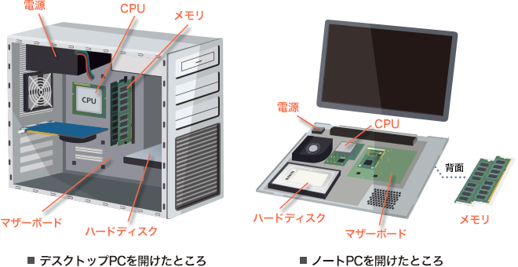

コンピュータの機能は，次の五つに分けて説明されることが多い．これらを**コンピュータの五大装置**という．

| 装置 | 主な役割 | 例 |
| --- | --- | --- |
| 入力装置 | コンピュータへデータや指示を与える | キーボード，マウス |
| 出力装置 | 処理結果を外部へ伝える | ディスプレイ，プリンタ |
| 記憶装置 | プログラムやデータを保持する | メモリ，SSD |
| 演算装置 | 数値計算や論理演算を行う | CPUの演算回路 |
| 制御装置 | 命令を解釈し，各装置の動作を制御する | CPUの制御回路 |

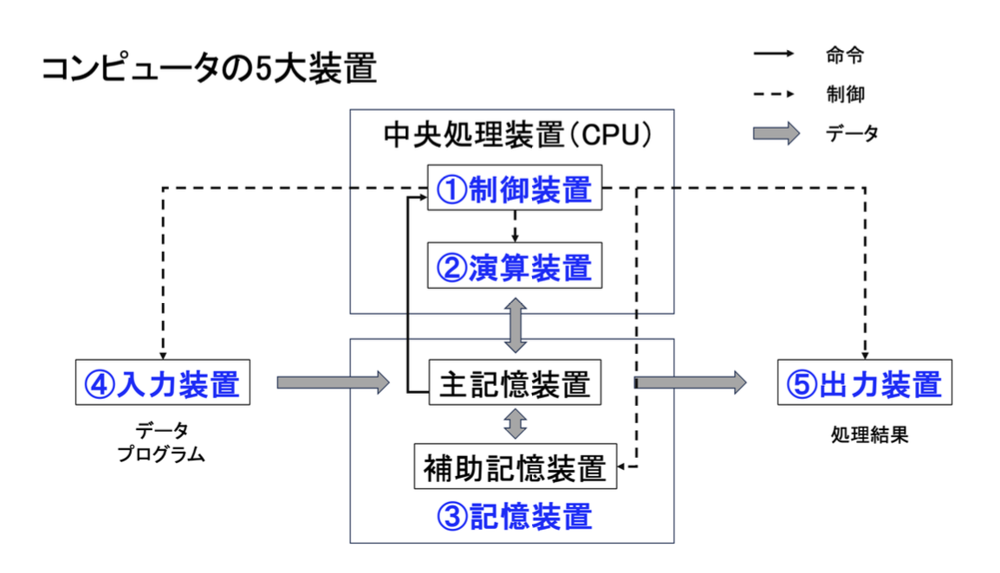

参考：[NEC LAVIE公式サイト「今さら聞けない！？パソコンの中身」](https://support.nec-lavie.jp/navigate/application/prevent/useful/20160405/index.html)

コンピュータ内部では，文字・画像・音声・数値などのデータが，最終的に0と1の並びで表現される．
0または1の一つ分の情報を**ビット（bit）**という．

---

## PythonとJupyter Notebook

### Python

Pythonは，読みやすい構文を持ち，データ分析，科学技術計算，Web開発，機械学習など幅広い用途で利用されているプログラミング言語である．

Pythonでは，多くの機能を**ライブラリ**として利用できる．
ライブラリとは，再利用できるプログラムをまとめたものである．
Pythonに初めから含まれる標準ライブラリのほか，必要に応じて追加する外部ライブラリがある．

### Anaconda

Anacondaは，Python本体と，データ分析や科学技術計算で利用される多くのライブラリ，Jupyter Notebookなどのツールをまとめたディストリビューションである．
**Anaconda Navigator**を使うと，画面上の操作でJupyter Notebookなどを起動できる．

### Jupyter Notebook

Jupyter Notebookは，プログラム，実行結果，説明文を一つの文書にまとめられる対話型の実行環境である．
Jupyter Notebookで作成するファイルを**Notebookファイル**といい，拡張子は `.ipynb` である．

Notebookは**セル**という単位で編集する．今回は次の二種類を使用する．

| セル | 用途 |
| --- | --- |
| Codeセル | Pythonのソースコードを入力して実行する |
| Markdownセル | 見出し，文章，箇条書きなどの説明を記述する |

Pythonのコードは，**カーネル**と呼ばれる実行を担当するプログラムへ送られる．
カーネルはコードを実行し，その結果をセルの下に返す．

---

## Jupyter Notebookの準備

### 起動する

1. 「アプリケーション」フォルダからAnaconda Navigatorを起動する．
2. Anaconda Navigatorの画面でJupyter Notebookの「Launch」をクリックする．
3. WebブラウザにJupyter Notebookのファイル一覧が表示されることを確認する．

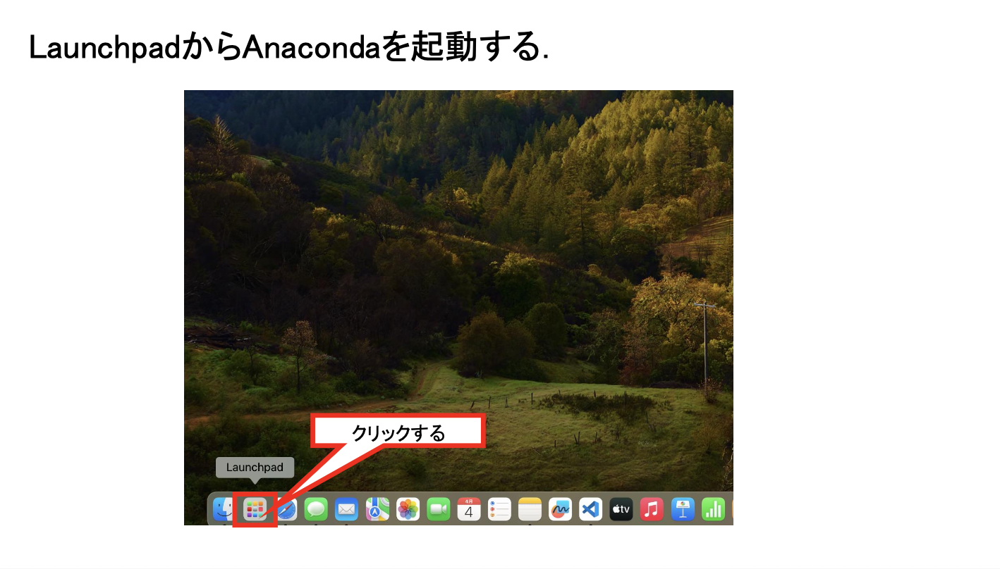

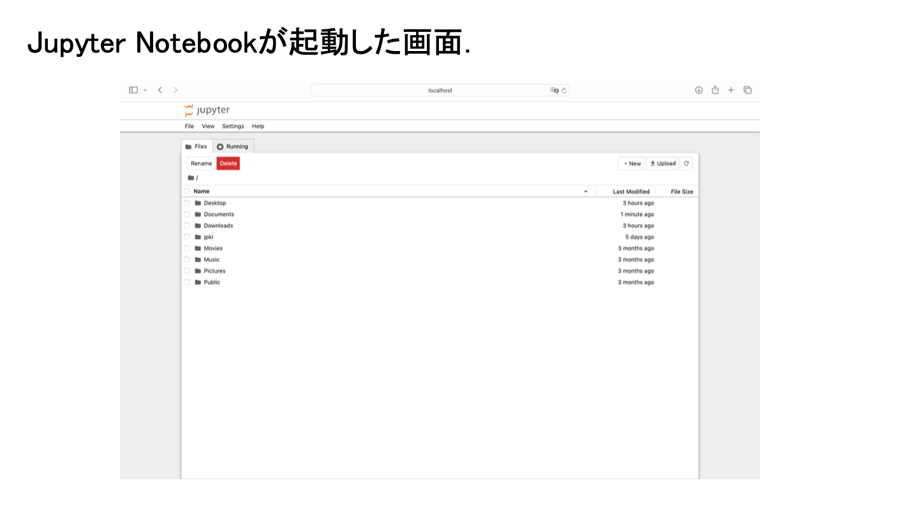

```{note}
AnacondaやJupyter Notebookのバージョンによって，ボタンの位置や画面の表示が画像と異なる場合がある．
```

### 作業用フォルダを作成する

Jupyter Notebookのファイル一覧から，今回のファイルを保存するフォルダを作成する．

1. `/Users/<ユーザ名>/fresh1` フォルダへ移動する．
2. 画面右上の「New」をクリックする．
3. 「New Folder」をクリックする．
4. 作成されたフォルダを選択し，「Rename」をクリックする．
5. フォルダ名を `12` に変更する．
6. `12` フォルダをクリックして開く．

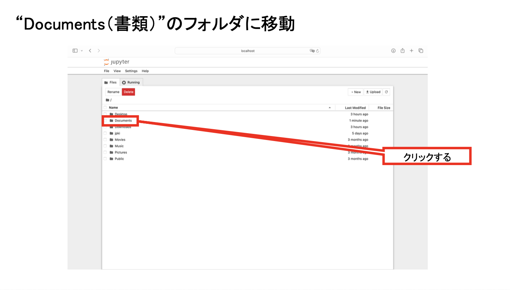

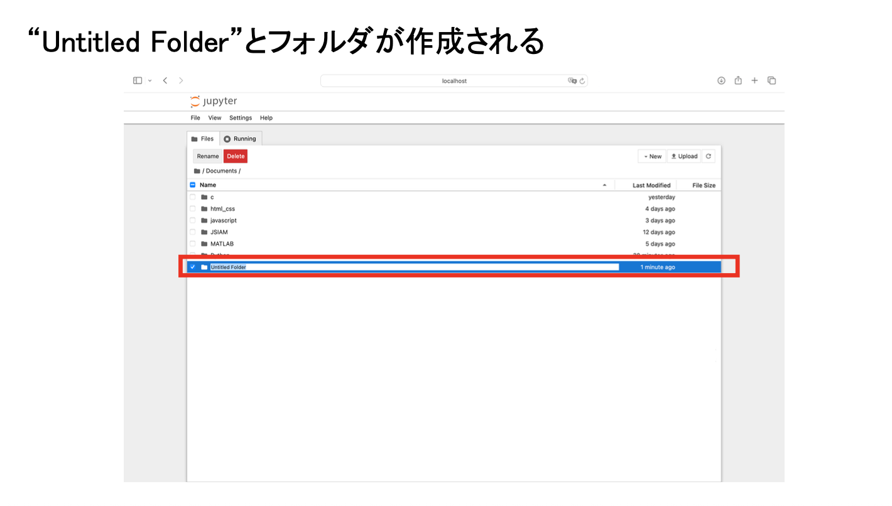

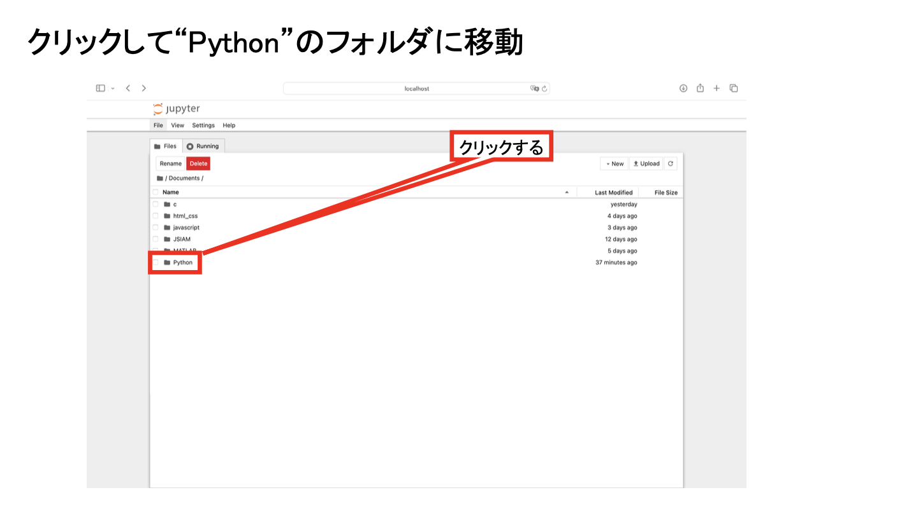

### Notebookファイルを新規作成する

1. `12` フォルダを開いた状態で，画面右上の「New」をクリックする．
2. 「Python 3 (ipykernel)」をクリックする．
3. 新しく開いたNotebookのファイル名をクリックする．
4. ファイル名を `第12回_<学籍番号>_<氏名>.ipynb` に変更する．
5. `<学籍番号>` と `<氏名>` は，自分の学籍番号と氏名に置き換える．

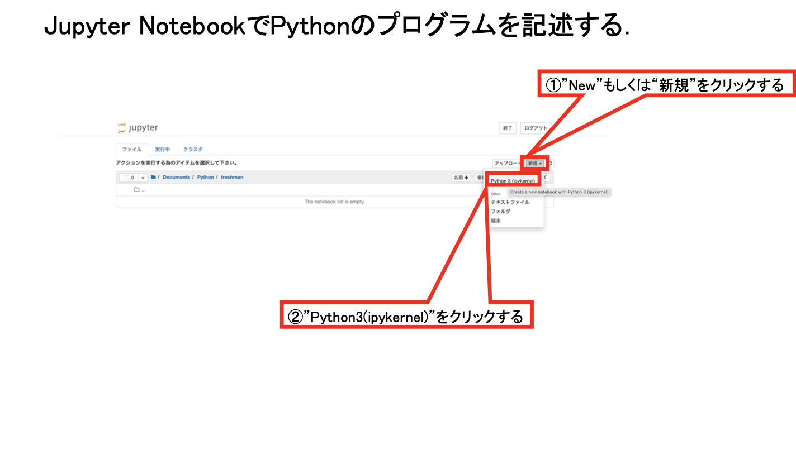

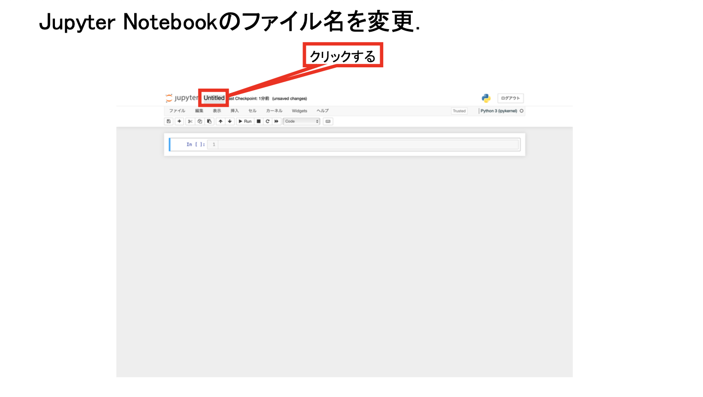

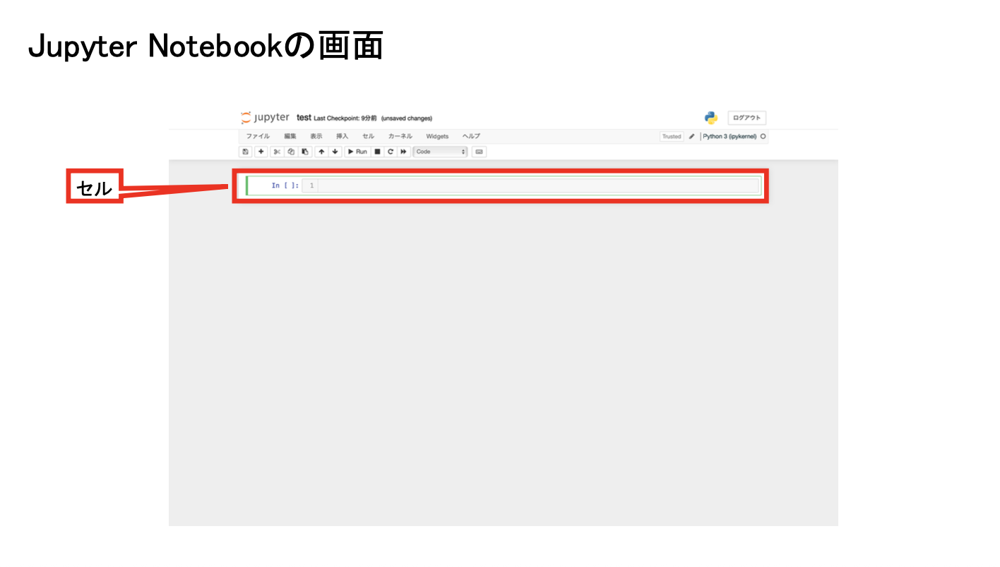

```{warning}
Notebookを作成したら，プログラムを入力する前に保存場所とファイル名を確認すること．
`.ipynb` はNotebookファイルの拡張子であり，`.py` や `.tex` とは異なる．
```

---

## 最初のプログラム

Codeセルへ次の1行を入力する．

```python
print("Hello, World!")
```

入力したセルを選択し，次のいずれかの方法で実行する．

- 画面上部の「Run」をクリックする
- キーボードで `Shift` を押しながら `Enter` を押す

セルの下に次の文字列が表示されれば，正しく実行できている．

```text
Hello, World!
```

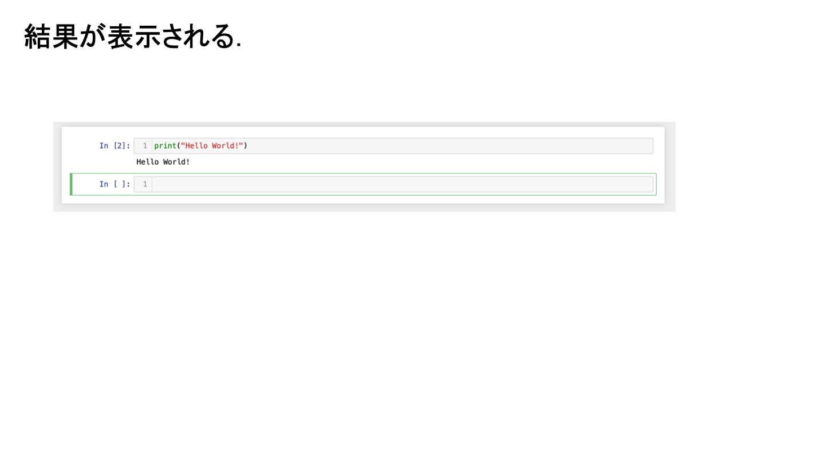

### コードの意味

```python
print("Hello, World!")
```

- `print`：指定した値を出力する**関数**
- `(` と `)`：関数へ渡す引数の並びを囲む記号
- `"Hello, World!"`：表示する**文字列**
- `"`：文字列の始まりと終わりを表す記号

**関数**とは，特定の処理をまとめ，名前を付けたものである．
関数に渡す値を**引数**という．この例では，文字列 `"Hello, World!"` が `print` 関数の引数である．

```{note} 入力時の注意
- Pythonでは，英字の大文字と小文字を区別する．`print` を `Print` と書くと別の名前として扱われる．
- コード中の記号には，原則として半角の記号を使用する．
- 文字列の前後の引用符は，同じ種類の記号で対応させる．
```

````{tip} 演習1
新しいCodeセルを追加し，次の二つの文をそれぞれ別の行に表示せよ．

```text
Pythonを学びます．
少しずつ実行して確認します．
```

入力例の `print` 関数を参考にすること．
````

---

## Pythonによる計算

Pythonでは，数値と**算術演算子**を組み合わせて計算できる．
算術演算子とは，加算や乗算などの計算を表す記号である．

| 演算 | 演算子 | 入力例 | 出力 |
| --- | --- | --- | --- |
| 加算 | `+` | `5 + 2` | `7` |
| 減算 | `-` | `5 - 2` | `3` |
| 乗算 | `*` | `5 * 2` | `10` |
| 除算 | `/` | `5 / 2` | `2.5` |
| べき乗 | `**` | `5 ** 2` | `25` |
| 切り捨て除算 | `//` | `5 // 2` | `2` |
| 剰余 | `%` | `5 % 2` | `1` |

数学で用いる記号と異なり，乗算には `*`，除算には `/`，べき乗には `**` を使用する．

### Codeセルで計算する

新しいCodeセルを追加し，次の式を一つずつ入力して実行する．

```python
5 + 2
```

```python
5 - 2
```

```python
5 * 2
```

```python
5 / 2
```

```python
5 ** 2
```

```python
5 // 2
```

```python
5 % 2
```

Jupyter Notebookでは，Codeセルの最後に書いた式の値がセルの下に表示される．
複数の値を確実に表示したい場合は，それぞれを `print(...)` の引数にする．

### 計算の順序

計算は，おおむね次の優先順位で行われる．

1. 丸括弧 `(...)` の内側
2. べき乗 `**`
3. 乗算 `*`，除算 `/`，切り捨て除算 `//`，剰余 `%`
4. 加算 `+`，減算 `-`

たとえば，次の二つの式では計算結果が異なる．

```python
2 + 3 * 4
```

出力は `14` となる．先に加算したい場合は，丸括弧を用いる．

```python
(2 + 3) * 4
```

出力は `20` となる．

````{tip} 演習2
Codeセルを追加し，次の値をPythonで求めよ．

1. $12+8\div 2$
2. $(12+8)\div 2$
3. $3^4$
4. 17を5で割った商
5. 17を5で割った余り

数学の式をそのまま入力するのではなく，Pythonの算術演算子へ置き換えること．
````

---

## Markdownセル

Markdownセルには，プログラムの説明や実行結果についての考察を記述できる．

1. 新しいセルを追加する．
2. セルの種類を「Code」から「Markdown」へ変更する．
3. 次の内容を入力する．
4. `Shift` を押しながら `Enter` を押し，表示を確認する．

```markdown
## 第12回に学んだこと

- Pythonはプログラミング言語である．
- CodeセルではPythonのコードを実行できる．
- Markdownセルには説明文を記述できる．
```

Markdownでは，行頭に `- `（半角ハイフンと半角空白）を入力すると箇条書きになる．
Markdownセルの内容はPythonのコードとして実行されない．

---

## エラーへの対応

プログラムに誤りがあると，セルの下にエラーメッセージが表示される．
エラーが表示された場合は，メッセージの最後の行と，入力したコードを確認する．

たとえば，次のコードでは文字列の終わりを表す `"` がないため，正しく実行できない．

```python
print("Hello, World!)
```

次の点を順に確認する．

- `(` と `)` が対応しているか
- `"` または `'` が対応しているか
- 命令のつづりと大文字・小文字が正しいか
- 全角の記号を入力していないか
- エラーが発生する直前に変更した箇所はどこか

修正後は，同じセルをもう一度実行して結果を確認する．

---

## Notebookの保存と終了

1. `⌘+S` を押すか，保存ボタンをクリックする．
2. 画面上部のファイル名が `第12回_<学籍番号>_<氏名>.ipynb` であることを確認する．
3. 必要なセルをすべて実行し，出力が表示されていることを確認する．
4. 「File」メニューからNotebookを閉じ，カーネルを終了する．メニューの名称はバージョンにより「Close and Shut Down」などと表示される．
5. Jupyter Notebookのファイル一覧で，作成した `.ipynb` ファイルが `12` フォルダ内にあることを確認する．

```{warning}
ブラウザの画面を閉じるだけでは，Jupyter Notebookの処理が終了していない場合がある．
講義終了時は教員の指示に従ってNotebookとJupyter Notebookを終了すること．
```

---

## 課題

````{warning} 第12回課題
今回作成した `第12回_<学籍番号>_<氏名>.ipynb` に，次の内容を記述せよ．

1. Codeセルで `Hello, World!` を表示する．
2. Codeセルで `5 + 2`，`5 - 2`，`5 * 2`，`5 / 2`，`5 ** 2`，`5 // 2`，`5 % 2` をそれぞれ実行する．
3. Markdownセルに，今回学んだことを三つ箇条書きでまとめる．
4. すべてのCodeセルを実行し，出力を表示した状態で保存する．

**発展課題**

自分の学籍番号の数字を並べ替えたり削除したりせず，数字の間に算術演算子や丸括弧を加えて，計算結果が `10` になる式を作成せよ．

例：学籍番号の数字が `2015014` の場合

```python
(2 + 0) * 1 * 5 + (0 * 14)
```
````

### 提出方法

- WebClassの「第12回課題」からNotebookファイル（`.ipynb`）を提出する．
- 提出前に，ファイル名，Codeセルの実行結果，Markdownセルの内容を確認する．

---

## まとめ

- プログラムは，コンピュータに行わせる処理を記述したものである．
- PythonのコードはJupyter NotebookのCodeセルに入力し，カーネルで実行する．
- `print`関数を用いると，文字列などの値を出力できる．
- Pythonでは，乗算に `*`，除算に `/`，べき乗に `**` を使用する．
- Markdownセルには，プログラムの説明や学習内容を文章として記録できる．
- プログラムは少しずつ実行し，出力やエラーメッセージを確認しながら修正する．

### 次回の準備

- Anaconda NavigatorからJupyter Notebookを起動できることを確認する．
- 第12回で作成したNotebookファイルを開き，Codeセルを実行できることを確認する．
- MacBookを充電して持参すること．
