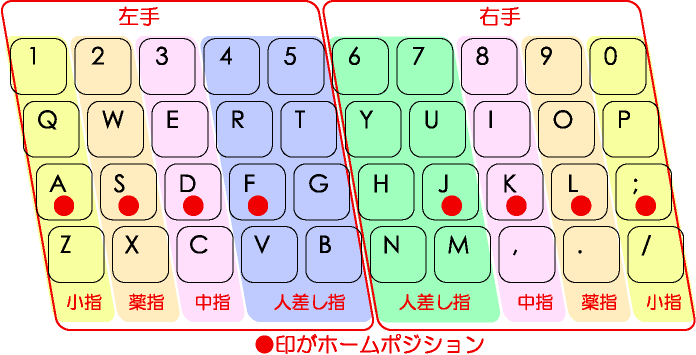
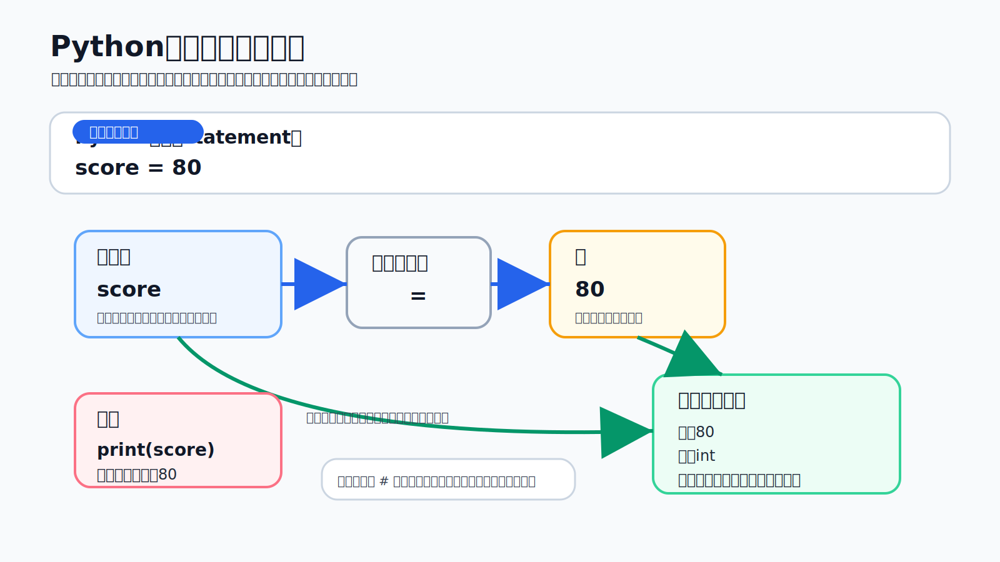

# 第13回　Pythonの変数と加減乗除

### 前回の復習

- PythonのコードはJupyter NotebookのCodeセルに入力してカーネルで実行した．
- `print`関数を使うと文字列などの値を出力できた．
- 乗算には `*` を使った．除算には `/` を使った．べき乗には `**` を使った．
- Codeセルの最後に書いた式の値はセルの下に表示された．
- Markdownセルにはプログラムの説明や学習内容を文章として記述できた．
- エラーが出た場合はメッセージと直前に変更したコードを確認した．

### 概要

今回は値に名前を付けて利用する変数とPythonで扱う値の型について学ぶ．
さらに数値と文字列に対する演算や型の変換を扱う．
第12回では「Pythonのコードを実行する」ことを体験した．
第13回では実行したコードを読み返す．
そのうえで自分で少し変更できるようになることを目指す．

- 変数への代入
- オブジェクト・値・型・識別値
- Pythonの基本的な型
- 変数名の規則とキーワード
- 算術演算子・代入演算子・比較演算子・論理演算子
- 文字列の演算とf-string
- 型の変換
- 変数を用いたBMIの計算

### 到達目標

1. 変数への代入と数学における等号との違いを説明できる．
2. `int`・`float`・`complex`・`bool`・`str` の違いを説明できる．
3. `type`関数を用いて値の型を確認できる．
4. Pythonの規則に従って変数名を付けられる．
5. 算術演算子・代入演算子・比較演算子・論理演算子を使用できる．
6. 文字列を結合してf-stringで値を文章へ埋め込める．
7. `int`・`float`・`str` を用いて基本的な型変換ができる．

### 確認事項

第12回で作成したNotebookファイルを開く．
Codeセルを実行できることも確認しておく．
第13回では第12回と同じくAnaconda NavigatorからJupyter Notebookを起動して作業する．

### 今回の学び方

Pythonを初めて学ぶ段階ではすべての用語を一度に暗記しようとしなくてよい．
まず次の流れを毎回確認する．

1. Codeセルに短いコードを入力する．
2. セルを実行する．
3. 表示された結果を確認する．
4. コードのどの部分が結果に対応しているかを考える．
5. 1箇所だけ変更して結果がどう変わるかを確認する．

エラーが出ることは学習が失敗したという意味ではない．
Pythonは「どこを読めなかったか」「どの値を扱えなかったか」を知らせている．
メッセージを手掛かりに少しずつ直す．

### タイピング（20分）

- 指はホームポジションに置く．ここから各指で所望のキーをタイプする．



出典：[https://upload.wikimedia.org/wikipedia/commons/6/67/TouchTyping_HomePosition_QWERTY.png](https://upload.wikimedia.org/wikipedia/commons/6/67/TouchTyping_HomePosition_QWERTY.png)

```{tip} 注意：タイピング練習
次のサイトなどでタイピング練習をすること（各自好きな方法で練習して良い）．

- 寿司打（スシダ）[https://sushida.net/](https://sushida.net/)
- e-typing [https://www.e-typing.ne.jp/](https://www.e-typing.ne.jp/)
```

---

## Jupyter Notebookの準備

第12回と同じ手順でJupyter Notebookを起動する．
今回使用するNotebookファイルは新規作成する．

### 起動する

1. Spotlight検索（⌘+Space）でAnaconda Navigatorを起動する．
2. Anaconda Navigatorの画面でJupyter Notebookの「Launch」をクリックする．
3. WebブラウザにJupyter Notebookのファイル一覧が表示されることを確認する．

```{note} 演習1：Jupyter Notebookの起動確認
Jupyter Notebookを起動せよ．
ファイル一覧の画面が表示されていることを確認する．
表示できたら隣の学生または教員に画面を見せて確認する．
```

### 作業用フォルダを作成する

Jupyter Notebookのファイル一覧から今回のファイルを保存するフォルダを作成する．

1. `/Users/<ユーザ名>/fresh1` フォルダへ移動する．
2. 画面右上の「New」をクリックする．
3. 「New Folder」をクリックする．
4. 作成されたフォルダを選択して「Rename」をクリックする．
5. フォルダ名を `13` に変更する．
6. `13` フォルダをクリックして開く．

```{note} 演習2：作業用フォルダの確認
`fresh1` フォルダの中に `13` フォルダを作成せよ．
その中に入っていることも確認する．
画面上部またはブラウザの表示で現在開いている場所を確認する．
```

### Notebookファイルを新規作成する

1. `13` フォルダを開いた状態で画面右上の「New」をクリックする．
2. 「Python 3 (ipykernel)」をクリックする．
3. 新しく開いたNotebookのファイル名をクリックする．
4. ファイル名を `第13回_<学籍番号>_<氏名>.ipynb` に変更する．
5. `<学籍番号>` と `<氏名>` は自分の学籍番号と氏名に置き換える．

```{tip} 注意：保存場所とファイル名
Notebookを作成したらプログラムを入力する前に保存場所とファイル名を確認すること．
第12回のファイルに上書きしない．
第13回用のNotebookファイルとして保存する．
```

```{note} 演習3：Notebookファイル名の確認
Notebookのファイル名が `第13回_<学籍番号>_<氏名>.ipynb` の形になっているか確認せよ．
`<学籍番号>` と `<氏名>` が文字通り残っている場合は自分の情報に置き換える．
```

### セルの種類を確認する

Jupyter Notebookでは入力欄を**セル**という単位で扱う．
今回使用するセルは主に次の二種類である．

| セル | 何を書くか | 実行するとどうなるか |
| --- | --- | --- |
| **Codeセル** | Pythonのコード | Pythonとして実行される．結果やエラーが表示される |
| **Markdownセル** | 見出し・説明文・箇条書き | 読みやすい文章として表示される |

新しく作成したNotebookでは最初のセルは通常Codeセルになっている．
Pythonのコードを書くときはCodeセルのままでよい．
授業名・学籍番号・氏名・説明文などを書くときはセルの種類をMarkdownへ変更する．

```{tip} 注意：セルの使い分け
- 計算させたい内容はCodeセルに書く．
- 後から読んだときの説明はMarkdownセルに書く．
- 課題提出時にはCodeセルの結果だけでなくMarkdownセルの説明も評価対象になることがある．
```

```{note} 演習4：セルの種類の切り替え
新しいセルを1つ作成せよ．
セルの種類をCodeからMarkdownへ変更する．
次にもう一度Codeへ戻せることを確認せよ．
```

### Markdownセルで表紙を書く

最初のMarkdownセルに次の見出しを入力する．

```markdown
# 第13回　Pythonの変数と加減乗除

- 学籍番号：自分の学籍番号
- 氏名：自分の氏名
```

Markdownセルを実行すると入力した記号が整形される．
見出しや箇条書きとして表示されることを確認する．
表紙を作成したら次のセルをCodeセルにしてPythonのコードを少しずつ入力していく．

````{note} 演習5：Markdownセルの表示確認
Markdownセルに次の内容を入力して実行せよ．

```markdown
## 今日の目標

- 変数を使えるようになる
- 型を確認できるようになる
```

実行後に見出しと箇条書きとして表示されることを確認する．
````

---

## Pythonの基本用語

プログラムを読み書きするために値や処理を表す基本用語を確認する．
最初は用語が多く感じられる．
コードの中で何を指しているかを一つずつ確認すればよい．

次の図は `score = 80` という1行を読むときの対応を示している．
`score` は値そのものではない．
値を持つオブジェクトを参照するための名前である．



| 用語 | 意味 |
| --- | --- |
| 式（expression） | 評価すると値になるコード．例：`2 + 3` |
| 文（statement） | Pythonが実行する命令の単位．例：`score = 80` |
| 値（value） | プログラムが扱う数値や文字列などのデータ |
| オブジェクト（object） | Pythonで扱われるデータ．値・型・識別値を持つ |
| 型（type） | 値の種類とその値に対して行える操作を定めるもの |
| 変数（variable） | プログラムの中でオブジェクトを参照するために付けた名前 |
| 出力（output） | プログラムを実行して得られる結果 |
| コメント（comment） | プログラムの実行結果に影響しない説明 |

ここでいう**評価**とはPythonが式を計算して値を得ることである．
たとえば `2 + 3` は評価されると `5` という値になる．
`score = 80` は値を表示する式ではない．
`80` という値を持つオブジェクトに `score` という名前を結び付ける文である．

Pythonでは整数や文字列などをすべてオブジェクトとして扱う．
オブジェクトは主に次の性質を持つ．

- **値**：オブジェクトが表す内容
- **型**：その値の種類
- **識別値**：実行中のオブジェクトを区別するための値

`type`関数で型を確認できる．
`id`関数では識別値を確認できる．

```python
number = 10

print(number)
print(type(number))
print(id(number))
```

このコードを実行するとおおよそ次のように読める．

1. `number = 10` で整数 `10` を表すオブジェクトに `number` という名前を付ける．
2. `print(number)` で `number` が参照している値を表示する．
3. `print(type(number))` でその値の型を表示する．
4. `print(id(number))` で実行中にそのオブジェクトを区別するための識別値を表示する．

`id`関数が返す整数は実行環境によって異なる．
この値はオブジェクトを識別するためのものである．
この講義では値そのものとして計算には使用しない．

````{note} 演習6：値・型・識別値の確認
Codeセルに次のコードを入力して実行せよ．

```python
number = 13

print(number)
print(type(number))
print(id(number))
```

出力された3行がそれぞれ値・型・識別値のどれに対応しているかを確認する．
````

### コメント

Pythonでは `#` から行末までがコメントになる．

```python
# 円の半径を表す
radius = 3

area = 3.14 * radius ** 2  # 円の面積を計算する
print(area)
```

コメントにはコードを見ただけでは分かりにくい目的や理由を簡潔に記述する．

````{note} 演習7：コメントを書く
次のコードを入力せよ．
それぞれのコメントが何を説明しているか確認する．

```python
# 長方形の面積を計算する
width = 8
height = 5

area = width * height  # 幅と高さを掛ける
print(area)
```

実行後にコメントの文章を1箇所だけ自分の言葉に直す．
もう一度実行する．
計算結果が変わらないことを確認する．
````

---

## 変数と代入

プログラムでは同じ値や計算結果を何度も使うことがある．
そのたびに数値を直接書くと後から修正するときに間違いやすい．
そこで値に名前を付けておく．
その名前を使って計算する．
この名前が**変数**である．

### 変数を作る

次のコードでは整数 `80` に `score` という名前を付けている．

```python
score = 80
```

- `score`：変数名
- `=`：代入演算子
- `80`：変数が参照する値

Pythonの `=` は右辺の式を評価する．
得られたオブジェクトを左辺の変数名へ**代入する**ことを表す．
したがってPythonの代入文は「右辺を先に計算する．その結果に左辺の名前を付ける」と読む．

```python
score = 80
print(score)

score = score + 5
print(score)
```

2行目の代入 `score = score + 5` は次の順序で処理される．

1. 右辺の `score + 5` を計算する．
2. 計算結果の `85` を左辺の `score` に改めて代入する．
3. その後の `score` は新しい値 `85` を参照する．

これは今の `score` に5を足した結果を新しい `score` として保存するという意味である．

```{tip} 注意：代入と等号
`=`は数学では等号の左右が等しいことを表す．
Pythonでは代入を表す．
```

````{note} 演習8：代入の順序を確認する
次のコードを入力せよ．
出力がどのように変わるか確認する．

```python
score = 50
print(score)

score = score + 10
print(score)

score = score * 2
print(score)
```

それぞれの `print(score)` が表示する値を実行前に予想してから実行する．
````

### 変数名の規則

この講義では変数名に半角の英字・数字・アンダースコア `_` を使用する．
変数名はPythonが正しく読める必要がある．
人間が後から読み返して意味を思い出せることも重要である．

- 英字または `_` から始める．
- 2文字目以降には数字も使用できる．
- 大文字と小文字は区別される．`score` と `Score` は別の名前である．
- Pythonのキーワードは変数名に使用できない．
- 内容を推測できる名前を付ける．
- 複数の単語は `student_score` のように `_` で区切る．

| 変数名 | 使用 | 理由 |
| --- | --- | --- |
| `score` | 可 | 英字で始まっている |
| `score2` | 可 | 数字が2文字目以降にある |
| `student_score` | 可 | 単語を `_` で区切っている |
| `2score` | 不可 | 数字で始まっている |
| `student-score` | 不可 | `-` は減算演算子として解釈される |
| `class` | 不可 | Pythonのキーワードである |

たとえば点数を入れる変数名として `x` と書くこともできる．
しかし後から読んだときに何の値か分かりにくい．
授業の中では `score`・`student_score`・`height`・`weight` のように値の意味が分かる名前を使う．

```{note} 演習9：変数名を判定する
次の名前が変数名として適切かどうかを考えよ．
理由を1行ずつMarkdownセルに書く．

- `total_price`
- `2026score`
- `student-name`
- `height`
- `Class`
```

### キーワード

Pythonには `if`・`for`・`class` などの**キーワード**がある．
キーワードにはあらかじめ文法上の役割が定められている．
<span style="color:red">キーワードは変数名として使用できない</span>．

使用しているPythonでキーワードの一覧を確認するには次のコードを実行する．

```python
import keyword

print(keyword.kwlist)
```

```{tip} 注意：キーワード
キーワードの一覧はPythonのバージョンによって変わる可能性がある．
一覧を暗記する必要はない．
変数名として使用できない名前があることを理解する．
```

````{note} 演習10：キーワードを確認する
`keyword.kwlist` の出力を見て見覚えのある英単語を3つMarkdownセルに書け．
その3つは変数名として使わないようにする．
````

````{note} 演習11：変数と型の確認
次の処理を行うコードを作成せよ．

1. 変数 `course_name` に文字列 `"フレッシュマンセミナーI"` を代入する．
2. 変数 `class_number` に整数 `13` を代入する．
3. 二つの変数の値を `print` 関数で表示する．
4. `type`関数を用いてそれぞれの型を表示する．
````

---

## 値の型

Pythonで最初に使用する主な型を次に示す．
**型**はその値に対してどのような操作ができるかを決める．
同じように見える `10` と `"10"` でも前者は数値で後者は文字列である．
Pythonにとっては別の種類の値である．

| 型 | 意味 | 例 |
| --- | --- | --- |
| `int` | 整数 | `0`・`-1`・`25` |
| `float` | 浮動小数点数 | `0.1`・`-34.5`・`3.14` |
| `complex` | 複素数 | `1 + 2j`・`3 - 4j` |
| `bool` | 真偽値 | `True`・`False` |
| `str` | 文字列 | `"Hello"`・`"こんにちは"` |

```{tip} 注意：floatの近似
`float` は実数をコンピュータで近似的に表すための型である．
そのため十進小数を用いた計算では数学上の値とわずかに異なる結果になることがある．
```

Pythonではオブジェクトが型を持つ．
変数名そのものに固定された型があるわけではない．
変数に別の型の値を代入することもできる．
ただし読み間違いを防ぐ必要がある．
一つの変数には同じ意味・同じ種類の値を代入することが望ましい．

```python
integer_value = 10
decimal_value = 3.14
complex_value = 1 + 2j
truth_value = True
text_value = "Python"

print(type(integer_value))
print(type(decimal_value))
print(type(complex_value))
print(type(truth_value))
print(type(text_value))
```

実行すると `<class 'int'>` や `<class 'str'>` のように型が表示される．

型を確認する習慣を付けるとエラーの原因を見つけやすくなる．
たとえば数値として計算したい値が文字列になっていると意図した足し算にならないことがある．

````{note} 演習12：型を予想してから確認する
次のコードを実行する前にそれぞれの型を予想せよ．
その後 `type` 関数で確認する．

```python
value_a = 100
value_b = 100.0
value_c = "100"
value_d = True

print(type(value_a))
print(type(value_b))
print(type(value_c))
print(type(value_d))
```
````
---

## 数値に対する演算

### 算術演算子

算術演算子は第12回に使用した数値計算の記号である．
数学のノートで使う記号とPythonで使う記号は一部異なる．
特に掛け算は `×` ではなく `*` を使う．
割り算は `÷` ではなく `/` を使う．
べき乗は `^` ではなく `**` を使う．

| 演算 | 演算子 | 例 | 結果 |
| --- | --- | --- | --- |
| 加算 | `+` | `7 + 3` | `10` |
| 減算 | `-` | `7 - 3` | `4` |
| 乗算 | `*` | `7 * 3` | `21` |
| 除算 | `/` | `7 / 3` | `2.3333333333333335` |
| べき乗 | `**` | `7 ** 3` | `343` |
| 切り捨て除算 | `//` | `7 // 3` | `2` |
| 剰余 | `%` | `7 % 3` | `1` |

変数に数値を代入すると変数を使って計算できる．
次の例では単価 `price` と個数 `quantity` を別々の変数に入れる．
そのあと合計金額 `total` を計算している．

```python
price = 120
quantity = 3
total = price * quantity

print(total)
```

はじめは1つのCodeセルに長いプログラムを書く必要はない．
まず数行だけ入力する．
実行結果を確認してから次の行を増やすと間違いを見つけやすい．

````{note} 演習13：算術演算子を置き換える
次の数学の式をPythonの式に直せ．
Codeセルで計算する．

1. $8 \times 7$
2. $45 \div 6$
3. $2^5$
4. $23$ を $4$ で割った余り
````

### 複合代入演算子

変数の現在の値を使って計算する．
その結果を同じ変数へ代入する場合は複合代入演算子を使用できる．

| 演算子 | 例 | 同じ処理を表すコード |
| --- | --- | --- |
| `+=` | `a += 2` | `a = a + 2` |
| `-=` | `a -= 2` | `a = a - 2` |
| `*=` | `a *= 2` | `a = a * 2` |
| `/=` | `a /= 2` | `a = a / 2` |
| `//=` | `a //= 2` | `a = a // 2` |
| `%=` | `a %= 2` | `a = a % 2` |
| `**=` | `a **= 2` | `a = a ** 2` |

```python
count = 10
count += 3
print(count)
```

出力は `13` となる．
`count += 3` は `count = count + 3` と同じ意味である．
最初のうちは意味を確認するために `count = count + 3` と書いてもよい．

````{note} 演習14：複合代入演算子を試す
次のコードを入力せよ．
それぞれの行の後で `count` がいくつになるか確認する．

```python
count = 5
count += 4
print(count)

count *= 3
print(count)

count -= 6
print(count)
```
````

---

## 値の比較

### 比較演算子

比較演算子を使うと二つの値の関係を調べられる．
比較の結果は `bool` 型の `True` または `False` になる．
`True` は真を表すPythonの値である．
`False` は偽を表すPythonの値である．
条件が成り立つかどうかを調べたいときに使う．

| 演算子 | 意味 | 例 | 結果 |
| --- | --- | --- | --- |
| `==` | 等しい | `3 == 3` | `True` |
| `!=` | 等しくない | `3 != 4` | `True` |
| `>` | 左辺が右辺より大きい | `5 > 3` | `True` |
| `<` | 左辺が右辺より小さい | `2 < 8` | `True` |
| `>=` | 左辺が右辺以上 | `3 >= 3` | `True` |
| `<=` | 左辺が右辺以下 | `2 <= 1` | `False` |

```python
score = 75

print(score >= 60)
print(score == 100)
```

1行目の出力は `True` になる．
2行目の出力は `False` になる．
このように比較演算子は数値を返すのではない．
条件の真偽を返す．

````{note} 演習15：比較の結果を確認する
次のコードを実行する前にそれぞれ `True` になるか `False` になるか予想せよ．

```python
age = 18

print(age >= 18)
print(age < 20)
print(age == 19)
print(age != 19)
```
````

### 論理演算子

複数の条件を組み合わせる場合は論理演算子を使用する．

| 演算子 | 意味 | 例 | 結果 |
| --- | --- | --- | --- |
| `and` | 両方が `True` なら `True` | `3 > 0 and 3 < 10` | `True` |
| `or` | 少なくとも一方が `True` なら `True` | `3 < 0 or 3 < 10` | `True` |
| `not` | 真偽を反転する | `not True` | `False` |

```python
score = 75

print(score >= 60 and score <= 100)
```

````{note} 演習16：条件を組み合わせる
変数 `score` に整数を代入せよ．
次の条件をCodeセルで確認する．

```python
score = 85

print(score >= 60 and score <= 100)
print(score < 60 or score > 100)
print(not score == 100)
```

`score` の値を `40` や `100` に変えて出力がどう変わるか確認する．
````

---

## 文字列

### 文字列と文字コード

文字列は文字を順番に並べた `str` 型の値である．
Pythonでは文字列を一重引用符 `'...'` または二重引用符 `"..."` で囲む．
引用符は「ここからここまでが文字列である」とPythonに伝えるための記号である．
`print` で表示するとき引用符そのものは通常表示されない．

```python
message1 = "Hello"
message2 = 'Python'

print(message1)
print(message2)
```

````{note} 演習17：文字列を表示する
自分の学科名を文字列として変数 `department` に代入せよ．
`print` 関数で表示する．
文字列の前後に引用符が必要であることを確認する．
````

コンピュータで文字を扱うには各文字と数値の対応を定める必要がある．
この対応や文字をバイト列として表現する方法に関係する規則を**文字コード**という．

- **ASCII**：英字・数字・記号・制御文字など128種類を7ビットで表す文字コード
- **Shift_JIS**：日本語を表すために広く使用されてきた文字コード
- **Unicode**：世界中の文字へ符号位置を割り当てるための国際的な文字コード規格
- **UTF-8**：Unicodeの文字を1バイトから4バイトの並びで表す符号化方式

1ビットは0または1の一つ分の情報である．
8ビットを1バイトという．
Python 3の `str` 型はUnicodeの文字を扱う．
異なる文字コードを想定してファイルを読み書きすると文字化けやエラーが発生することがある．

### 文字列の演算

文字列では `+` で結合できる．
`*` で同じ文字列を繰り返せる．
ただし文字列の `+` は数値の加算ではない．
文字列を前後につなげる操作である．

| 演算 | 例 | 結果 |
| --- | --- | --- |
| 結合 | `"Hello" + "World"` | `"HelloWorld"` |
| 繰り返し | `"Hello" * 3` | `"HelloHelloHello"` |

```python
first_name = "情報"
last_name = "太郎"
full_name = first_name + last_name

print(full_name)
print("Python" * 3)
```

数値の加算と文字列の結合は同じ `+` を使用する．
ただし処理の意味は異なる．

```python
print(10 + 5)
print("10" + "5")
```

出力はそれぞれ `15` と `105` になる．

````{note} 演習18：数値の加算と文字列の結合を比べる
次のコードを実行せよ．
出力の違いを確認する．

```python
print(20 + 26)
print("20" + "26")
print("Python" * 2)
```

Markdownセルに数値の `+` と文字列の `+` の違いを1文で書く．
````

### f-string

**f-string**を使用すると文字列の中に変数の値や式の結果を埋め込める．
引用符の前に `f` を付ける．
埋め込みたい変数名や式を `{ }` で囲む．

```python
name = "情報太郎"
score = 85

print(f"{name}さんの点数は{score}点です．")
```

`print`関数へ複数の引数を渡す方法でも表示できる．

```python
print(name, "さんの点数は", score, "点です．")
```

複数の引数をカンマ `,` で区切ると標準では値の間に半角空白が入る．
表示する文章を細かく整えたい場合はf-stringが便利である．

````{note} 演習19：f-stringで自己紹介文を作る
次のコードを参考に変数の値を自分用に変更して実行せよ．

```python
name = "情報太郎"
favorite_subject = "数学"

print(f"{name}さんは{favorite_subject}に関心があります．")
```
````

---

## 型の変換

異なる型の値をそのまま演算できない場合がある．
たとえば次のコードでは `int` 型と `str` 型を `+` で結ぼうとしている．
そのため `TypeError` が発生する．
これはPythonが「数値の足し算」と「文字列の結合」のどちらをすればよいか判断できないためである．

```python
number = 10
text = "5"

print(number + text)
```

文字列 `"5"` を整数へ変換して加算する場合は `int`関数を使用する．

```python
number = 10
text = "5"

print(number + int(text))
```

出力は `15` になる．
このとき `text` という変数の中身が書き換わるわけではない．
`int(text)` によって文字列 `"5"` から整数 `5` が新しく作られる．
その値を使って計算している．

整数 `10` を文字列へ変換して結合する場合は `str`関数を使用する．

```python
number = 10
text = "5"

print(str(number) + text)
```

出力は `105` になる．

| 関数 | 変換後の型 | 例 |
| --- | --- | --- |
| `int(...)` | `int` | `int("5")` は `5` |
| `float(...)` | `float` | `float("3.14")` は `3.14` |
| `str(...)` | `str` | `str(10)` は `"10"` |

```{tip} 注意：型変換できない文字列
すべての文字列を数値へ変換できるわけではない．
たとえば `int("Python")` を実行すると `ValueError` が発生する．
```

````{note} 演習20：文字列を数値へ変換する
次のコードを実行せよ．
`result` の値と型を確認する．

```python
price_text = "120"
quantity = 3

result = int(price_text) * quantity
print(result)
print(type(result))
```
````

---

## Notebookの実行順序とエラー

Jupyter NotebookではCodeセルを上から順番に実行するとは限らない．
変数を作るセルより先にその変数を使用するセルを実行すると `NameError` が発生する．
Notebookでは実行したセルの結果をカーネルが覚えている．
そのため見た目では上にあるセルでもPythonには伝わっていない場合がある．
まだ実行していないセルはPythonに伝わっていない．

```python
print(undefined_value)
```

上のコードは `undefined_value` という変数が定義されていないため `NameError` になる．

エラーが出た場合はメッセージの最後の行にあるエラーの種類を確認する．

| エラー | 主な原因 |
| --- | --- |
| `NameError` | 変数を作る前に使用した．または変数名を誤入力した |
| `TypeError` | 対応していない型同士を演算した |
| `ValueError` | 型は変換できる形式だが値の内容が変換に適さない |
| `SyntaxError` | Pythonの文法に合わないコードを入力した |

提出前にはカーネルを再起動して全セルを上から順番に実行する．
これにより必要な変数が正しい順序で作られる．
すべてのセルを再現できるか確認できる．

```{tip} 注意：エラーが出たときの確認順序
1. エラーメッセージの最後の行を読む．
2. 直前に入力または変更したセルを確認する．
3. 変数名のつづり・大文字と小文字・引用符・括弧の対応を確認する．
4. 必要なセルを上から順番に実行し直す．
```

---

## Notebookの保存と終了

1. `⌘+S` を押すか保存ボタンをクリックする．
2. 画面上部のファイル名が `第13回_<学籍番号>_<氏名>.ipynb` であることを確認する．
3. 必要なセルをすべて実行する．出力が表示されていることを確認する．
4. 「Kernel」メニューからカーネルを再起動する．すべてのセルを上から順番に実行する．
5. エラーがないことを確認してからもう一度保存する．
6. Jupyter Notebookのファイル一覧で作成した `.ipynb` ファイルが `13` フォルダ内にあることを確認する．

---

## 課題

````{warning} 課題
身長と体重を変数に代入せよ．
BMI（Body Mass Index）を計算するプログラムを作成する．

BMIは次の式で計算する．

$$
\mathrm{BMI}=\frac{\text{体重}\,[\mathrm{kg}]}{\left(\text{身長}\,[\mathrm{m}]\right)^2}
$$

自分や実在する人物の個人情報を使う必要はない．架空の対象と任意の身長・体重を設定してよい．

次のコードをNotebookへ入力せよ．
`bmi =` の右辺を完成させること．
`bmi` には計算結果を入れる．
完成後は `"各自で式を入力する"` という文字列を残さない．

```python
target = "例題の人物"
weight = 60.0  # 体重（kg）
height = 1.70  # 身長（m）

bmi = "各自で式を入力する"

print(f"{target}のBMIは{bmi}です．")
```

作成するときは次の順序で考える．

1. `weight` には体重をkg単位で入れる．
2. `height` には身長をm単位で入れる．
3. 身長の2乗はPythonでは `height ** 2` と書く．
4. 体重を身長の2乗で割った結果を `bmi` に代入する．
5. `print` の出力を確認する．BMIの値が文章の中に表示されていることを確認する．

次の条件をすべて満たすこと．

1. Notebookのファイル名を `第13回_<学籍番号>_<氏名>.ipynb` とする．
2. `target`・`weight`・`height`・`bmi` の四つの変数を使用する．
3. BMIの計算に除算 `/` とべき乗 `**` を使用する．
4. f-stringを使用して対象の名前とBMIを一つの文として表示する．
5. Markdownセルに使用した身長・体重・計算式を記述する．
6. カーネルを再起動して全セルを上から実行する．エラーがないことを確認する．

この課題はPythonによる計算を練習するためのものである．
健康状態の診断を目的としない．
````

```{tip} 注意：提出前の再実行
カーネルを再起動せよ．
Notebookのすべてのセルを上から順番に実行する．
エラーが出たセルがあれば提出前に修正する．
```

### 提出方法

- WebClassの「第13回課題」からNotebookファイル（`第13回_<学籍番号>_<氏名>.ipynb`）を提出する．
- 提出前にファイル名・Codeセルの実行結果・Markdownセルの内容を確認する．
- すべてのCodeセルの出力を表示した状態で保存する．

---

## まとめ

- 変数はPythonで扱うオブジェクトを参照するための名前である．
- `=` は右辺の評価結果を左辺の変数名へ代入する．`==` は二つの値が等しいかを比較する．
- Pythonの値には `int`・`float`・`complex`・`bool`・`str` などの型がある．
- 算術演算子で計算できる．比較演算子と論理演算子では条件の真偽を調べられる．
- 文字列は `+` で結合できる．f-stringを使うと変数の値を文章へ埋め込める．
- `int`・`float`・`str` などの関数を用いて型を変換できる．
- Notebookは実行順序の影響を受ける．提出前に全セルを上から実行する．

### 提出前の確認

- 未提出の課題がないかWebClassで確認する．

発展課題・自由提出課題を除く各回の提出物は次のとおりである．

| WebClassの提出先 | 提出物・回答内容 | ファイル名・形式 |
| --- | --- | --- |
| 第1回課題 | タイピングスコアのスクリーンショット | `<学籍番号>_<氏名>.png` |
| 第2回課題 問1〜3 | 問1：情報漏えい事例の問題点と改善策<br>問2：特許権の説明<br>問3：知的財産基本法第7条の大学等の責務 | WebClassに直接回答 |
| 第3回課題 | 自己紹介・情報数理学科で学びたいこと・動画を見た感想をまとめたWordファイル | `第3回_<学籍番号>_<氏名>.docx` |
| 第4回課題 | 第3回課題3の文章のChatGPTによる校正結果とやりとりのスクリーンショットを入れたWordファイル | `第4回_<学籍番号>_<氏名>.docx` |
| 第5回課題 | 微分積分Iの教科書指定範囲をWordで複写したファイル | `第5回_<学籍番号>_<氏名>.docx` |
| 第6回課題 | 2元・3元連立1次方程式をExcelで解いて検算したファイル | `第6回_<学籍番号>_<氏名>.xlsx` |
| 第7回課題 問1・問2 | 出身地または好きな町を紹介するPowerPointファイルとPDF化したファイル | `第7回_<学籍番号>_<氏名>.pptx`<br>`第7回_<学籍番号>_<氏名>.pdf` |
| 第8回課題 問1・問2 | 問1：修飾語を整理する文章課題のWordファイル<br>問2：「頭が青い魚を食べる猫」の解釈を図示したPowerPointファイル | `第8回_<学籍番号>_<氏名>.docx`<br>`第8回_<学籍番号>_<氏名>.pptx` |
| 第9回課題 | 課題1：段落分けと理由<br>課題2：レポート文の誤りと参考文献の確認を記入したWordファイル | `第9回_<学籍番号>_<氏名>.docx` |
| 第10回課題 問1〜3 | 問1：TeXのエラーメッセージ<br>問2：課題のTeXファイル<br>問3：課題のPDFファイル | WebClassに直接回答<br>`第10回_<学籍番号>_<氏名>.tex`<br>`第10回_<学籍番号>_<氏名>.pdf` |
| 第11回課題 問1・問2 | 線形代数の教科書指定範囲を写経したTeXファイルとPDFファイル | `第11回_<学籍番号>_<氏名>.tex`<br>`第11回_<学籍番号>_<氏名>.pdf` |
| 第12回課題 | 学籍番号の数字を用いて指定された値を作る式を作成・実行したNotebookファイル | `第12回_<学籍番号>_<氏名>.ipynb` |
| 第13回課題 | 身長と体重の変数を用いてBMIを計算したNotebookファイル | `第13回_<学籍番号>_<氏名>.ipynb` |

### <span style="color:red">授業アンケート</span>

残った時間でWebClassのアンケートに回答して下さい．
それでも時間が余った場合には他の講義の授業アンケートにも回答していて良いです．

### <span style="color:red">未提出課題の受け入れ期間</span>

本講義では課題の評価も成績に考慮します．
これまで毎回実施してきた課題（第1回〜第13回）について提出忘れの課題がある場合にはWebClass「提出忘れ課題」の問から提出して下さい．
問はどれに提出しても構いません．
提出するファイル名は`第N回_<学籍番号>_<氏名>.<拡張子>`のようにして第何回の課題であるかが明示的に分かるようにして下さい．
ファイル提出ではなく問に直接解答を記述する課題だった場合には解答内容をWord・LaTeX・テキストファイルのいずれかに記入して提出して下さい．
