# 第1回　Mac利用環境の構築

### カリキュラム

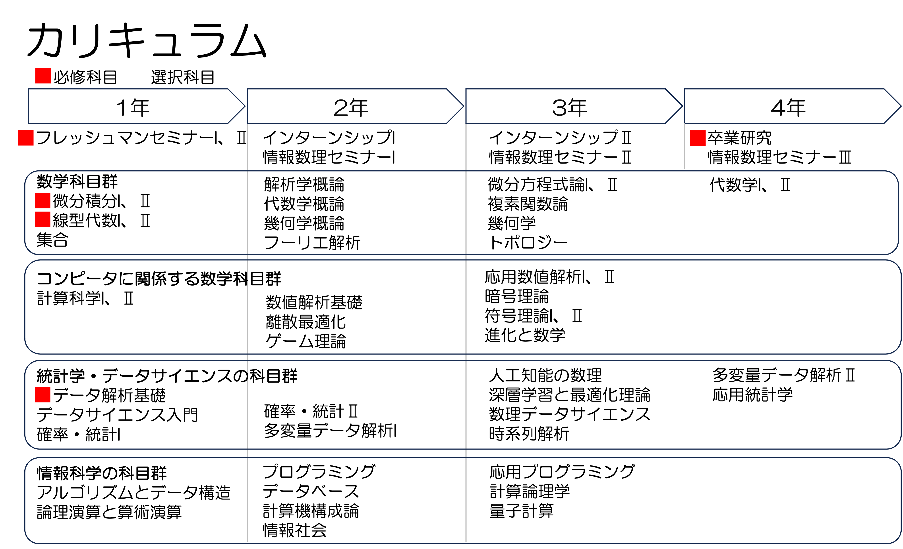

### 必修内容

1. Microsoft Office (Word, Excel, PowerPoint): 2年生から始まるインターンシップを想定
2. Python: 多くの大学で1年生から必修化されている．本学科でも秋学期のフレッシュマンセミナーIIで学ぶ．

### スケジュール

1. Mac利用環境の構築とタイピングの練習
2. 情報セキュリティ、情報モラル（プライバシー保護、著作権、不正利用）
3. Wordによる文書作成1
4. Wordによる文書作成2と生成系AI
5. 演習：Wordによる文書作成
6. 文章作成術
7. レポート・論文作成法
8. 演習：Wordによるレポート作成
9. PowerPointによるプレゼン資料作成
10. 演習：PowerPointによるプレゼン資料作成
11. Texによる文書作成1
12. Texによる文書作成2
13. 演習：Texによる数式のある文書作成

### 成績評価

- <span style="color:red">平常点40点・課題点60点の計100点</span>で成績を評価する．
- <span style="color:red">欠席を1回するごとに平常点から10点減点</span>する．
体調不良・法事・部活動の大会などのやむを得ない事情により講義を欠席する場合には事務に連絡すること．
連絡のあった回については平常点の減点を行わない．
- なお，欠席回の課題は課題点に加算されるため，後日提出すること．
- 本学の規程（[学則・学位規程・ガバナンスコード｜城西大学](https://www.josai.ac.jp/about/information/gakusokukitei/)）に従い，<span style="color:red">5回以上欠席した場合には単位が与えられない（Z評価）</span>．
- 他の学生の講義の受講を阻害する行為を行なった学生は平常点から減点する．
- 全ての講義が終了した段階で<span style="color:red">平常点と課題点の総点が60点以上にならなかった場合には単位は与えられない（F評価）</span>．

### 準備学習等の指示

- 各自のMacBookを持参すること．各回の課題では各自のMacBookを使用する．
- MacBookは充電をしておくこと．

### 出席登録

- 毎回WebClassで出席登録を行う．
- 講義の始めにパスワードを掲示するため，これを入力することで出席登録を完了する．
- 登録可能時間は講義開始時刻後15分間(11:00-11:15)とし，それ以降15分間(11:15-11:30)での登録は遅刻扱いとする．
- 講義開始時刻後30分以降の登録はできないため欠席扱いとなる．

```{tip} 本日のパスワード

<span style="font-size: 200%;">**123459**</span>

```

## 到達目標

1. PCの基本操作
2. 各種ソフトウェアのインストール
    1. Anaconda（Pythonの利用ツール）のインストール
    2. Microsoft Officeのインストール
    3. MacTeX（TeXを実行するためのソフトウェア）のインストール<br>
    ※ TeX: 主に数式を含む文書の組版を行うプログラミング言語
    4. Visual Studio Code (VSCode) のインストール
3. タイピング練習

## OS (Operating System)

- コンピュータ全体を管理する基本ソフト
- 例：
    - macOS
    - Linux
    - Windows
- macOS / Linux は **UNIX系OS** と呼ばれる．
    
    特徴
    
    - コマンド操作が強力．
    - プログラミング・研究用途に適している．
    - サーバ・AI・数値計算で広く使われている．

## 効率的にパソコンを操作するために

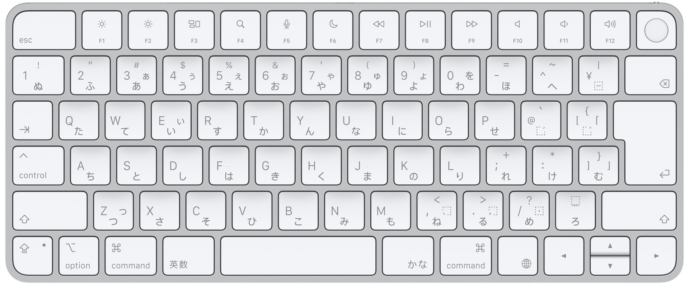

### 特別な役割を持つキー

- ⇥：Tabキー
- ⇧：Shiftキー
- ⌘：Commandキー（Windowsでのcontrolキー）
- ^：Controlキー
- ⌥：Optionキー（Windowsでのaltキー）
- ⇪：Caps Lockキー…アルファベットの入力を大文字に固定する．（日本語では使う機会は少ないので，システム設定で他のキーに置き換える人も多い）

### ショートカット

| キー入力 | 動作 |
| --- | --- |
| ⌘+C | 選択された文字をクリップボードにコピー |
| ⌘+X | 選択された文字をクリップボードにコピーし，選択箇所の文字を削除 |
| ⌘+V | カーソル位置にクリップボードに保存された文字を貼り付け（ペースト） |
| ⌘+Z | 直前に行った操作をキャンセルして元に戻す |
| ⌘+A | 全てを選択する |
| ⌘+S | ファイルを保存する |
| ⌘+N | 新しいファイル・ウィンドウを作成する |
| ⌘+⇧+3 | 画面全体のスクリーンショットを撮る． |
| ⌘+⇧+4 | 画面内指定の範囲のスクリーンショットを撮る． |
| ⌘+⇧+5 | 様々な条件でスクリーンショットを撮る．画面録画も可能． |

※ スクリーンショット：画面を画像ファイルとして保存する機能．

---

## コンピュータの操作

コンピュータの操作方法にはGUIとCUIの2種類が存在する．

- **GUI** (Graphical User Interface)
    - アイコン、ボタン、ウィンドウなどの視覚的な要素を使って、マウスやタッチパネルで直感的にコンピューターを操作するための画面（インターフェース）
- **CUI** (Character User Interface)
    - キーボードから文字（コマンド）を入力してコンピューターを操作するための画面（インターフェース）
    - CUIの例：ターミナル（Windowsでは「コマンドライン」）

### パス（path）の考え方

- コンピュータのファイルは階層構造の中に保存されている．
- どの階層にいるかの場所を指定することでファイルを指定することができる．
- 場所の指定方法には次の2種類がある．
    - **絶対パス**：コンピュータ内の絶対的な位置．例：`/Users/<ユーザ名>/Documents/`
        
        ※ ただし `<ユーザ名>` は各自のユーザ名に変換すること
        
    - **相対パス**：現在いるディレクトリから見た相対的な位置．例：`./`：現在のディレクトリ，`../`：一つ上の階層のディレクトリ．

## Anacondaのインストール

- Anaconda：Anaconda社が提供するデータサイエンス，科学技術計算ができるソフト
- 秋学期にパッケージに含まれるJupyter Notebookを使ってPython（プログラミング言語の1つ）のプログラミングを行う

### 手順

1. MacのCPU・メモリの構成を確認する．
    
    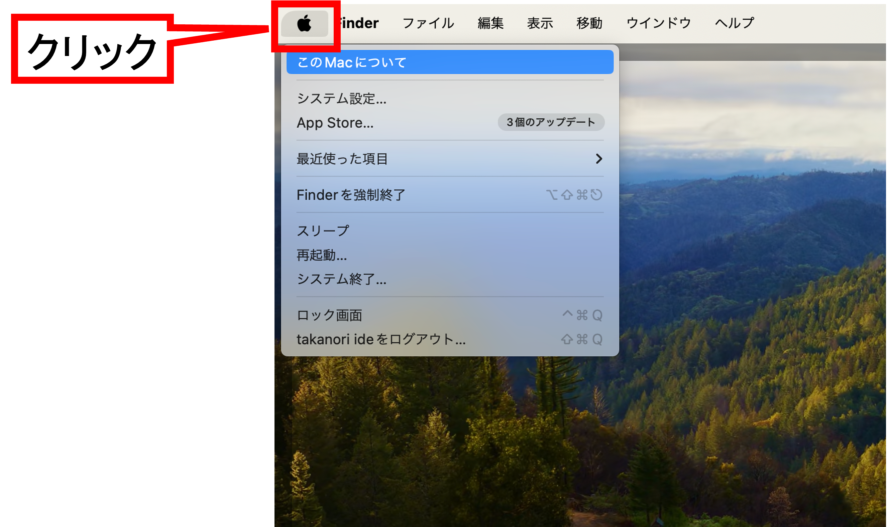
    
    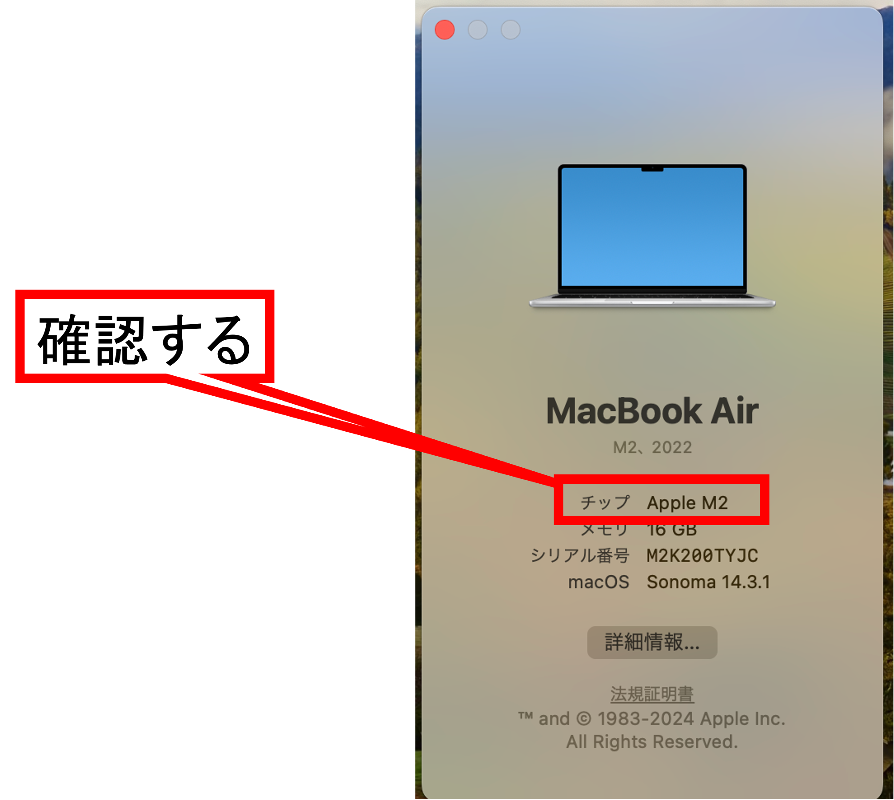
    
2. Anacondaのページにアクセスし，ダウンロードする．
    
    [https://www.anaconda.com/download/success](https://www.anaconda.com/download/success)
    
    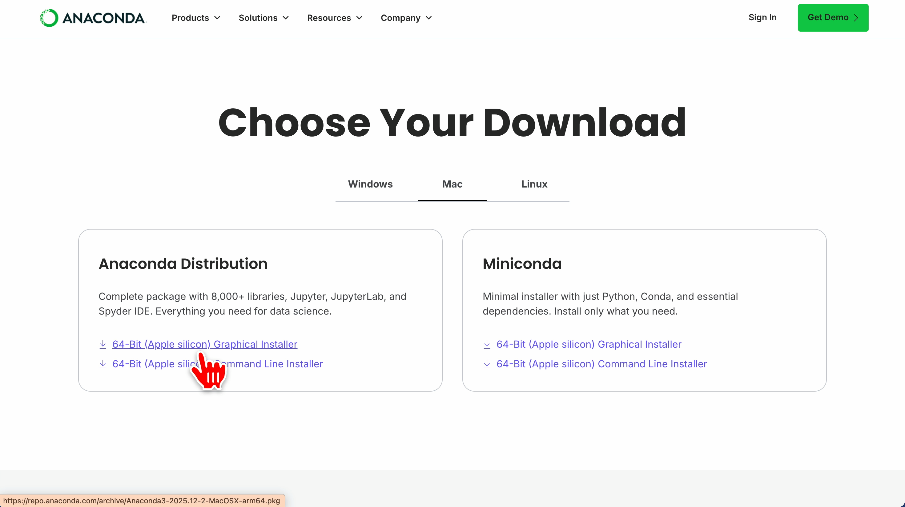
    
3. ダウンロードしたパッケージを確認し，インストールする．
（パッケージは `/Users/<ユーザ名>/Downloads` にダウンロードされている）
    
    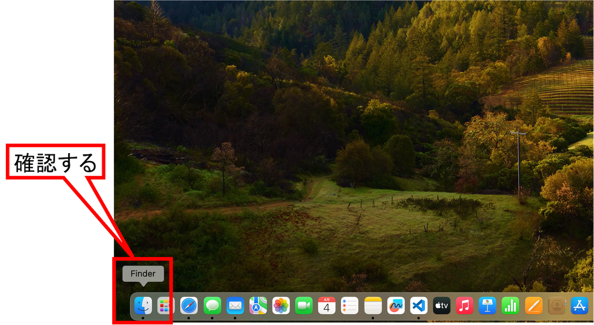
    
    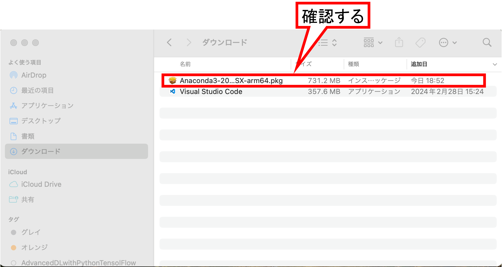
    
    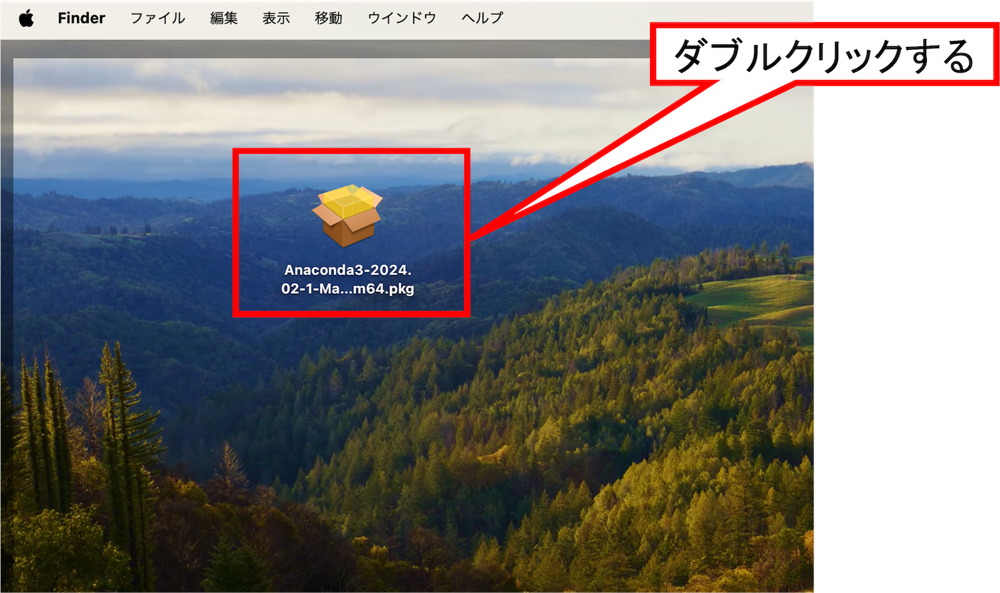
    
    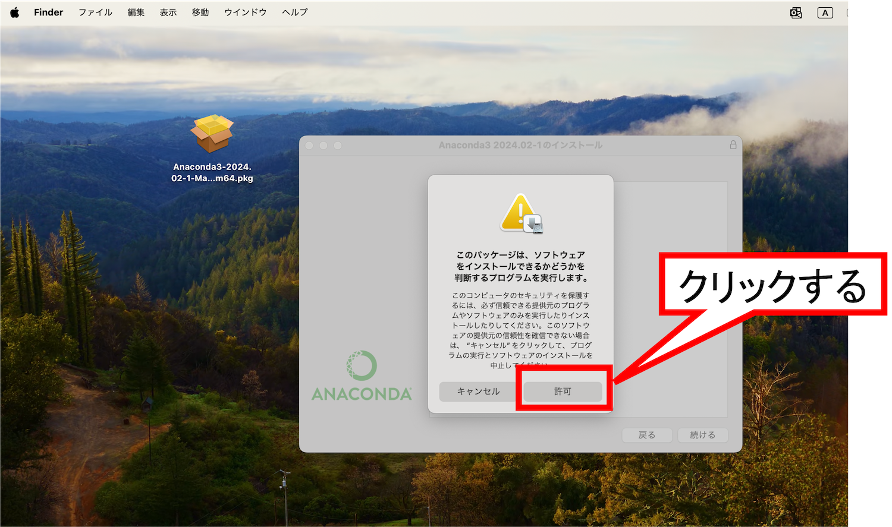
    
    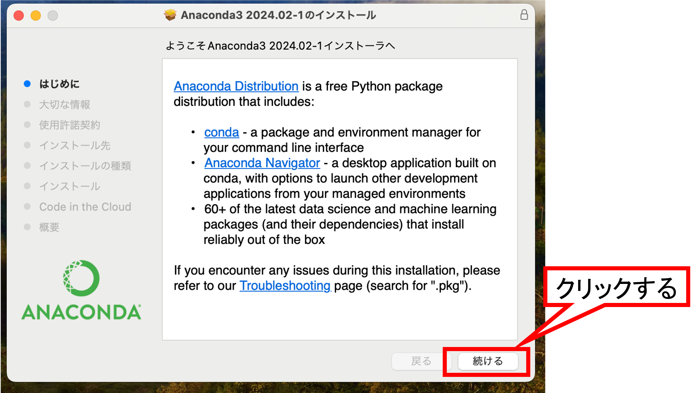
    
    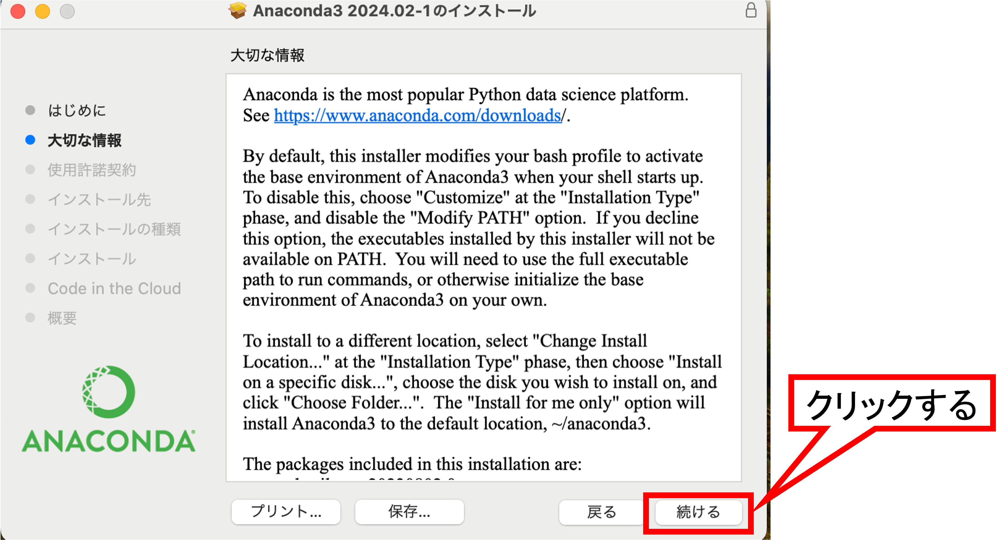
    
    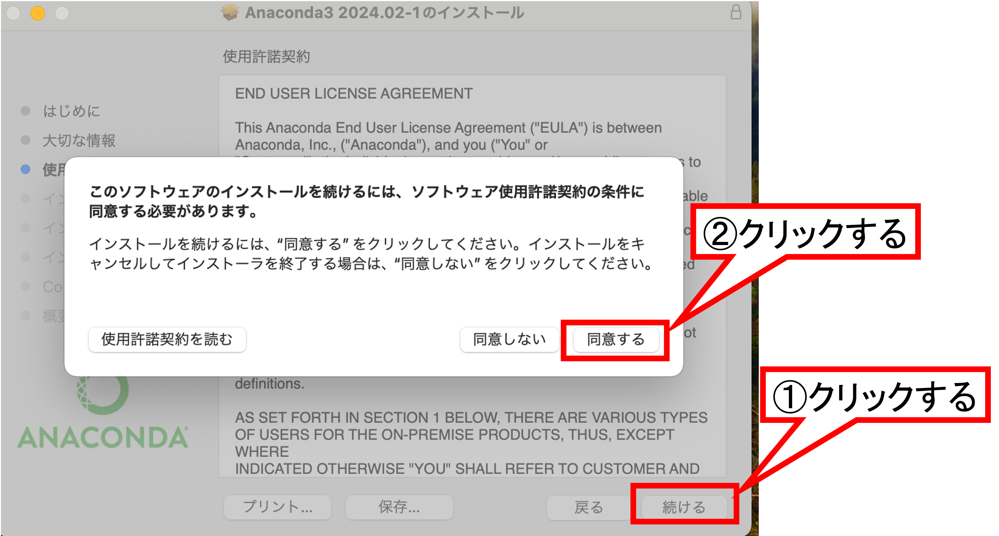
    
    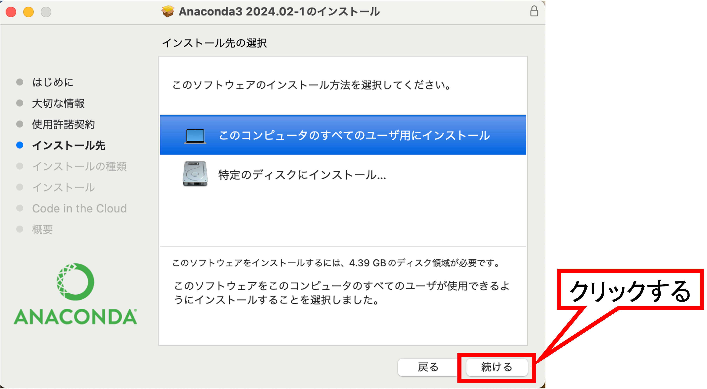
    
    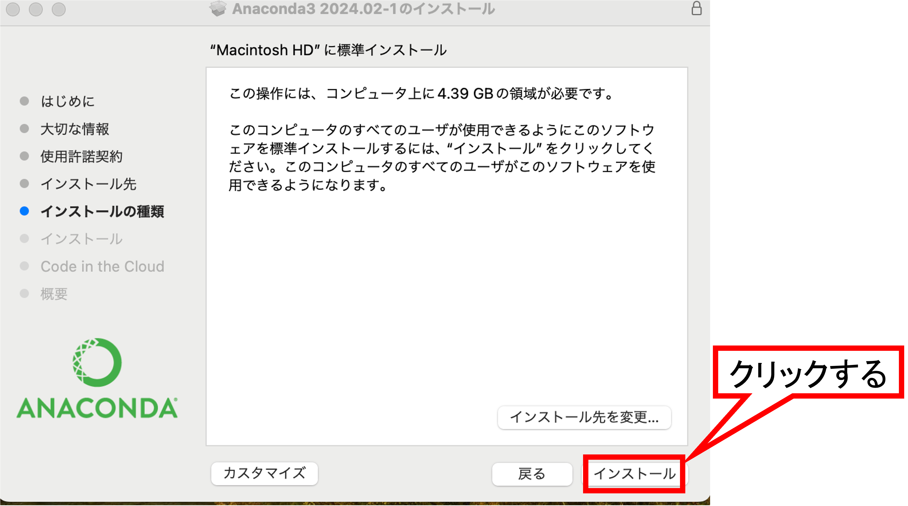
    
    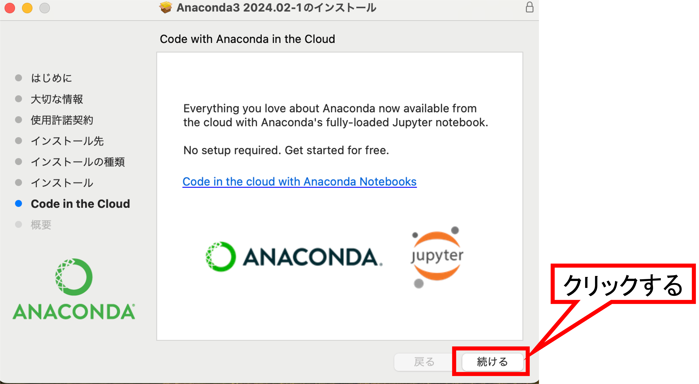
    
    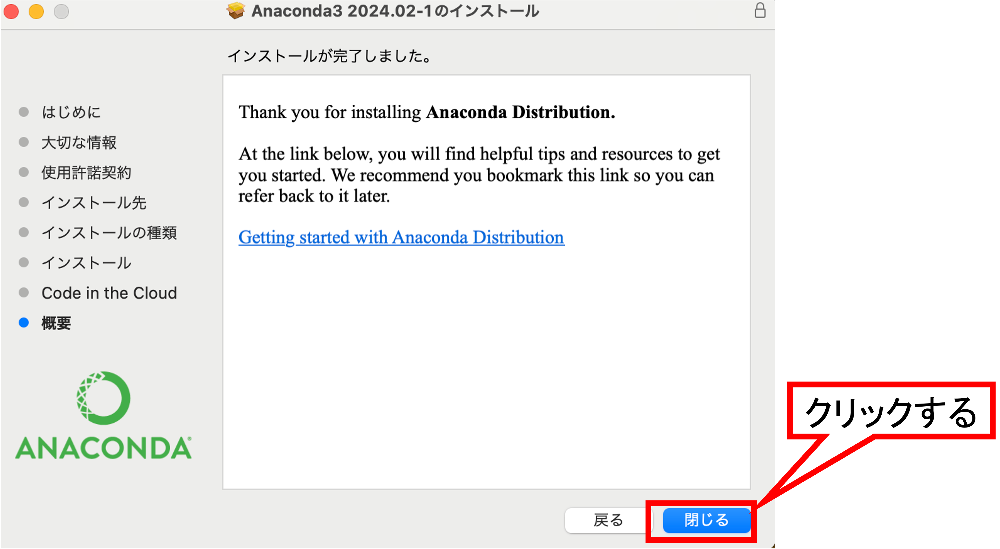
    
4. インストールを確認し，アプリケーションフォルダから「Anaconda-Navigator」を開く．
    
    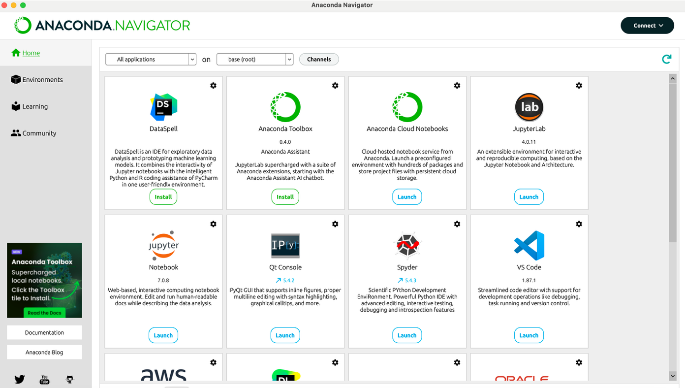
    

## Microsoft Officeのインストール

[https://www.josai.ac.jp/inforesearch/office_desktop/](https://www.josai.ac.jp/inforesearch/office_desktop/) にアクセスし，記載の手続きに従う．

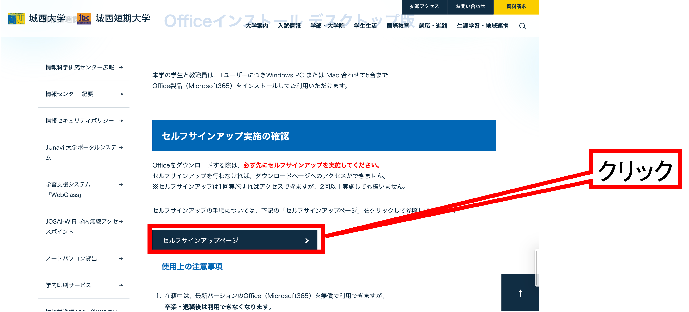

## MacTeXのインストール

[https://tug.org/mactex/mactex-download.html](https://tug.org/mactex/mactex-download.html) にアクセスし，下画像の⭕️をクリックする．

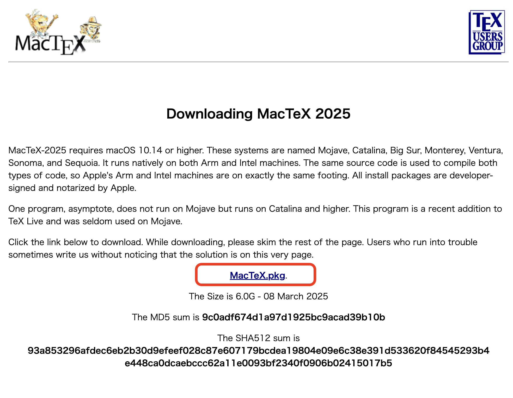

## Visual Studio Codeのインストール

[https://code.visualstudio.com/download](https://code.visualstudio.com/download)にアクセスし，下画像の⭕️をクリックする．


## タイピング練習

- PCを使いこなすにあたり，タイピングをスムーズにできることは大前提必要な技術である．
- 本講義では毎回20分間，タイピング練習の時間を設ける．

### 方法

- 指はホームポジションに置き，ここから各指で所望のキーをタイプする．


出典：[https://upload.wikimedia.org/wikipedia/commons/6/67/TouchTyping_HomePosition_QWERTY.png](https://upload.wikimedia.org/wikipedia/commons/6/67/TouchTyping_HomePosition_QWERTY.png)

### 練習のコツ

- 始めは正確さを追求，9割以上正確にタイプできるようになったら速さを上げる．
- 数学・スポーツ・タイピング，技術を習得するいずれの分野においても共通する考え方．

### 練習サイト

- 寿司打（スシダ）[https://sushida.net/](https://sushida.net/)
- e-typing [https://www.e-typing.ne.jp/](https://www.e-typing.ne.jp/)

```{warning} 課題

タイピングのスコアのスクリーンショットを撮影し，ファイル名を「<学籍番号>_<氏名>.png」としてWebClassの「第1回課題」から提出せよ．

ファイル名の例：si26999_コマちゃん.png

WebClassの使い方を確認するための課題であるため，課題点はスコアによらず一律で与えられる．
```

## 次回の準備

- Mac bookを充電・持参すること
