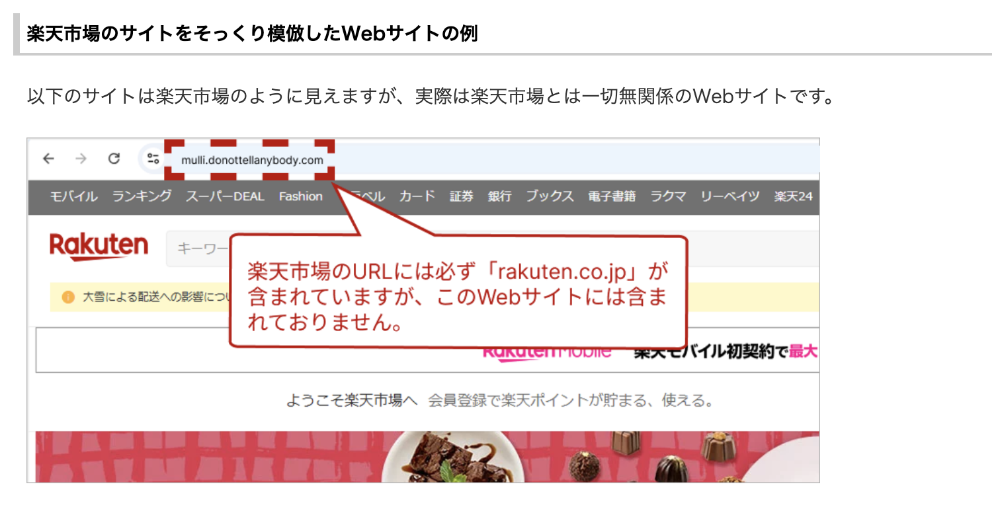
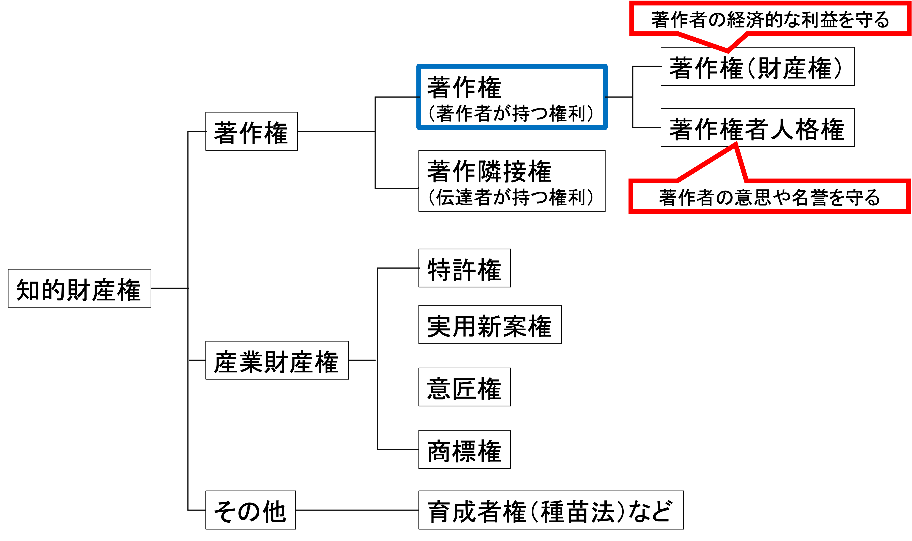

# 第2回：情報セキュリティ・情報モラル
<!-- テーマ：プライバシー保護，著作権，不正利用 -->

### 概要

大学生活で必要となる**情報モラル**と**情報セキュリティ**の基礎を学ぶ．
特に，レポートや発表で必ず関わる**プライバシー保護**と**著作権**，そして大学アカウントや端末を守るための**情報セキュリティ**を扱う．

この回で学ぶ内容は，単に「ルールを知る」だけではなく自分の行動として実践できることを目標とする．

### 前回の復習

1. Anaconda（Python利用環境）のインストール  
2. Microsoft Officeのインストール  
3. MacTeXのインストール  
  ※ TeX：主に数式を含む文書の組版に用いられるシステム
4. Visual Studio Code（VS Code）のインストール  
5. タイピング練習  

### 到達目標

1. 情報化社会における情報モラルと情報セキュリティの基本を説明できる．
2. 自分のアカウントを守るために，**強い認証**（パスワード管理・多要素認証）と**アップデート**を実践する．
3. **フィッシング**や**不正ログイン**の典型例を見分け，適切に対処できる．
4. 友人や他者の情報を含むデータについて，**プライバシー保護**の観点から適切に扱える．
5. レポートやスライドで文章・画像・図・コードを使う際に，**引用・出典・ライセンス**を意識して利用できる．
6. **不正利用**（アカウント貸し借り，海賊版利用，不正アクセス，盗用など）を避け，大学のルールに沿って行動できる．

### Boxの利用設定

> 新入生の入学時に自動送信された登録メールの有効期限は2週間となっており 4/14（火）に有効期限切れとなっております。
> メールの期限切れの場合は、サインイン画面からパスワード設定ができます。
> 
> （1）以下URLの１ページ目を参照してパスワードリセットメールを送信する
> （大学HPの「オンラインストレージサービス「Box」」からも閲覧できます）  
> https://www.josai.ac.jp/media/BoxFAQ.pdf
> 
> （2）以下URLの大学メール（Outlook）にログインし、「Box」から受け取ったメールの案内に従いパスワード設定手続きを行う  
> https://outlook.office.com/mail/

### タイピング（20分）

- 指はホームポジションに置き，ここから各指で所望のキーをタイプする．


```{note} タイピング練習
次のサイトなどでタイピング練習をすること（各自好きな方法で練習して良い）．

- 寿司打（スシダ）[https://sushida.net/](https://sushida.net/)
- e-typing [https://www.e-typing.ne.jp/](https://www.e-typing.ne.jp/)
```

---

## 大学生活と情報モラル・情報セキュリティ

現代では，日常生活のほとんどが情報技術と結びついている．
そのため誰もが情報トラブルや犯罪の被害者・加害者になり得る．

特に大学生活では，次のような重要な情報を日常的に扱う．

- 学内システムのアカウント（メール，LMS，Wi-Fi，図書館等）
- レポートや課題データ（自分の成果物）
- 研究・演習で扱うデータ（他者の情報を含むことがある）
- SNSやクラウドサービス上の情報
- オンライン授業や会議で共有される映像・音声・資料

さらに近年では，生成AIを悪用した詐欺，偽情報の作成，なりすましなども問題になっている．
したがって，情報モラルと情報セキュリティは**自分を守るため**だけでなく，**友人，大学，社会を守るための基礎教養**として必要な知識となっている．

---

## 情報モラル

- 情報モラル：情報社会の一員として，法令やルールを守りながら，他者に配慮し，責任ある行動をとるための考え方

次の視点が重要となる．

- その情報を公開してよいか
- その使い方で他人を傷つけないか
- その行為が**信頼**を損なわないか
- 自分の発信・発言に**責任**を持てるか

### 大学生に必要な情報モラル

大学生活では次のような場面で情報モラルが問われる．

- 友人の写真や名前をSNSに勝手に載せない
- グループワークの資料を外部に無断共有しない
- 他人のレポートを写したり，生成AIの出力をそのまま提出しない
- 出典不明の画像や文章を無断で使わない
- オンライン授業の録画や配布資料を無断転載しない

### 情報モラル違反が招く問題

情報モラルに反する行為は，法的問題になるだけでなく，次のような影響を与える．

- 友人や教員との信頼関係を損なう
- 学内規程違反として指導対象になる
- レポートの評価が無効になる
- 被害者のプライバシーや権利を侵害する
- 自分自身の将来の信用に関わる

---

##  情報セキュリティ

### 情報セキュリティの3要素（CIA）

情報セキュリティは，次の3要素で考えることが多い．

- **機密性**（Confidentiality）  
  情報が外部に漏れたり誰かに見られたりしないようにすること  
  
- **完全性**（Integrity）  
  情報が最新かつ正確ですべて揃っている状態であること  

- **可用性**（Availability）
  必要なときに使えること  

> 参考：NECフィールディング「情報セキュリティとは？ 3要素や対策の具体例・ポイントを徹底解説」  
> https://www.fielding.co.jp/service/security/measures/column/column-40/

### 脅威

- **フィッシング**  
  偽サイトや偽メールでID・パスワードを盗み取る

- **不正ログイン**  
  パスワード使い回しや漏えい情報の悪用により，他人がログインする

- **マルウェア**  
  添付ファイル，海賊版ソフト，怪しい拡張機能などを通じて感染する

- **紛失・盗難**  
  ノートPCやスマートフォンの置き忘れ・盗難

- **設定ミス**  
  共有リンクが公開状態になっていた，メール誤送信をした，公開範囲を誤った

### 基本的な対策

- OSやアプリを最新の状態に保つ
- パスワードを使い回さない
- 多要素認証（MFA / 2FA）を有効にする
- 怪しいメールやリンクを安易に開かない
- 重要ファイルはバックアップを取る
- クラウド共有時は公開範囲を確認する
- 端末にロックをかけ，紛失時に備える

> 参考：IPA（情報処理推進機構）「情報セキュリティ10大脅威」（2026.4.19閲覧）  
> https://www.ipa.go.jp/security/10threats/

```{note} 演習1
次の事例について，情報セキュリティの3要素（機密性・完全性・可用性）のうち，どれが損なわれる事例かを答えよ．

事例  
(1) 提出したレポートの内容が勝手に書き換えられた  
(2) 成績データが外部に漏えいした  
(3) 締切直前にWebClassへアクセスできなくなった
```
<!-- 
解答
(1) 完全性
(2) 機密性
(3) 可用性
 -->

---

## アカウント防衛：パスワード・多要素認証

### パスワード

**悪い方針**

- 同じパスワードを複数のサイトで使い回す
- 短すぎる
- 単語そのまま
- 誕生日や学籍番号に近い文字列を使う

**良い方針**

- 長い
- 使い回さない
- 覚えようとせず安全に管理する

→ **パスワードアプリ**を使用することが推奨されている．

**Macの場合**
- パスワードアプリを使用する．
- iCloudキーチェーンによって同じAppleアカウントでログインしている端末はまとめて管理できる．
- 安全で強力なパスワードを自動で生成してくれる．

### 被害例

- 沖縄県立看護大学（2023年）  
  https://www.okinawa-nurs.ac.jp/wp-content/uploads/2023/05/kouhyou_incident.pdf


### 多要素認証（MFA / 2FA）

多要素認証：パスワードに加えて別の要素を使って本人確認を行う仕組み

例：
- 認証アプリ
- セキュリティキー
- SMS 認証（場合によっては注意が必要）

パスワードが漏れても追加要素がなければログインしにくいため，被害を大きく減らせる．

### フィッシングの見分け方

**典型的なパターン**
- 「至急」「アカウント停止」「未払い」「当選」など，不安や欲をあおる
- 本物らしく見えるが，実際は偽のドメインに誘導する
- 添付ファイルを開かせる（`.zip`，`.html`，Office ファイル等）

**対応方針**
- メール本文のリンクを直接開かず**公式サイトへ自分でアクセスする**
- 「今すぐ」と言われても**一呼吸おいて確認する**
- 迷ったら**スクリーンショットを残して相談する**

偽ドメインの例（楽天）



> 参考：楽天「【ご注意】「楽天を装ったWEBサイト」一覧」（2026.4.19閲覧）
> https://ichiba.faq.rakuten.net/detail/000009756

- リンクにアクセスする前にサイトの安全性を確認する．

> リンクチェッカー（NordVPN）：[https://nordvpn.com/ja/link-checker/](https://nordvpn.com/ja/link-checker/)

---

## プライバシー保護：個人情報・SNS・クラウド

個人情報：特定の個人を識別することのできる情報．関係者以外に流出することでプライバシー侵害につながるなどする．

例：
- 氏名・住所・生年月日・顔写真
- 学籍番号・履修状況
- 位置情報
- SNSの投稿履歴
- レポート内容（内容が本人と結びつく場合）
- メールアドレスや通知の写り込み

### よくある事故

- グループ課題の共有フォルダを「リンクを知っている全員」にしており，共有リンクが他者に漏れた  
※ 大学のBoxでは城西大以外のメールアドレスには共有できない設定になっている．
- スクリーンショットに通知や氏名，メールアドレスが写り込んでいた
- SNSに位置情報付きで投稿し，現在地や行動パターンが分かってしまった
- 生成AIに個人情報を入力した

### 実践のポイント

- 共有リンクは，**誰が見られる設定か**を必ず確認する
- グループワークの資料は共有相手と公開範囲を明確にする
- 提出前に画像・PDF・スクリーンショットの写り込みを確認する
- SNSに投稿する前に，自分を特定される内容かを考える
- 生成AIには**個人情報や機密情報を入力しない**

```{note} 演習2
次のメールにはフィッシングの疑いがある．怪しい点を2つ挙げ，どう対応するべきかを書きなさい．

> 件名：【至急】大学アカウント停止のお知らせ
> 本文：あなたのアカウントは本日中に確認しないと停止されます．
> 下記の大学のリンクから今すぐログインしてください．
> http://univ-account-check.example.com
```
<!-- 
解答

- 「至急」「停止」など不安をあおる表現
- 大学公式らしくないURL
- メール内リンクを開かず，公式サイトから確認する
- 迷ったらスクリーンショットを残して相談する
 -->

```{warning} 課題1
次の話を読み，問題点を2つ挙げた上で適切な改善策を述べよ．  
なお，回答はWebClass「第2回課題」問1から回答すること．

> Aさんはグループ課題の資料をクラウドに保存し，「リンクを知っている全員が閲覧可」に設定した．
> その資料には，学生番号，提出前のレポート案，打ち合わせ中のスクリーンショットが含まれていた．
> さらにAさんは，作業の様子をSNSに投稿し，画面の一部が写った写真も公開した．
```
<!-- 
解答

公開範囲が広すぎる
学生番号やレポート案などの個人情報・未公開情報が含まれている
SNS投稿から情報が漏れる可能性がある
共有先を限定する，写り込みを確認する，SNS投稿前に内容を見直す
 -->
---

## 知的財産権・著作権

**知的財産権**

- 知的財産：知的な活動によって生み出された成果物
- 知的財産権：それらの価値を守るための権利

文章，音楽，画像，プログラム，デザインなどは，いずれも知的財産となり得る．

**著作権**

著作権は知的財産権の一つであり，他人が作った文章・画像・図・コード・スライドなどを守る権利である．



- 他人が作成したものは基本的に**勝手に使えない**
- 無断転載，無断改変，無断配布は法的に問題になる
- ただし，条件を満たした**引用**は認められる場合がある

### 引用

著作物は適切な条件を満たせば引用して利用できる．  
レポートや論文で適切に引用することは，自分の主張の根拠を示し学術的な誠実さを保つうえで重要である．

**引用のルール**
- 引用部分が明確に区別されていること
- 自分の本文が主であり，引用が従であること（量・質ともに）
- 出所を明記すること
- 図や画像は**引用**なのか，**ライセンス利用**なのか，**許諾が必要**なのかを判断すること

**出典表記の考え方**：書かれている情報から目的のページや書籍にアクセスできる．

Webページの場合
- 著者名「ページタイトル」サイト名，URL（閲覧日：2026.2.15）

書籍の場合
- 著者名「書籍名」出版社名（出版年）．

※ 出版年はその版の第1刷の年を記入する．

### Creative Commons（CC）ライセンス

Creative Commons（CC）は，「条件を守れば利用してよい」ことを示すライセンスである．  
よく見かける種類には次のようなものがある．

- **CC BY**：表示をすれば利用可能
- **CC BY-SA**：表示＋同じ条件で共有
- **CC BY-NC**：表示＋非営利利用に限る

CC と書かれていても，**条件の確認は必須**である．

---

## オンライン授業・面談

オンライン授業やオンライン面談などでは，対面とは異なる注意が必要である．

### 気を付けること

- 配布資料や録画を無断で転載・共有しない
- 画面共有の前に，通知や不要なタブを閉じる
- 背景や部屋の様子に個人情報が写り込まないようにする
- チャット欄や表示名に不適切な情報を書かない
- 参加URLやパスコードを第三者に渡さない

### よくあるトラブル

- 画面共有中にメールや成績情報が見えてしまう
- 授業録画をSNSや動画サイトに再配布してしまう
- 会議URLを他人に送ってしまい，無関係な人が入室する

---

## 不正利用

- アカウントの貸し借り（友人にID / パスワードを教える）
- 海賊版サイトからのダウンロード（PDF，ソフト，動画等）
- 他人のデータやアカウントへの侵入
- 他人や生成AIによるレポートをコピーして自分のものとして提出する（盗用・剽窃）
<!-- - 生成AIの出力を出典や利用方針を確認せずそのまま提出する -->

> 参考：警察庁「不正アクセス対策」（2026.4.19閲覧）  
> https://www.npa.go.jp/bureau/cyber/countermeasures/unauthorized-access.html

> 参考：警察庁「不正アクセス行為の禁止等に関する法律の解説」（2026.4.19閲覧）  
> https://www.npa.go.jp/bureau/cyber/pdf/1_kaisetsu.pdf

これらの行為は規則違反・権利侵害・違法行為につながる可能性がある．  
興味本位であっても，他人の情報に無断でアクセスする行為は認められない．


iThenticate：盗用・剽窃を確認するツール．教員や研究者が利用する．

> https://www.turnitin.jp/products/ithenticate/

```{note} 演習3
「産業財産権」とは何か，インターネット上で調べて述べよ．
ただし，参考にしたWebページは適切に引用すること．
```

<!-- https://www.jpo.go.jp/system/patent/gaiyo/seidogaiyo/chizai01.html -->

```{warning} 課題2
「特許権」とは何か，インターネット上で調べて述べよ．ただし，参考にしたWebページは適切に引用すること．  
また，回答はWebClass「第2回課題」問2から回答すること．
```

```{warning} 課題3
知的財産基本法（平成十四年法律第百二十二号）第七条に記載されている大学等の責務とは何か，2つ述べよ．  
※ 法律の文言を引用する場合は参考文献として表記する必要はない．  
回答はWebClass「第2回課題」問3から回答すること．
```

<!-- ・人材の育成並びに研究及びその成果の普及に自主的かつ積極的に努めること -->
<!-- ・研究者及び技術者の適切な処遇の確保並びに研究施設の整備及び充実に努めること -->
<!-- https://laws.e-gov.go.jp/law/414AC0000000122/ -->
