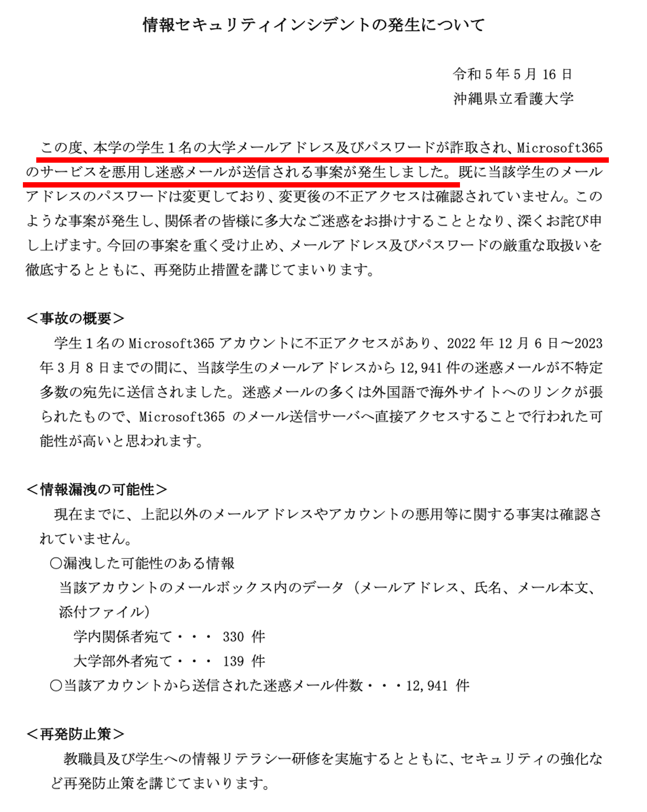

# 第2回：情報セキュリティ・情報モラル
<!-- （プライバシー保護，著作権，不正利用） -->

# 概要

本科目の後半で扱う「レポート作成」「プレゼン資料作成」「TeX」に進むために，**大学生活で“やってはいけない”と“やるべき”の基礎**を押さえます．  
特に，レポートや発表で必ず関わる **プライバシー** と **著作権**，そしてアカウント管理などの **情報セキュリティ** を扱います．

## 復習

1. Anaconda（Pythonの利用ツール）のインストール
2. Microsoft Officeのインストール
3. MacTeX（TeXを実行するためのソフトウェア）のインストール 
   ※ TeX: 主に数式を含む文書の組版を行うプログラミング言語
4. Visual Studio Code (VSCode) のインストール
5. タイピング練習

## 到達目標

1. 情報化社会における情報モラルと情報セキュリティの知識を身につける．
- 自分のアカウントを守るために，**強い認証（パスワード管理・多要素認証）** と **アップデート** を実践できる  
- **フィッシング** や **不正ログイン** の典型パターンを見分け，被害を避ける行動がとれる  
- 友人や他者の情報を含むデータの取り扱いについて，**プライバシー保護**の観点から判断できる  
- レポート／スライドに画像・文章・コードを使うとき，**引用・出典・ライセンス**を意識した扱いができる  
- 「不正利用（アカウント貸し借り，海賊版，侵入行為など）」を避け，大学のルールに沿って行動できる

# 情報モラルと情報セキュリティが取り巻く状況

- 日常生活において誰もが犯罪に巻き込まれ得る．
- 情報化社会における犯罪には最新のIT技術が使われている．
- 近年では生成系AIを利用した犯罪も確認されている．

特に大学生活では次の情報を日常的に扱う．

- 学内システムのアカウント（メール，LMS，Wi-Fi，図書館等）
- レポートや課題データ（自分の成果物）
- 研究・演習で扱うデータ（他人の情報を含む場合も）
- SNSやクラウドに載る情報（意図せず公開されることも）

情報セキュリティ／情報モラルは全ての人が最低限身につける必要のある基礎教養である．
（自分を守る／友人を守る／大学や社会を守る）

# 情報モラル

# 情報セキュリティ

## 情報セキュリティ3要素

- **機密性**（Confidentiality）
  - 見られてはいけない情報を守る．
  - 例：個人情報，成績，住所，学生証番号，ログイン情報
- **完全性**（Integrity）
  - 内容を勝手に改ざんされない．
  - 例：レポートの内容，提出データ，成績データ
- **可用性**（Availability）
  - 必要なときに使える（消されない・止まらない）
  - 例：提出締切前にPCが壊れる／ファイルが消える（＝バックアップが重要）

## よくある脅威（学生が遭いやすい）

- **フィッシング**（偽サイト・偽メールでID/パスを盗む）
- **不正ログイン**（漏えいしたパスワードの使い回し等）
- **マルウェア**（添付ファイル，海賊版ソフト，怪しい拡張機能など）
- **紛失・盗難**（ノートPC・スマホ）
- **設定ミス**（共有リンクが“公開”になっていた，誤送信）

※ 参考：IPA（情報処理推進機構）の「情報セキュリティ10大脅威」[https://www.ipa.go.jp/security/10threats/](https://www.ipa.go.jp/security/10threats/)

## 対策

# アカウント防衛：パスワード・多要素認証・フィッシング（25分）

## パスワード

**ダメな例**

- 同じパスワードを複数サイトで使い回す
- 短い／単語そのまま／誕生日や学籍番号に近い

**良い方針**

- 「長い」＋「使い回さない」＋「覚えずに管理」  
- 目標：**パスワードマネージャ**（iCloudキーチェーン等）を使う

**被害例**

- 沖縄県立看護大学（2023年）[https://www.okinawa-nurs.ac.jp/wp-content/uploads/2023/05/kouhyou_incident.pdf](https://www.okinawa-nurs.ac.jp/wp-content/uploads/2023/05/kouhyou_incident.pdf)

## Macでの実践例

- iCloudキーチェーン（パスワード）を有効化し，Safariで自動生成パスワードを使う  
- 重要アカウント（大学メール，Apple ID，GitHubなど）から優先的に整備する

## 多要素認証（MFA/2FA）

パスワードが漏れても，**追加の要素**がないとログインできないようにする仕組み．  
推奨：認証アプリ，セキュリティキー等（SMSは状況により注意点あり）

> 参考（政府系の解説PDFの一例）：多要素認証やパスワードの考え方  
> https://security-portal.cyber.go.jp/guidance/pdf/handbook/handbook-05.pdf

## フィッシングの見分け方

**典型パターン**

- 「至急」「アカウント停止」「未払い」「当選」など不安や欲を煽る
- リンク先が“それっぽい”偽ドメイン
- 添付ファイルを開かせる（.zip / .html / Officeファイル等）

**行動ルール**

- メールのリンクを踏まず，**公式サイトから自分でアクセス**する．
- “今すぐ”と言われても，**一呼吸おいて確認**する．
- 迷ったら，**スクショ＋相談**（教員／情報推進課など）

# デジタル時代の著作権

## 知的財産権

- 知的財産：「知的な活動で創造した情報・・・音楽，文章，コンピュータのプログラム，　製品のデザインやアイデア」（情報I Next, 数研出版，令和4年4月1日）
- 知的財産権：「知的財産の価値を守る権利」（情報I Next, 数研出版，令和4年4月1日）

## 著作権

- 知的財産権の一つに「著作権」がある．

- 他人が作った文章・画像・図・コード・スライドは，基本的に**勝手に使えない**．
- 著作権法：「著作物を作った人（著作者）や伝えた人（伝達者）の権利を保護する法律」（情報I Next, 数研出版，令和4年4月1日）
- 著作権侵害の例：他人の著作物の無断で複製して利用したり、一部を改変して公表すると著作権の侵害となる．（情報I Next, 数研出版，令和4年4月1日）
- ただし，条件を満たす「引用」は許される．

## 引用

- 著作権法32条「公表された著作物は，引用して利用することができる」
- レポート，論文を作成するとき，適切な引用を行うことは，自分の主張の正確性の裏付けや，独自性の主張として有効である．（アイザック・ニュートン「巨人の肩に乗る」）
<!-- ⭐️要出典⭐️ -->

> 参考：CRIC（著作権情報センター）Q&A（著作権の制限・引用など）  
> https://www.cric.or.jp/qa/hajime/hajime7.html

## 引用の実務ルール

- **引用部分が分かる**（「」や段落，図の枠などで明確に区別）
- 自分の本文が主，引用が従（引用が本文の大半にならない）
- **出所を書く**（著者，タイトル，URL，閲覧日など）
- 図や画像を使う場合は，**引用**か**ライセンス**（CC等）か**許諾**かを判断

## 出典表記の例（Web）
- 著者名『ページタイトル』サイト名，URL（閲覧日：2026-02-15）

## Creative Commons（CC）に出会ったら
- CC BY / CC BY-SA / CC BY-NC など，条件がある  
- “条件を守れば使える”ことが多いが，**条件は必ず確認**する

# オンライン授業で気を付けること

---

# 事前準備（5分でOK）

- 自分が普段使う端末（Mac）で，次を確認しておく  
  - OSのアップデート通知が来ているか（後で一緒に確認します）
  - 大学アカウント（メール／LMS等）のID・パスワードが分かるか
- 可能なら：スマホを持参（多要素認証の確認で使う場合があります）

---

# 授業の流れ（105分）

1. 導入：なぜ情報セキュリティ／モラルが必修なのか（10分）
2. 情報セキュリティの基礎：脅威と対策の全体像（20分）
3. アカウント防衛：パスワード・多要素認証・フィッシング（25分）
4. プライバシー保護：個人情報・SNS・クラウド（20分）
5. 著作権と引用：レポート／スライドで守ること（20分）
6. まとめ・ミニ確認テスト・課題説明（10分）

---

# 4. プライバシー保護：個人情報・SNS・クラウド（20分）

# 4.1 「個人情報っぽいもの」は広い

- 氏名・住所・電話番号だけでなく  
  - 学籍番号，顔写真，位置情報，授業の履修状況  
  - SNSの投稿履歴，レポートの内容（本人が特定できる場合）

# 4.2 ありがちな事故例（短いケース）

- グループ課題で，共有フォルダを「リンクを知っている全員」公開にしていた
- スクリーンショットに，通知・メール・氏名が写り込んでいた
- SNSで「今ここにいる」が分かる投稿をしてしまった

# 4.3 今日のチェックポイント（実践）

- 共有リンクは「誰が見られるか」を必ず確認（限定公開／権限）
- 提出前に，ファイル・画像・PDFの写り込み（名前，学籍番号，位置情報）を確認
- 生成系AIに入力する内容：**個人情報／機密情報を入れない**  
  （第4回で詳しく扱いますが，今日の段階でも“入れない”が基本）

---

# 6. 不正利用をしない：大学でありがちなNG（10分）

# 6.1 これはNG（例）

- アカウントの貸し借り（友人にID/パスワードを教える）
- 海賊版サイトからのダウンロード（PDF，ソフト，動画など）
- 他人のデータやアカウントへの侵入（興味本位でもNG）
- レポートのコピペ提出（盗用・剽窃）

> 参考（制度の概要に触れるための資料例）：警察庁「不正アクセス禁止法」解説PDF  
> https://www.npa.go.jp/bureau/cyber/pdf/1_kaisetsu.pdf

---

# ミニ演習（授業内で実施）

# 演習A：フィッシング判定（10分）
次のメール文を読んで，危険度を「高／中／低」で判断し，理由を1行で書く．

- 例1：大学を装った「パスワード期限切れ」通知  
- 例2：配送業者を装った「不在通知」リンク  
- 例3：サービス利用明細の“確認はこちら”リンク

> ※ここは授業当日に例文を配布（またはスライド表示）して実施

# 演習B：レポートでの“図の利用”判断（10分）
「この図をレポートに貼りたい」—次のどれで対応するべき？

1. 引用（出典つき）  
2. CC等のライセンスに従って利用  
3. 自分で描き直す（参考にした旨を書く）  
4. 許諾を取る／別素材にする

---

# まとめ：今日の“必ずやる”3つ

1. **パスワード使い回しを止める**（パスワードマネージャ導入）
2. **多要素認証を有効化**（できるものから）
3. **レポートは「出典を書く」**（文章も図も）

---

# 課題（次回まで）

# 課題1：セキュリティ自己点検（提出）
以下を確認し，チェックリストを提出（LMSまたはGitHub上の提出方法に合わせて指定）．

- [ ] OSアップデートの確認（更新があれば実施計画を立てる）
- [ ] 大学メール／LMSのパスワード使い回し有無
- [ ] 可能なら多要素認証の設定状況（オン／オフ）
- [ ] 共有リンクの権限を説明できる（限定公開／全体公開など）

# 課題2：短いリフレクション（200〜400字）
次のうち1つを選び，具体例を入れて書く．

- 「今日から変える行動」  
- 「危ないと思った経験（または想像）と，どう防ぐか」  
- 「レポートで著作権を守るために意識すること」

---

# 参考資料（任意）

- IPA：情報セキュリティ10大脅威  
  https://www.ipa.go.jp/security/10threats/
- 政府系ポータル（手引きPDF例）：多要素認証・パスワード等  
  https://security-portal.cyber.go.jp/guidance/pdf/handbook/handbook-05.pdf
- CRIC：著作権Q&A（引用など）  
  https://www.cric.or.jp/qa/hajime/hajime7.html
- 警察庁：不正アクセス禁止法 解説（PDF）  
  https://www.npa.go.jp/bureau/cyber/pdf/1_kaisetsu.pdf

---

