# 第3回　Wordによる文書作成1

### 前回の復習

- 本科目の後半で扱うレポート作成，プレゼン資料作成，TeXに進むために，大学生活で必須となる情報モラルと情報セキュリティの基礎を学んだ．
- プライバシー保護，著作権と引用，不正利用の防止を理解し，パスワード管理，多要素認証，フィッシング対策などアカウント防衛の実践方法を学んだ．

### 概要

- Wordとは
- Wordの起動
- Wordに画像を取り込む方法

### 到達目標

- Wordで文章を書けるようになる

### タイピング（20分）

- 指はホームポジションに置き，ここから各指で所望のキーをタイプする．


```{note} タイピング練習
次のサイトなどでタイピング練習をすること（各自好きな方法で練習して良い）．

- 寿司打（スシダ）[https://sushida.net/](https://sushida.net/)
- e-typing [https://www.e-typing.ne.jp/](https://www.e-typing.ne.jp/)
```

---

## Word

- Microsoft社のアプリケーションソフトウェア
  - Word：文書作成ソフト
  - Excel：表計算ソフト
  - PowerPoint：プレゼンソフト
- 公的機関，教育機関，企業で最も使われている
- インターンシップI・Ⅱで必須

## 起動

1. Cmd+SpaceでSpotlight検索を起動する
2. 「Word」を検索する
    
    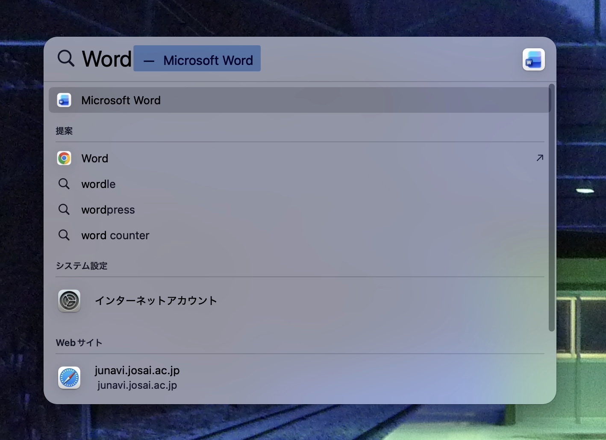
    
3. 「Microsoft Word」を起動する
4. スタート画面が表示される
    
    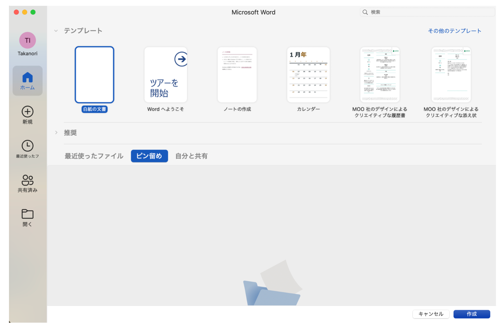
    
5. 「白紙の文書」または「作成」をクリックして新しいファイルを作成する
    
    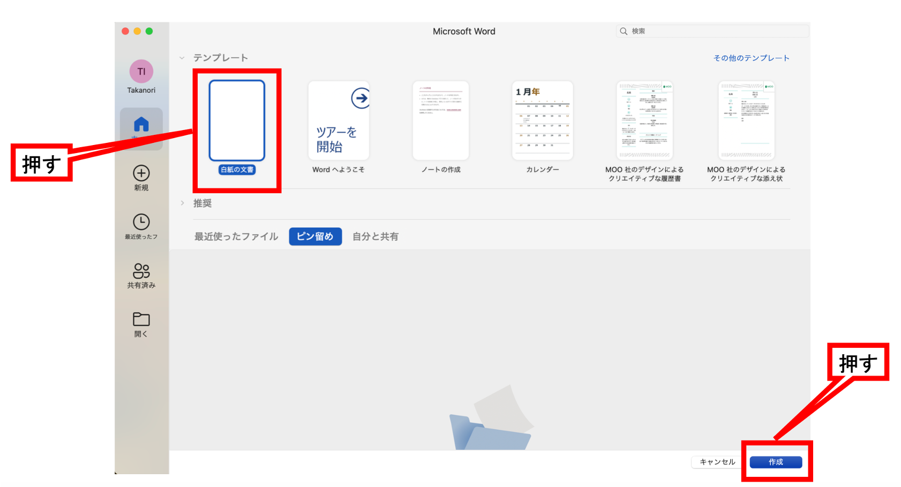
    
6. ファイルを保存する
    
    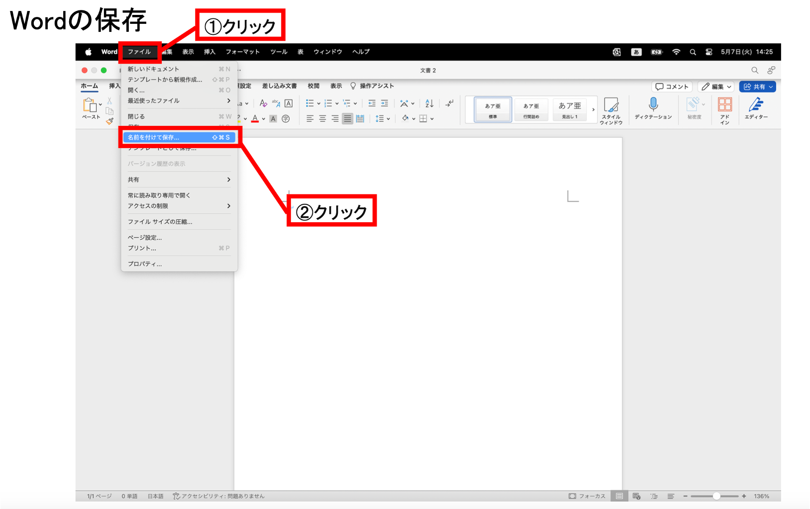
    
    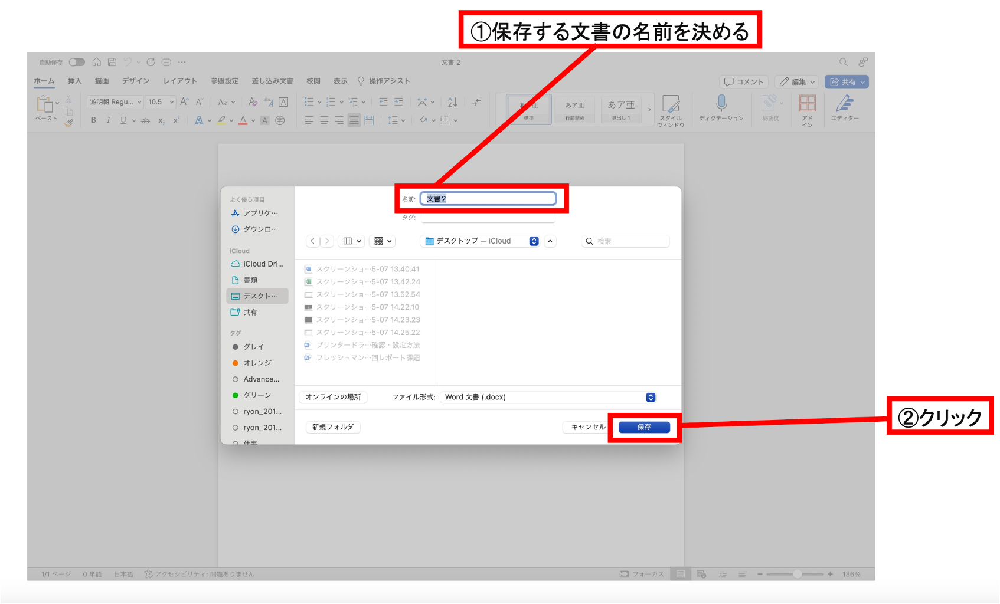
    

### 画面構成

- 表示設定
    
    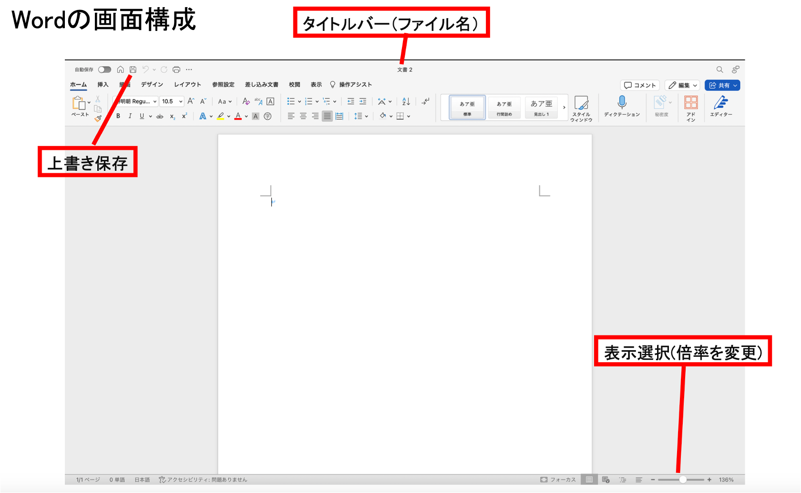
    
- 文字のフォントとサイズの設定
    
    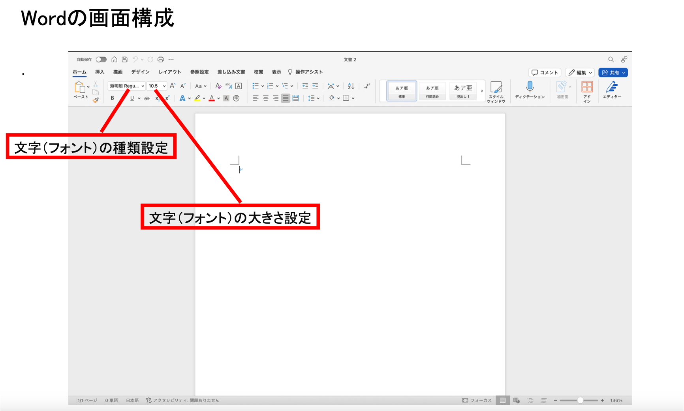
    
- 文字の修飾設定
    
    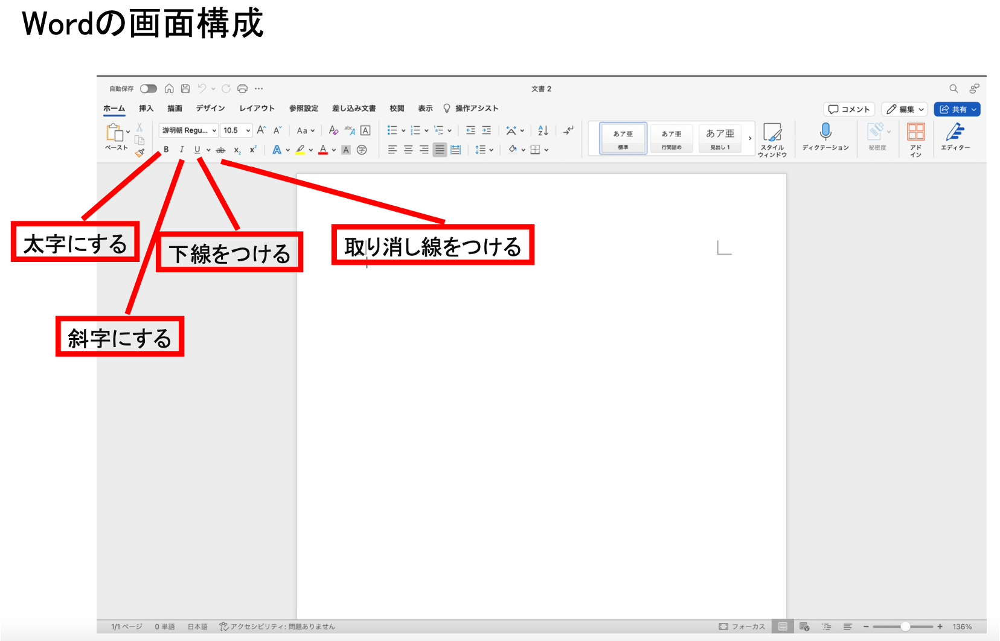
    
- 文字の色と位置の設定
    
    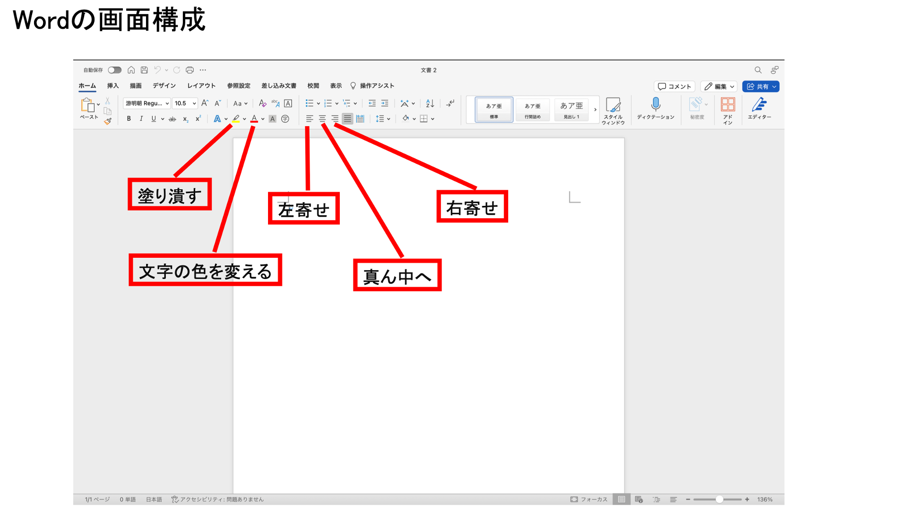
    
- 段落や箇条書きの設定
    
    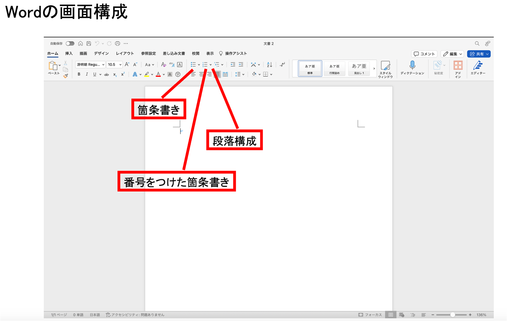
    

---

## 画像の取り込み

| ⌘+⇧+3 | 画面全体のスクリーンショットを撮る． |
| --- | --- |
| ⌘+⇧+4 | 画面内指定の範囲のスクリーンショットを撮る． |
| ⌘+⇧+5 | 様々な条件でスクリーンショットを撮る．画面録画も可能． |

上のコマンドによって保存した画像は `/Users/<ユーザ名>/Desktop` に保存されている．

### Wordへの挿入

1. 挿入したい箇所にカーソルを合わせた状態で，挿入＞図のイラスト＞図をファイルから挿入… を選択する
    
    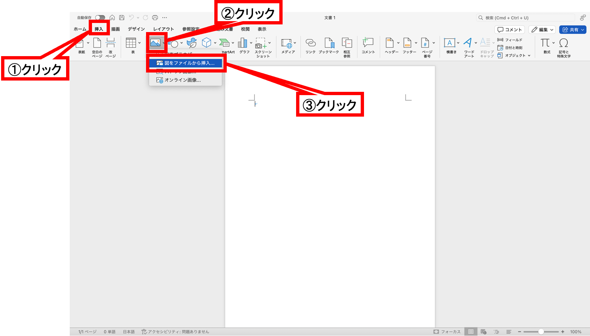
    
2. 挿入したい画像を選択し，「挿入」をクリックする
    
    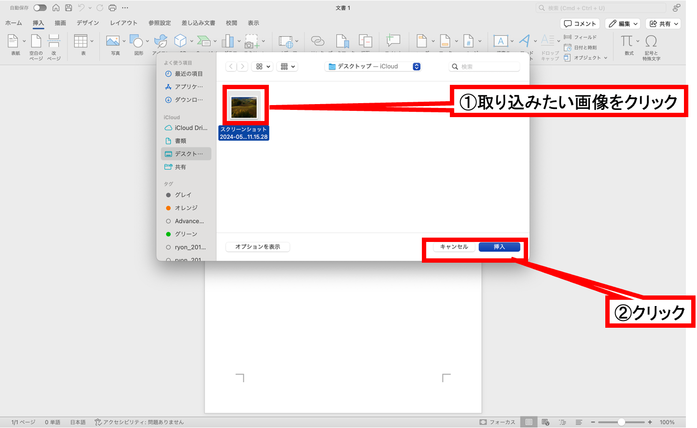
    
3. カーソルの位置に画像が挿入される
    
    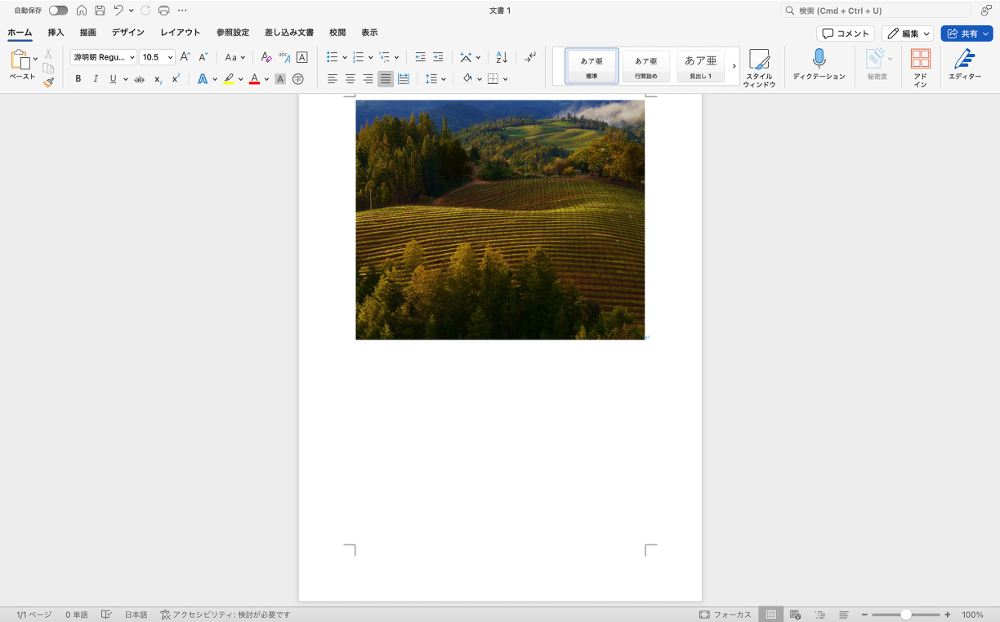
    
4. 画像の調整を行いたい場合は，対象の画像をクリックして選択した状態で「図の書式設定」のタブを選択する
    
    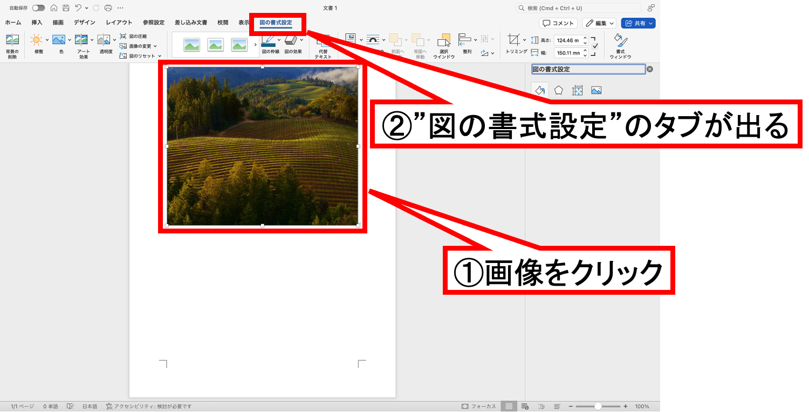
    
---

## 演習

```{note} 演習1
次の手順で新しいWord文書を作成せよ．

1. Wordを起動する．
2. 白紙の文書を作成する．
3. 1行目に「学籍番号　氏名」を入力する．
4. 2行目に「第3回　Wordによる文書作成1」と入力する．
5. ファイル名を「第3回_<学籍番号>_<氏名>.docx」として保存する．

ファイル名の例：第3回_SI26999_城西太郎.docx

ただし次の条件を守ること．

- 文字のフォントは「游ゴシック」
- 文字の大きさは12ポイント
```

---

## 課題

```{warning} 課題1-3
演習1のファイルに加筆する形で次の3つの内容に関する文書にせよ．

1. 自己紹介（10行以上）
2. 情報数理学科で学びたいこと（10行以上）
3. 動画を見た感想を書く（10行以上）  
    動画リンク https://www.ted.com/talks/hannah_fry_the_mathematics_of_love?subtitle=ja

ただし次の条件を守ること．

- 動画の印象に残った場面をWordに取り込むこと
- 動画のホームページを引用すること

- 作成したWordファイルはWebClass「第3回課題」から提出すること
- 提出期限は<span style="color: red; ">5月1日(金)23:59まで</span>とする
```

**作成例**

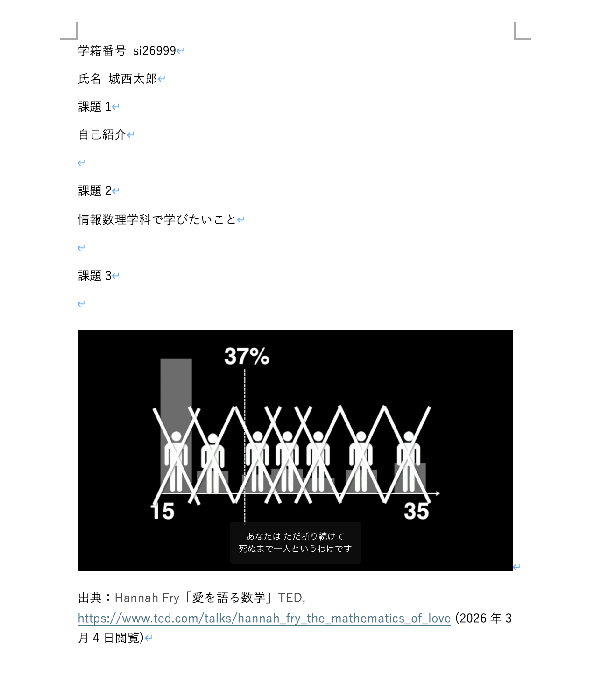

---

## アナウンス

### 課題の提出期限

<span style="color: red; ">5月1日(金)23:59まで</span>

### 次回の準備

- 次回も今回同様，次の教科書を使用するため持参すること．
    
    富士通ラーニングメディア「よくわかるWord 2021 & Excel 2021 & PowerPoint 2021 Office 2021/Microsoft 365 対応」富士通ラーニングメディア(FOM出版)（2022）
    
    [Microsoft Word 2021 & Microsoft Excel 2021 & Microsoft PowerPoint 2021 Office 2021／Microsoft 365対応 | 富士通ラーニングメディア出版サービス](https://www.fom.fujitsu.com/goods/office/fpt2208.html)
    
- Mac bookを充電・持参すること
