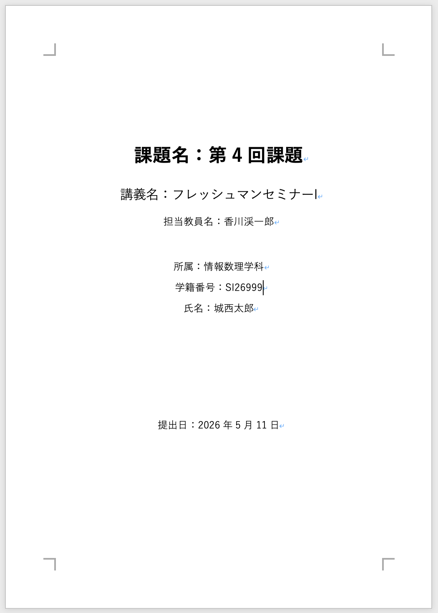
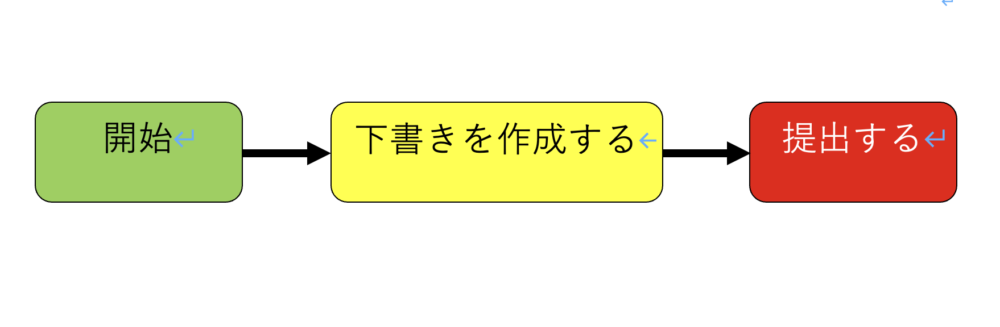
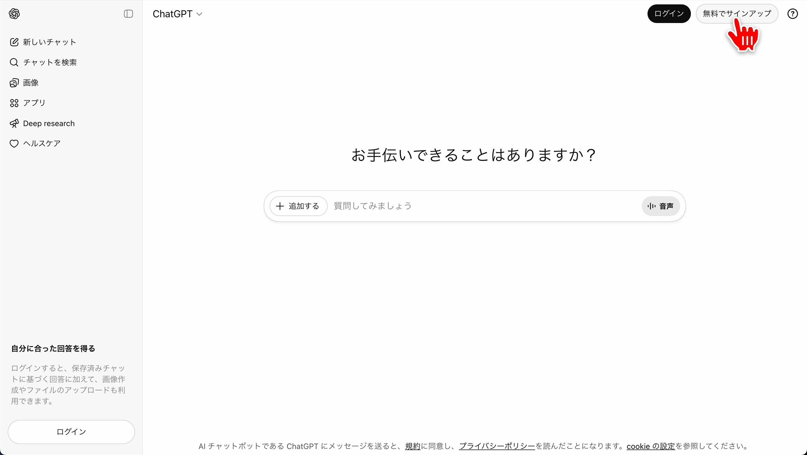
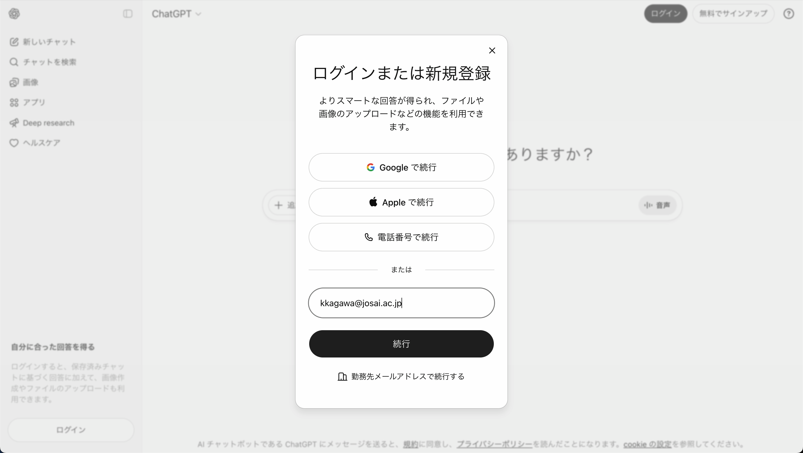
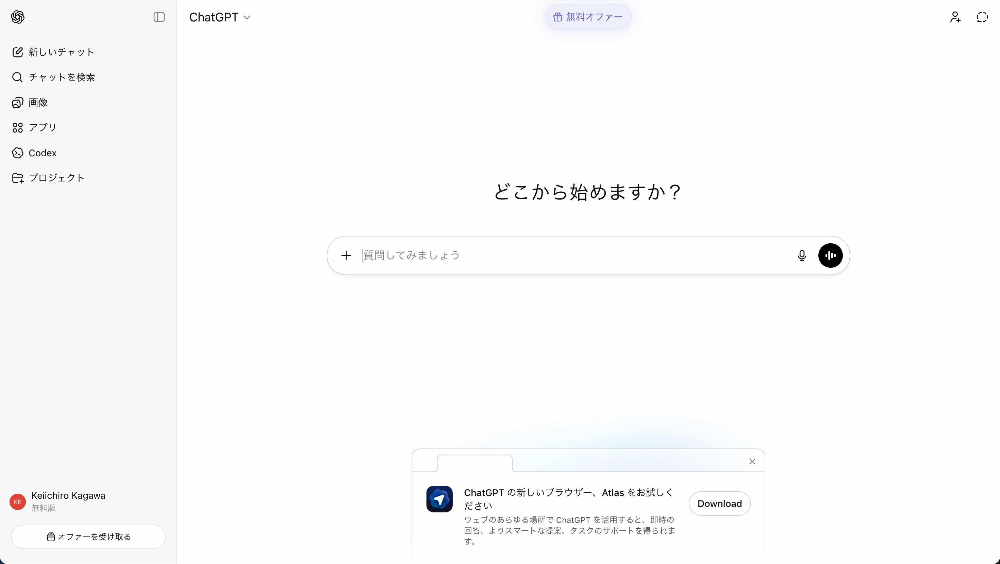

# 第4回　Wordによる文書作成2と生成系AI

### 前回の復習

- Wordとは
- Wordの起動
- Wordに画像を取り込む方法

### 概要

- 課題レポートの表紙作成
- 生成AIによる文章校正
- Wordによる図形の作成

### 到達目標

1. Wordを用いてレポート課題の表紙を作成する
2. 生成AIによる文章校正法を取得する
3. Wordによる図の書き方を習得する

### タイピング（20分）

- 指はホームポジションに置き，ここから各指で所望のキーをタイプする．


```{note} タイピング練習
次のサイトなどでタイピング練習をすること（各自好きな方法で練習して良い）．

- 寿司打（スシダ）[https://sushida.net/](https://sushida.net/)
- e-typing [https://www.e-typing.ne.jp/](https://www.e-typing.ne.jp/)
```

---

## 表紙の作成

### 表紙に入れる情報

一般的に次の情報を入れる．指定がある場合はそれに従うこと．

- どのレポートかを特定するための情報（What）
    - 課題名
    - 講義名
    - 担当教員名
- 誰が書いたかを特定するための情報（Who）
    - 所属（学科）
    - 学籍番号
    - 氏名
- 提出日（When）

### Wordでの作成手順

1. 新規文書を作成し，保存する
2. 1ページ目に表紙を作る
3. 表紙は中央揃えを基本にし，情報の塊ごとに段落を分ける
4. 見出しや課題名はフォントサイズを少し大きくする
5. 位置調整にはEnterを連打せず，段落間隔や余白で行う

作成例



### 表紙と本文の区切り

表紙の次のページから本文を始める．

本文を2ページ目から始めるには次のいずれかの手順で改ページを使う．

- 挿入タブ＞改ページ
- または 「⌘ + Enter」

```{note} 演習1

ファイル名を“第4回_<学籍番号>_<氏名>.docx”としたWordファイルを作成し，表紙をつけよ．
ただし，ファイル名の<学籍番号>は自身の学籍番号に，<氏名>は自身の氏名に置き換え，表紙には次の情報を入れよ．

- 課題名「第4回レポート」・講義名「フレッシュマンセミナーI」・担当教員名「香川渓一郎」
- 所属（学科）・学籍番号・氏名
- 提出日
```

---

## 図形の作成

Wordには図形描画の機能があり，簡単な模式図やフローチャートを作れる．図形は画像よりも後から編集しやすい．

### 図形の挿入

- 挿入タブ＞図形

四角形，矢印，吹き出し，線などを使う

### 図形の色

- 図形本体の色の設定：図形の書式設定タブ＞図形の塗りつぶし
- 図形枠線の色・太さの設定：図形の書式設定タブ＞図形の枠線（図形の塗りつぶしの右）

### 文字を入れる

- **新しく文字を入れる場合**：図形を選択＞文字を入力
- **既に入力された文字を編集する場合**：右クリック＞テキストの編集

### 整列と配置

図形が多いときは，整列を使うときれいに揃う．

- 図形を選択＞図形の書式設定タブ＞配置＞整列
  - 左揃え，中央揃え，上揃えなど
  - 間隔の均等配置も使える

### グループ化

複数の図形をまとめて動かす場合はグループ化する．

- まとめたい複数の図形を選択＞右クリック＞グループ化

### 図の作り方のコツ

- 伝えたい要点を先に決める
- 図の要素を増やしすぎない
- 矢印の向きをなるべく統一する
- 図の中の文字は短くする
- 図だけで意味が通るようにキャプションを付ける

```{note} 演習2

Wordファイル“第4回_<学籍番号>_<氏名>.docx”の表紙の次のページ（1ページ目）に以下の図形と文字を再現せよ．


```

---

## 生成AIによる文章校正

生成AIは文章の改善提案，論理の抜けの指摘，読みやすい表現への言い換えなどの使用に有効である．
ただし，AIの出力は誤りを含む可能性がある（ハルシネーション）ため，<span style="color:red">最終責任は使用者が負う</span>．

生成AI登場以後の世界では，個人のオリジナリティを出す点は生成AIの出力に対して「自分が納得するか」になってくる．

例）陶芸家が満足できない作品を割り続けて納得のいく作品を仕上げるように，私たちは納得いく出力が出るまで生成AIと対話し続けることになる

### 使ってよい用途の例

- 文のねじれ，誤字脱字の指摘
- 冗長表現の削減
- 段落構成の改善案
- 読み手を意識した表現への言い換え
- 主張と根拠の対応関係の確認

### 避けるべき用途の例

- そのまま提出することを目的に全文生成させる
- 出典不明の内容を事実として書く
- 個人情報，機密情報を入力する
- 授業で禁止されている範囲の利用

### 入力する前の注意

- 学籍番号，氏名，住所，電話番号などの個人情報は入力しない
- 他人のレポートや未公開資料を入力しない
- 研究データや学内限定情報は入力しない

生成AIのプロンプトに入力した内容は生成AIを提供している企業のサーバに保存される．
企業からの情報漏洩が生じた場合に，プロンプトに入力した内容も漏洩するリスクがある．
一度生成AIのプロンプトに入力して企業のサーバに保存された情報の保護は自身の制御の範囲外となってしまう．

### 校正の基本手順

1. 自分でまず書く
2. AIに「改善の観点」を指定して依頼する
3. 返答を鵜呑みにせず，理由を確認する
4. 納得した箇所については自分の文章に反映し，全体の整合性を確認する
5. 事実や定義は必ず自分で確認する

### プロンプト例

- **文体と誤りを直す**：  
  `次の文章を，意味を変えずに，誤字脱字と文のねじれを直してください．専門用語は変更しないでください．`
- **構成を点検する**：  
  `次の文章について，主張，根拠，結論が明確かを点検し，不足している要素を箇条書きで指摘してください．`
- **読み手を意識した改善**：  
  `次の文章を，大学1年生にも読みやすい説明文として，段落構成を整えて書き直してください．ただし内容の追加はしないでください．`
- **反論への備え**：  
  `次の主張に対して想定される反論を3つ挙げ，それぞれに対する補足説明案を提案してください．`

### AIの出力を採用する基準

- 自分の意図と一致している
- 事実関係が正しい
- 文章の論理が通っている
- 課題の条件や授業ルールに反していない

### ChatGPTのアカウント作成

1. [https://chatgpt.com/](https://chatgpt.com/) にアクセス
    
    
    
2. 新規登録する（既にアカウントを持っている場合はログインする）
    
    
    
3. ログインに成功すると次のような画面になる
    
    

---

## 課題

```{warning} 課題1〜3

Wordファイル“第4回_<学籍番号>_<氏名>.docx”の**2ページ目以降**に以下の課題に対する回答を記入せよ．

1. 前回の講義の課題1-3の文章をChatGPTに校正してもらい，校正結果を記入せよ．
2. ChatGPTとのやりとりの画面をスクリーンショットに撮り，文末に貼り付けよ．（1枚の画像に収まらない場合は複数回に分けてスクリーンショットを撮ること）
3. スクリーンショットの画像の枠線の色を赤にし，太さを3ptとせよ．
```

### 提出方法

- WebClassの「第4回課題」よりファイル“第4回_<学籍番号>_<氏名>.docx”を提出

### 提出期限

<span style="color: red; ">5月15日(金)23:59まで</span>

質問等がある場合には

- メール kkagawa@josai.ac.jp
- Teamsのチャット

で連絡してください．

## 次回の準備

- 次回はWordを用いて数式と図のある文書を作成するため，<span style="color: red; ">「微分積分I」の教科書を持ってくること</span>．
    
    
    
    2024年度以前の過年度生で微分積分Iで使用した教科書が上記のものでない場合は自身が使用した教科書を持参すること
<!-- 
- 次回も今回同様，次の教科書を使用するため持参すること．
    
    富士通ラーニングメディア「よくわかるWord 2021 & Excel 2021 & PowerPoint 2021 Office 2021/Microsoft 365 対応」富士通ラーニングメディア(FOM出版)（2022）
    
    [Microsoft Word 2021 & Microsoft Excel 2021 & Microsoft PowerPoint 2021 Office 2021／Microsoft 365対応 | 富士通ラーニングメディア出版サービス](https://www.fom.fujitsu.com/goods/office/fpt2208.html)
     -->
- Mac bookを充電・持参すること
    
