# 第5回　演習：Wordによる文書作成

科目: フレッシュマンセミナー
学期: 2026春
時間割: 月２
日付: 2026/05/18

## 講義概要

### 復習

- 課題レポートの表紙作成
- 生成AIによる文章校正
- Wordによる図形の作成

### 概要

- 微分積分Iの教科書を参考に，数式や図形を含む文書を作成する

### 到達目標

1. Wordによる数式の書き方を習得する
2. 数式や図形を含む文書を作成できるようになる

---

## Wordによる数式のある文書の作成

Wordでも数式を入力できる．レポートやスライドで数式を扱うために，最低限の入力方法を身につける．

### 数式入力の開始

- 挿入＞（記号と特殊文字）＞数式
- ショートカット：「^ + =」

数式は本文の文字とは別の「数式オブジェクト」として扱われる．

### 入力方法

1. UnicodeMathで入力する方法（簡単な数式）
2. LaTeX記法で入力する方法
3. 数式タブから記号を選択して挿入する方法

※ LaTeXは数式を含めた組版プログラミング言語（文章を綺麗に書くための言語）

**(1) UnicodeMathで入力する方法（簡単な数式で便利）**

- 分数： `a/(b+c)`+スペース → $\frac{a}{b+c}$
- べき乗：`x^2`+スペース → $x^2$
- 添字：`a_i`+スペース → $a_i$
- 平方根：`\sqrt(x)`+スペース → $\sqrt{x}$
- 総和：`\sum_(i=1)^n`+スペース+`i` → $\sum_{i=1}^n i$
- 積分：`\int_0^1`+スペース+`f(x)dx` → $\int_0^1 f(x)dx$

**(2) 数式タブから記号を選択して挿入する方法**

例：行列を入力する

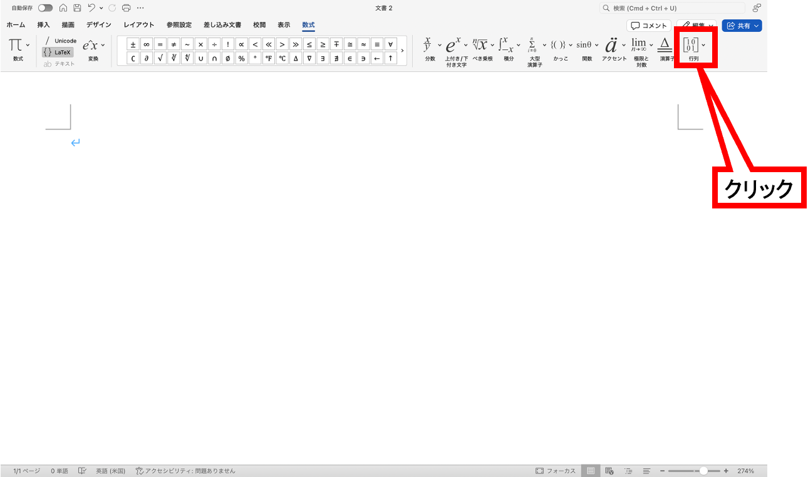

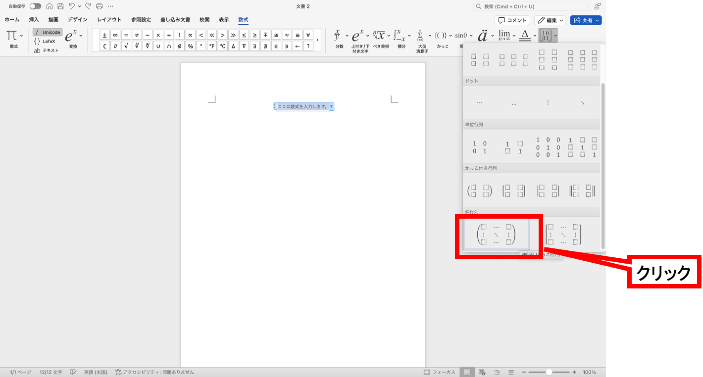

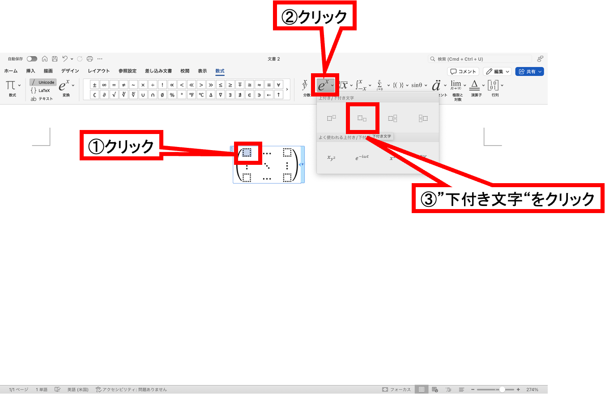

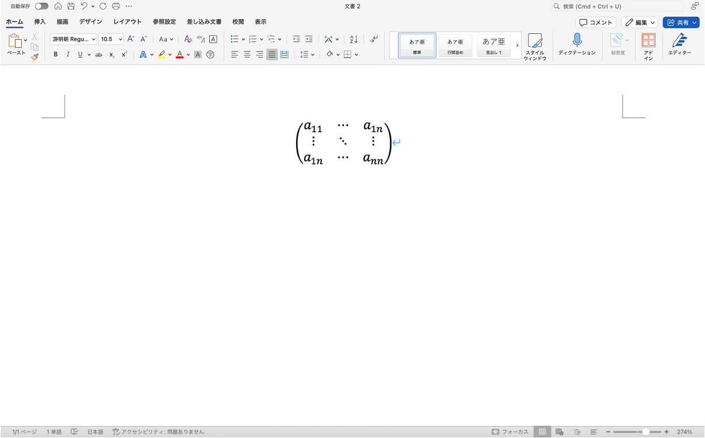

例：微分積分の入力

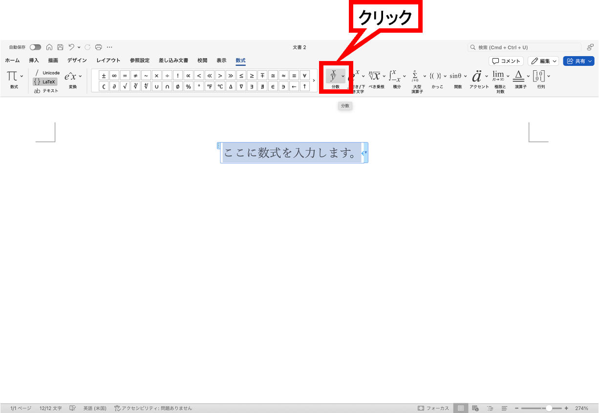

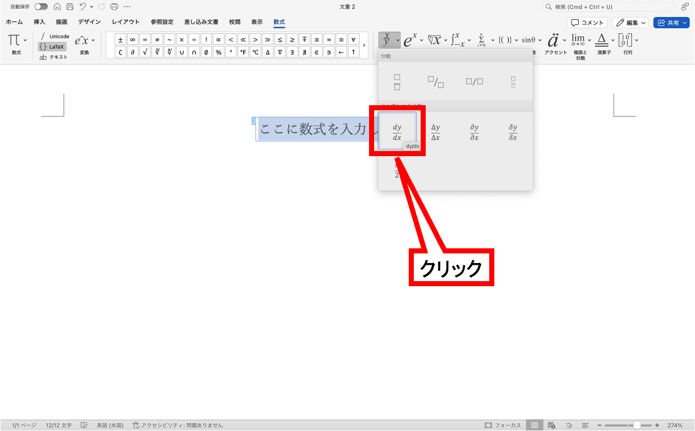

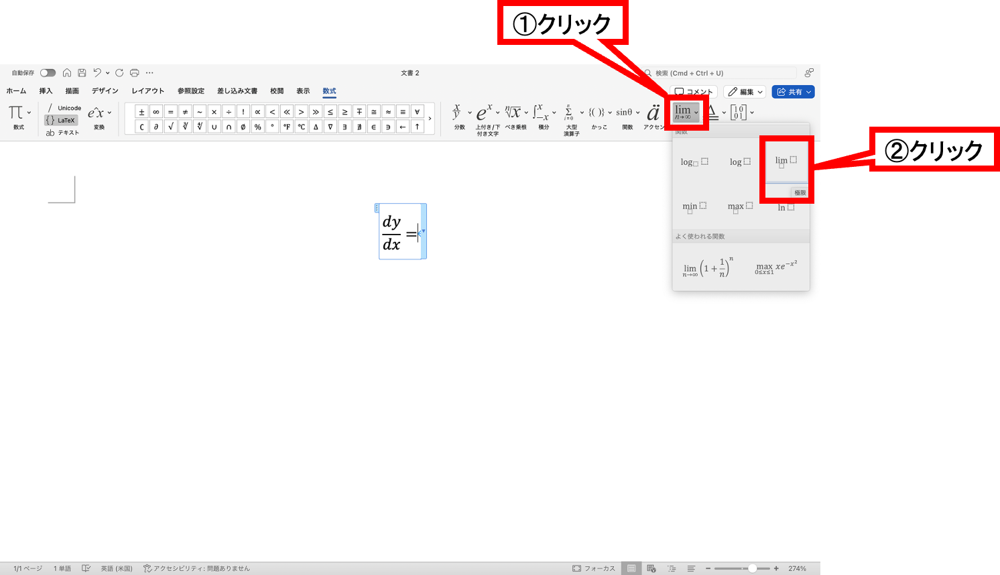

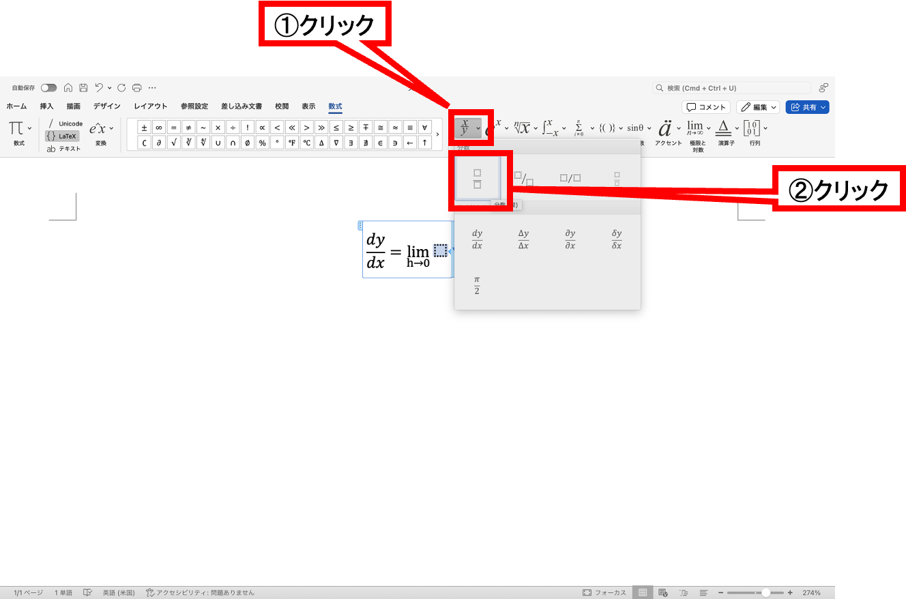

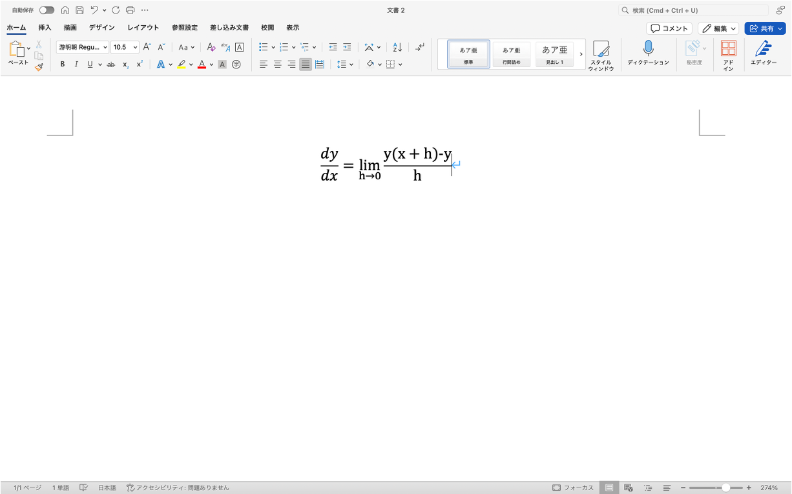

**(3) LaTeX記法で入力する方法**

「数式タブ＞ {} LaTeX」を選択

- 分数：`\frac{a}{b+c}` → $\frac{a}{b+c}$
- べき乗：`x^2` → $x^2$
- 添字：`a_i` → $a_i$
- 平方根：`\sqrt{x}` → $\sqrt{x}$
- 総和：`\sum_{i=1}^n i` → $\sum_{i=1}^n i$
- 積分：`\int_0^1 f(x) dx` → $\int_0^1 f(x)dx$

```{warning} 発展

より詳しく知りたい場合は次のページが参考になる．

https://support.microsoft.com/ja-jp/office/word-%E3%81%A7-unicodemath-%E3%81%8A%E3%82%88%E3%81%B3-latex-%E3%82%92%E4%BD%BF%E7%94%A8%E3%81%97%E3%81%A6%E8%A1%8C%E5%BD%A2%E5%BC%8F%E3%81%AE%E6%95%B0%E5%BC%8F%E3%82%92%E5%85%A5%E5%8A%9B%E3%81%99%E3%82%8B-2e00618d-b1fd-49d8-8cb4-8d17f25754f8
```

### 数式の配置

- 文中に入れる
    - 例
        
        関数 $f(x)$ を考える．
        
- 独立行として入れる
    - 例
        
        次を満たすとする．
        
        $$
        x = \frac{a+b}{2}
        $$
        

数式を独立行にするか文中にするかは，読みやすさや本文における数式の重要度で決める．後で参照したりする重要な数式は独立行にする．

### 数式の注意点

- 数式フォントと本文フォントの混在に注意する
- 記号の意味を本文で説明する
- 変数の定義を書かずに式だけ並べてはいけない

```{note} 演習1

ファイル名を“第5回_<学籍番号>_<氏名>.docx”としたWordファイルを作成し，1ページ目（表紙の次のページ）に次の文書を再現せよ．

ただし，表紙を忘れないようにすること．

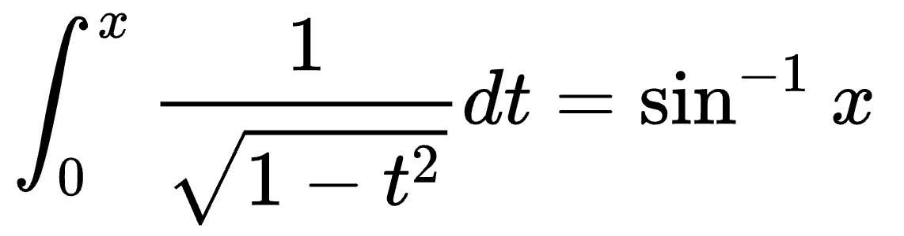
```


---

## ＜タイピング練習＞

- 20分間のタイピング練習

練習サイト

- 寿司打（スシダ）[https://sushida.net/](https://sushida.net/)
- e-typing [https://www.e-typing.ne.jp](https://www.e-typing.ne.jp/)/

---

## 課題

```{note} 課題

Wordファイル“第5回_<学籍番号>_<氏名>.docx”の2ページ目以降で次の課題に取り組むこと．

- 微分積分Iの教科書，藤岡敦「手を動かしてまなぶ 微分積分」の 46・47・48ページをWordで複写せよ．

ただし次の条件を守ること．

- 文字は游ゴシックとする
- 文字の大きさは任意とする
- 図も描く
- 英数字は半角で入力する

注意事項

- 用語，記号に注意すること
- 句読点は“. ”と “，”が使われていることに注意すること
```

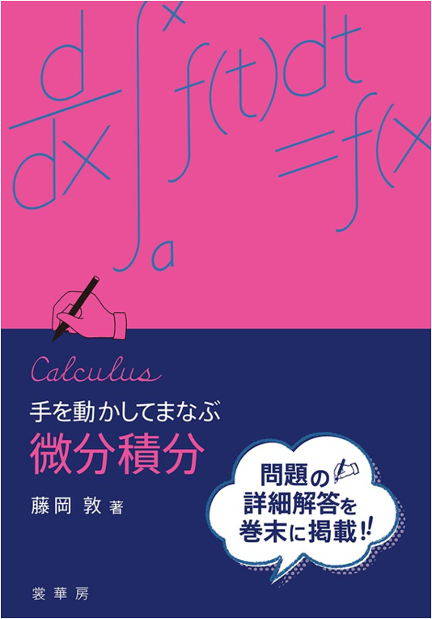

### 作成例

教科書

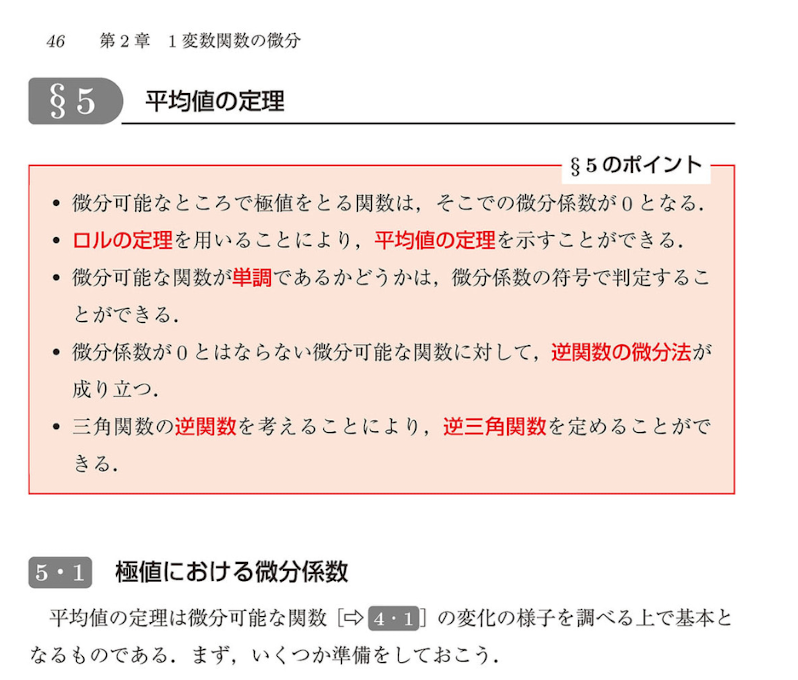

Word

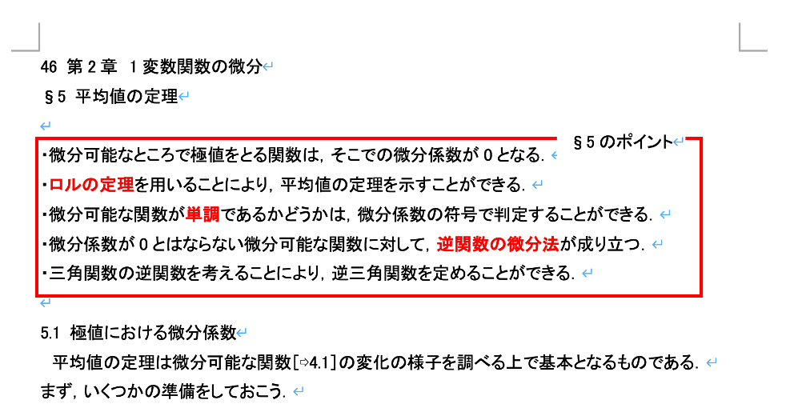

### 提出方法

- WebClassの「第5回課題」よりファイルを提出

### 提出期限

本日5月18日(月)23:59まで

質問等がある場合には

- メール kkagawa@josai.ac.jp
- Teamsのチャット

で連絡してください．

<!-- ## 次回の準備 -->
