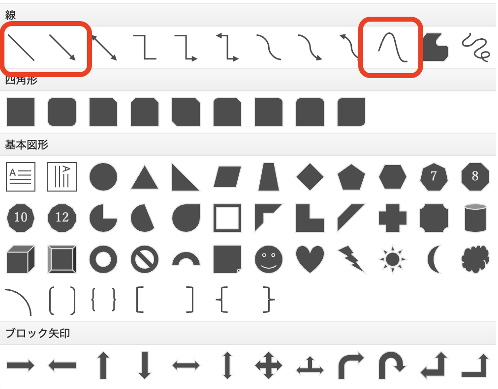
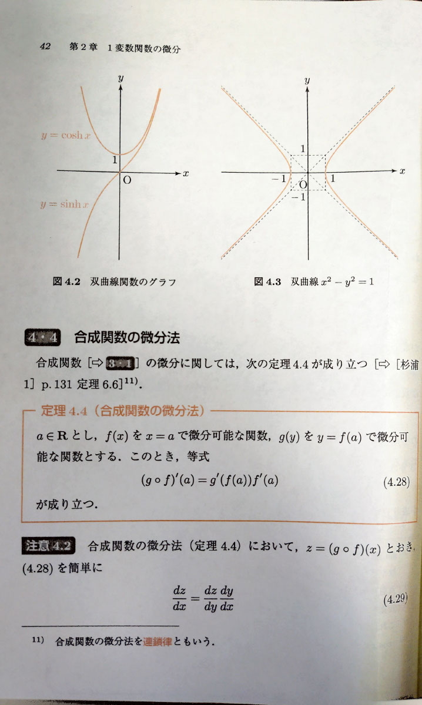
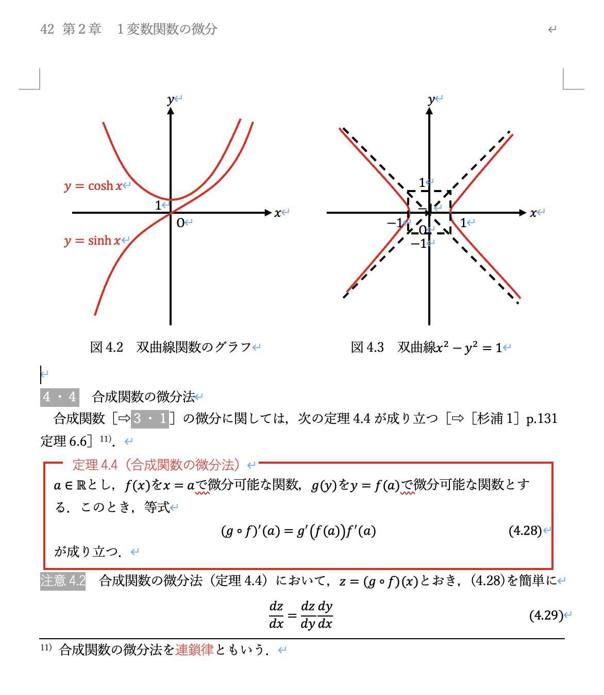

# 第5回　Wordによる文書作成3

### 前回の復習

- 課題レポートの表紙作成
- 生成AIによる文章校正
- Wordによる図形の作成

### 概要

- 微分積分Iの教科書を参考に数式や図形を含む文書を作成する

### 到達目標

1. Wordによる数式の書き方を習得する
2. 数式や図形を含む文書を作成できるようになる

### タイピング（20分）

- 指はホームポジションに置き，ここから各指で所望のキーをタイプする．


出典：[https://upload.wikimedia.org/wikipedia/commons/6/67/TouchTyping_HomePosition_QWERTY.png](https://upload.wikimedia.org/wikipedia/commons/6/67/TouchTyping_HomePosition_QWERTY.png)

```{warning} タッチタイピング
**タッチタイピング**：キーを見ずに行うタイピング

指の配置をホームポジションに固定することで，キーを見ずにタイピングできるようになる．
キーを見ずに打てることで入力画面を見ながらタイピングできるため次のメリットが得られる．
- 入力が速くなる
- 打ち間違いに気づきやすい
- 思考の流れが止まりにくい
- 疲れにくい

タッチタイピングをマスターする上ではキーの配置を覚える必要がある．
キー配置を覚えるには [e-typing](https://www.e-typing.ne.jp/) がおすすめ．
```

```{note} タイピング練習
次のサイトなどでタイピング練習をすること（各自好きな方法で練習して良い）．

- 寿司打（スシダ）[https://sushida.net/](https://sushida.net/)
- e-typing [https://www.e-typing.ne.jp/](https://www.e-typing.ne.jp/)
```

---

## 数式の入力開始

Wordでは数式の入力もできる．
レポートやスライドで数式を扱うために最低限の入力方法を身につける．

次のいずれかの方法で数式の入力を開始できる．

- 挿入タブ＞数式  
ウィンドウ幅が足りない場合は「記号と特殊文字」の中に「数式」がある．
- ショートカット：「^+=」（control+=）

数式は本文の文字とは別の「数式オブジェクト」として扱われる．

## 入力方法

数式を打ち込む方式には次の3種類がある．

1. UnicodeMathで入力する方法（簡単な数式）
2. LaTeX記法で入力する方法
3. 数式タブから記号を選択して挿入する方法

※ UnicodeMath：テキスト入力で数式を作成できる入力方式  
※ LaTeX（読み：らてふ）：数式を含めた組版プログラミング言語（文章を綺麗に書くための言語）．第11〜13回で扱う．

### UnicodeMathで入力する方法（簡単な数式を入力する際に手軽で便利）

- 分数： `a/(b+c)`+スペース → $\frac{a}{b+c}$
- べき乗：`x^2`+スペース → $x^2$
- 添字：`a_i`+スペース → $a_i$
- 平方根：`\sqrt(x)`+スペース → $\sqrt{x}$
- 総和：`\sum_(i=1)^n`+スペース+`i` → $\sum_{i=1}^n i$
- 積分：`\int_0^1`+スペース+`f(x)dx` → $\int_0^1 f(x)dx$

### 数式タブから記号を選択して挿入する方法

例）行列を入力する


例）微分積分の入力


### LaTeX記法で入力する方法

数式タブ＞{} LaTeX

- 分数：`\frac{a}{b+c}` → $\frac{a}{b+c}$
- べき乗：`x^2` → $x^2$
- 添字：`a_i` → $a_i$
- 平方根：`\sqrt{x}` → $\sqrt{x}$
- 総和：`\sum_{i=1}^n i` → $\sum_{i=1}^n i$
- 積分：`\int_0^1 f(x) dx` → $\int_0^1 f(x)dx$

```{tip} 補足

より詳しく知りたい場合は次のMicrosoftのページが参考になる．

https://support.microsoft.com/ja-jp/office/word-%E3%81%A7-unicodemath-%E3%81%8A%E3%82%88%E3%81%B3-latex-%E3%82%92%E4%BD%BF%E7%94%A8%E3%81%97%E3%81%A6%E8%A1%8C%E5%BD%A2%E5%BC%8F%E3%81%AE%E6%95%B0%E5%BC%8F%E3%82%92%E5%85%A5%E5%8A%9B%E3%81%99%E3%82%8B-2e00618d-b1fd-49d8-8cb4-8d17f25754f8
```

---

## 数式の配置

- 文中に入れる  
    ```{tip} 例
    関数 $f(x)$ を考える．
    ```

- 独立行として入れる  
    ```{tip} 例
    次を満たすとする．
    $$
    x = \frac{a+b}{2}
    $$
    ```

数式を独立行にするか文中にするかは，読みやすさや本文における数式の重要度で決める．
後で参照したりする重要な数式は独立行にする．

### 数式番号の入れ方

`<数式>#(<数式番号>)`+Enterで<数式>が中央揃えに，<数式番号>が右寄せになる．

### 数式の注意点

- 数式フォントと本文フォントの混在に注意する
- 記号が初出であれば，その意味を本文で説明する
- 変数の定義を書かずに式だけ並べてはいけない

```{note} 演習1

ファイル名を“第5回_<学籍番号>_<氏名>.docx”としたWordファイルを作成し，1ページ目（表紙の次のページ）に次の数式を再現せよ．  
ただし，**表紙を忘れずにつけること**．


```

---

## ヘッダとフッタ

- **ヘッダ**：文書の各ページの上部に表示される領域．文書のタイトル・章や節の名前・作成日・作成者・ページ番号などを記載する．
- **フッタ**：文書の各ページの下部に表示される領域．ページ番号・作成日・著作権表示・注意書きなどを記載する．

入力方法
- 挿入タブ＞ヘッダー
- 挿入タブ＞フッター

### ヘッダの設定

- 奇数／偶数ページ別指定：奇数ページは仕分けが可能
- ヘッダーとフッタータブ＞ページ番号：ページ番号を入れる
- ヘッダーとフッタータブ＞ページ番号＞書式設定：ページ番号の開始番号を指定できる

---

## 直線・矢印・曲線の描画



挿入タブ＞図形＞線

- ⇧（シフト）を押しながらドラッグすると水平・垂直な直線になる．
- 図形の書式設定＞書式ウィンドウ＞バケツマーク＞線＞実線／点線：線の種類を変更する

挿入タブ＞図形＞矢印

- ⇧（シフト）を押しながらドラッグすると水平・垂直な矢印になる．

挿入タブ＞図形＞曲線

- 変曲点や極点のところでクリックすることで細かい曲線を描画することができる．
- 終点をクリックしたらescで終了する．

### 文中に図形を挿入する

描画した図形を選択＞図形の書式設定タブ＞整列＞文字列の折り返し＞四角

これで文章を避けるように図形を挿入できる．

---

## 課題

```{warning} 課題

Wordファイル“第5回_<学籍番号>_<氏名>.docx”の2ページ目以降で次の課題に取り組むこと．

- 微分積分Iの教科書である藤岡敦「手を動かしてまなぶ 微分積分」の 41ページ4.3節から43ページまでをWordで複写せよ．

ただし次の条件を守ること．

- 文字は游明朝と游ゴシックとする
- 文字の大きさは任意とする
- 図も描く

注意事項

- 用語，記号に注意すること
- 句読点は“. ”と “，”が使われていることに注意すること
```


### 作成例

教科書

<!--  -->


Word

<!--  -->


### 提出方法

- WebClassの「第5回課題」よりファイル“第5回_<学籍番号>_<氏名>.docx”を提出

### 提出期限

<span style="color: red; ">5月24日(日)23:59まで</span>

質問等がある場合には

- メール kkagawa@josai.ac.jp
- Teamsのチャット

で連絡してください．

## 次回の準備

- 次回は文章作成術を扱う．
- 今回作成したWordファイルを見直し，数式や図を含む文書で読みにくかった点を確認しておくこと．
- Mac bookを充電・持参すること
