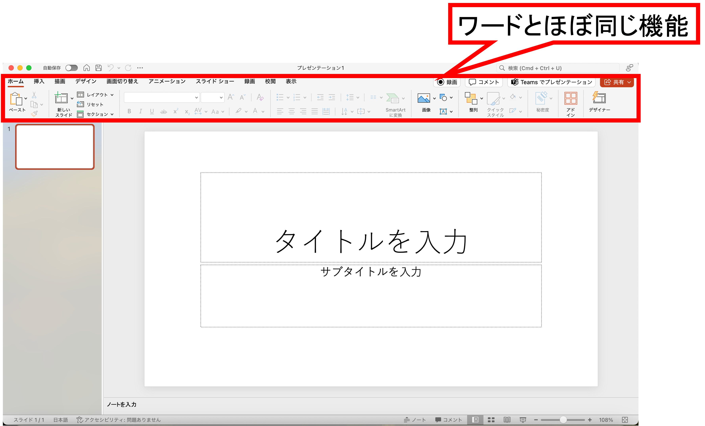
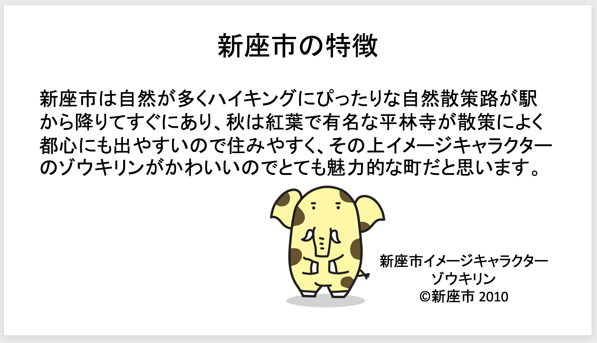
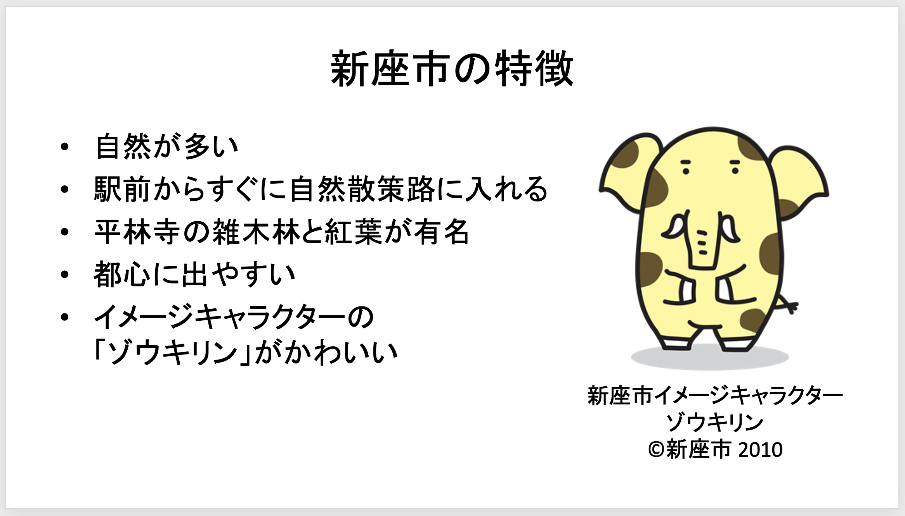
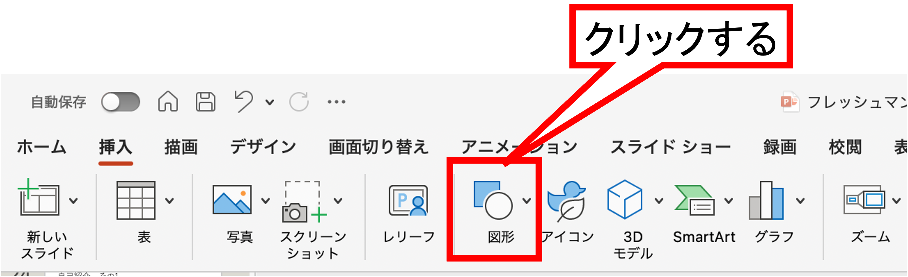
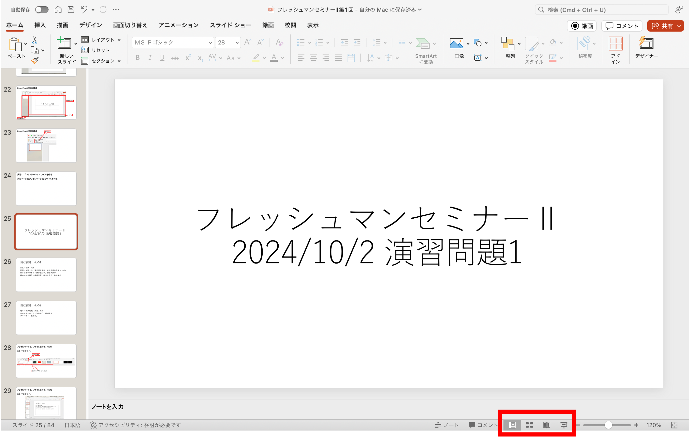
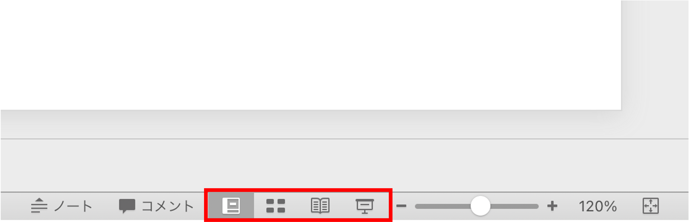
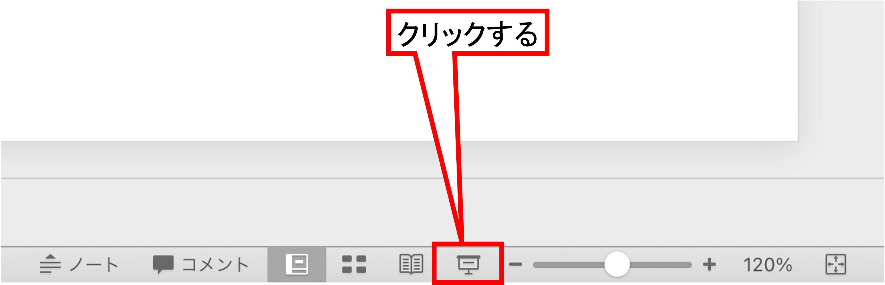
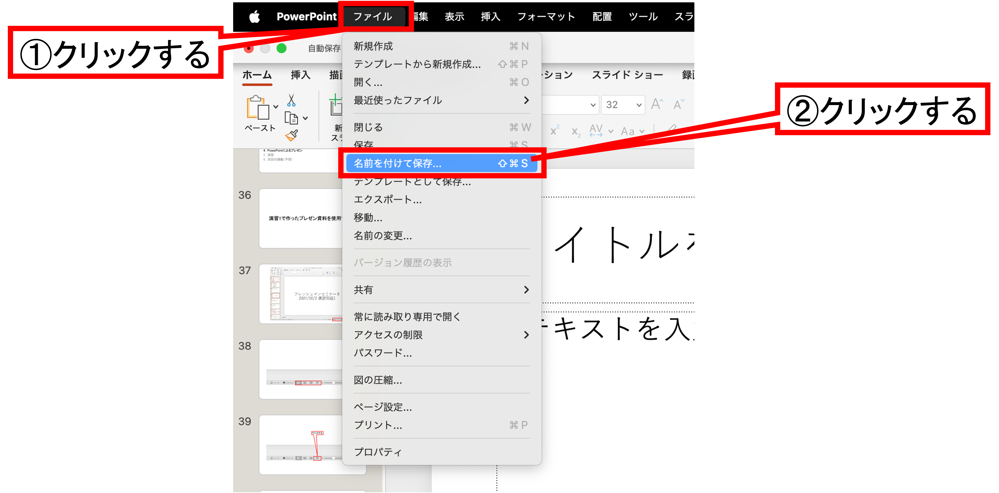
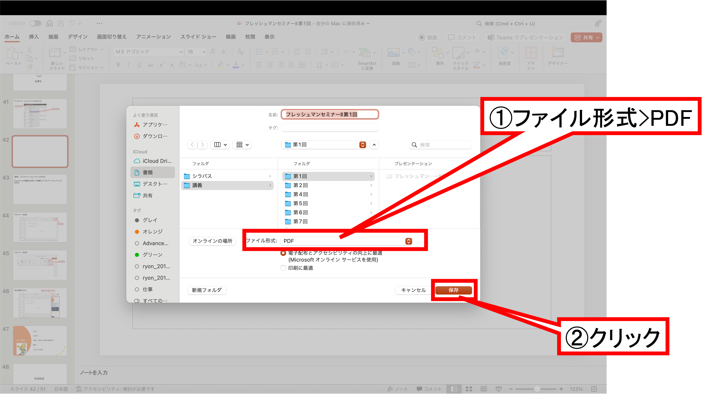

# 第7回　PowerPointによるプレゼン資料作成

### 前回の復習

- Excelの基本操作は「データ解析基礎」で既習のものとして，Excelを数学の計算に利用した．
- セル参照を用いることで，入力値を変更したときに計算結果が自動で更新されることを確認した．
- 2次方程式を解くワークシートを作成し，数式をExcel上で表現した．
- 行列，ベクトル，連立1次方程式をExcelの表として表現した．
- `MDETERM`，`MINVERSE`，`MMULT` 関数を用いて，行列式，逆行列，行列の積を計算した．
- 求めた解を元の方程式に代入し，検算によって計算結果を確認する必要があることを学んだ．

### 概要

- PowerPointとは
- PowerPointの起動
- スライドの基本構成
- 文字，画像，図形の挿入
- 見やすいスライドの作り方
- 発表原稿とスライドの違い
- 出身地を紹介するスライドの作成

### 到達目標

1. PowerPointで新しいプレゼンテーションを作成し，保存できる．
2. タイトルスライド，本文スライド，まとめスライドを作成できる．
3. 文字，画像，図形を用いて，見やすい発表資料を作成できる．
4. 自分の出身地について，聞き手に伝わるスライドを作成できる．

### タイピング（20分）

- 指はホームポジションに置き，ここから各指で所望のキーをタイプする．


出典：[https://upload.wikimedia.org/wikipedia/commons/6/67/TouchTyping_HomePosition_QWERTY.png](https://upload.wikimedia.org/wikipedia/commons/6/67/TouchTyping_HomePosition_QWERTY.png)

```{note} タイピング練習
次のサイトなどでタイピング練習をすること（各自好きな方法で練習して良い）．

- 寿司打（スシダ）[https://sushida.net/](https://sushida.net/)
- e-typing [https://www.e-typing.ne.jp/](https://www.e-typing.ne.jp/)
```

---

## PowerPoint

PowerPoint：Microsoft社のプレゼンテーション資料作成ソフト

発表用のスライド，授業の説明資料，ポスターなどを作成できる．

### WordやExcelとの違い

- Word：章を中心とした文書作成に向いている
- Excel：表計算やデータ整理に向いている
- PowerPoint：発表時に見せる資料を作成するために使う．

| ソフト | 主な目的 |
| --- | --- |
| Word | レポート，文書，文章の作成 |
| Excel | 表計算，データ整理，計算結果の確認 |
| PowerPoint | 発表スライド，説明資料の作成 |

発表では，スライドにすべての文章を書くのではなく**重要な内容を短く示し**，詳しい説明は発表者が口頭で補う．

## 起動

1. Cmd+SpaceでSpotlight検索を起動する
2. 「PowerPoint」を検索する
3. 「Microsoft PowerPoint」を起動する
4. 「新しいプレゼンテーション」を選択する
5. ファイル名を付けて保存する

```{note} 演習1
次の手順で新しいPowerPointファイルを作成せよ．

1. PowerPointを起動する．
2. 新しいプレゼンテーションを作成する．
3. ファイル名を“第7回_<学籍番号>_<氏名>.pptx”として保存する．
```



---

## スライドの基本構成

短い発表では，次の構成を基本とする．

1. タイトル
2. 目的
3. 本文
4. まとめ
5. 参考文献

### タイトルスライド

タイトルスライドには発表内容を特定する情報を書く．

※ Wordの表紙と同じ役割

- 何のスライドかを特定するための情報（What）
    - スライドタイトル
    - 講義名
- 誰が書いたかを特定するための情報（Who）
    - 所属（学科）・学籍番号
    - 氏名
- 発表日（When）

### 目的スライド

発表やスライドの目的を示すスライドでは，何について説明するのかを短く書く．
理解してもらいたいことがあれば，何を理解してもらいたいかを示すとより明確になる．

例1：
```text
私の出身地である〇〇村について紹介する．
特に，場所・特徴・おすすめしたいものの3点に注目する．
```

例2：
```text
私の出身地である〇〇村について紹介する．
名産の人参とそれにまつわる歴史について知り，村に興味を持ってほしい．
```

### 本文スライド

- 主張，根拠，具体例を分けて示す．
- 1枚のスライドに入れる情報を増やしすぎないようにする．

### まとめスライド

- スライド全体の要点を整理する．
- 本文で説明した内容を短くまとめる．
- ここでは新しい内容を急に追加しない．

---

## 文字を入れる

PowerPointでは，テキストボックスに文字を入力する．
文字は読みやすさを優先して設定する．

### 文字の大きさ

スライドの文字はWordの本文よりも大きくする．
スライドは教室や会議室などのスクリーンやモニターに表示して大勢の人に見てもらうことが多く，画面から十分遠く離れた人にも見える必要があるためである．

目安

- タイトル：32ポイント以上
- 見出し：24ポイント以上
- 本文：18ポイント以上

### 文字量

スライドには長い文章をそのまま貼り付けず，要点を短い箇条書きにする．

悪い例：

<!-- ```text
私の出身地は自然が多くて食べ物もおいしくて観光地もあって住みやすい場所で，駅の近くには店も多く，休日には多くの人が訪れるので，とても魅力的な地域だと思います．
``` -->

改善例：

<!-- ```text
私の出身地の特徴

- 自然が多い
- 地元の食べ物が有名
- 駅周辺に店が集まっている
- 休日に訪れる人が多い
``` -->

```{note} 演習2
自分の出身地を紹介するために，次の3枚のスライドを作成せよ．

1. タイトルスライド
2. 目的
3. 出身地の特徴

本文スライドでは文章を書くのではなく，要点を箇条書きにすること．
```

---

## 図形と画像

スライドでは，文字だけでなく図形や画像を使うと内容を説明しやすくなる．

### 図形の挿入

- 挿入タブ＞図形

四角形，矢印，線などを使うと，関係や流れを示しやすい．



### 図形作成のコツ

- 要素を増やしすぎない
- 矢印の向きをそろえる
- 色を使いすぎない
- 図形内の文字は短くする
- 位置をそろえる

### 画像の挿入

- 挿入タブ＞写真＞図をファイルから挿入
- 画像を選択して挿入する

画像を使う場合は，著作権や出典に注意する．  
自分で撮影した画像であっても，他人の顔や個人情報が写っている場合は扱いに注意する．

---

## 見やすいスライドの作り方

見やすいスライドでは，読み手が短時間で要点を理解できる．

### 1枚1メッセージ

1枚のスライドには，中心となるメッセージを1つにする．
複数の話題を詰め込むと，発表を聞く人は何に注目すればよいか分からなくなる．

### 余白を作る

スライドいっぱいに文字や図を配置すると，読みにくくなる．
余白を作ることで，重要な情報が見えやすくなる．

### 色を使いすぎない

色は強調したい部分に使う．
多くの色を使いすぎると，かえって見にくくなる．

基本的には，次の程度にするとよい．

- 背景色
- 文字色
- 強調色

### 配置をそろえる

- 図形の書式設定タブ＞整列

文字や図形の位置がそろっているとスライド全体が見やすくなる．
PowerPointの整列機能を使うと，位置をきれいにそろえられる．

---

## スライドを表示する

スクリーンやモニターでスライドを表示する場合は**スライドショーモード**にする．







スライドショーモードを終了する場合は`esc`キー（キーボード左上）を押す．

---

## スライドのPDF化

PowerPointとして作成したスライドを共有する際に，PDF化をすることがある．

PowerPointファイル（`.pptx`）は編集しやすい形式であるが，PDFファイル（`.pdf`）は作成したスライドを相手に見せたり提出したりするために適した形式である．

PDF化には次の目的がある．

- **表示の崩れを防ぐ**  
  使用しているフォントやPowerPointのバージョンが相手と異なっても，PDFでは見た目が崩れにくい．
- **意図しない編集を防ぐ**  
  PDFは閲覧用の形式であるため，PowerPointファイルよりも内容を誤って変更されにくい．
- **PowerPointがない環境でも見られる**  
  PDFは多くのPC，スマートフォン，タブレットで表示できる．
- **印刷しやすい**  
  スライドを資料として配布したり印刷したりする場合，PDFの方が扱いやすいことが多い．
- **提出物として確認しやすい**  
  教員が内容を確認する際，PDFであればスライドの見た目をそのまま確認しやすい．

ただし，PDF化した後はスライドの編集がしにくくなる．
そのため，作業中はPowerPointファイル（`.pptx`）を保存し，提出や共有が必要な場合にPDFを書き出すとよい．

### PDF化の手順





```{note} 演習3
作成中のPowerPointファイルをPDFとして書き出せ．

PDFを開き，次の点を確認すること．

- 文字が途中で切れていないか
- 画像や図形の位置がずれていないか
- すべてのスライドが出力されているか
- 参考文献や出典が読める大きさになっているか
```

---

## 課題

```{warning} 課題
PowerPointファイル`第7回_<学籍番号>_<氏名>.pptx`を編集し，次のいずれかのテーマで5枚以上のスライドを作成し，完成したPowerPointファイルをPDF化をせよ．  
その上で，作成したPowerPointファイル`第7回_<学籍番号>_<氏名>.pptx`を<span style="color:red">WebClassの「第7回課題」問1</span>に，PDFファイル`第7回_<学籍番号>_<氏名>.pdf`を<span style="color:red">WebClassの「第7回課題」問2</span>に提出せよ．

テーマ
- **私の出身地紹介**
- **私が好きな町紹介**

ただし次の条件を守ること．

- 全体の構成について
    - 1枚目にタイトルスライドを作成すること
    - 目的を示すスライドを入れること
    - 紹介する町の場所や特徴を説明する本文スライドを2枚以上入れること
    - まとめスライドを入れること
- 書き方について
    - 文字は読みやすい大きさにすること
    - 地図，写真，図形のいずれかを1つ以上使うこと
    - 文章をそのまま貼り付けず，要点を箇条書きにすること
    - 画像や図形を1つ以上使うこと
    - Webページや画像を参考にした場合は，該当の箇所と最後のスライドに参考文献または出典を書くこと（第2回「的財産権・著作権」参照）
```

### 提出方法

- WebClassの「第7回課題」問1にPowerPointファイル`第7回_<学籍番号>_<氏名>.pptx`を提出
- WebClassの「第7回課題」問2にPDFファイル`第7回_<学籍番号>_<氏名>.pdf`を提出

### 提出期限

<span style="color: red; ">6月5日(金)23:59まで</span>

質問等がある場合には

- メール kkagawa@josai.ac.jp
- Teamsのチャット

で連絡してください．

## 次回の準備

- 次回は文章作成術を扱う．
- Mac bookを充電・持参すること
