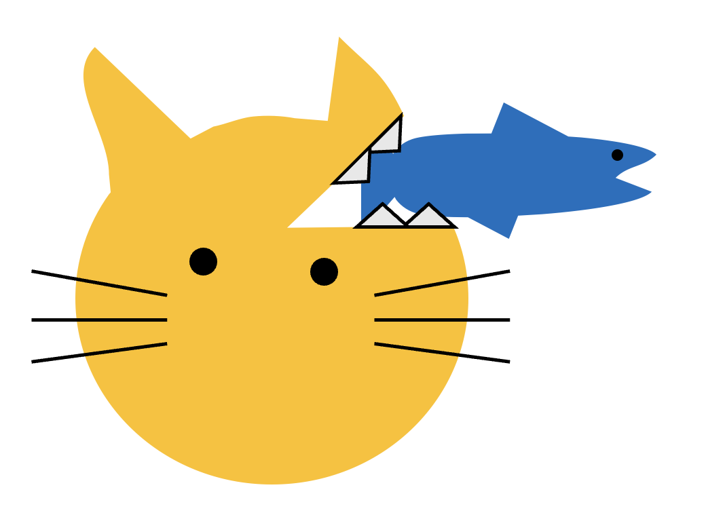

# 第8回　文章作成術

### 前回の復習

- PowerPointで新しいプレゼンテーションを作成し，保存する方法を学んだ．
- タイトルスライド，発表の目的，本文スライド，まとめスライドという基本構成を確認した．
- スライドでは長い文章をそのまま貼り付けず，要点を短い箇条書きで示すことを学んだ．
- 自分の出身地について，場所，特徴，おすすめを整理して紹介するスライドを作成した．
- 画像や図形を使う場合は，著作権や出典，個人情報の扱いに注意する必要があることを学んだ．

### 概要

- 文書は見た目が整っているだけでは十分ではない．
- レポートや説明文，生成AIに投げかける文章は，読み手に意図が正確に伝わることが重要である．
- 意図を正確に伝えるための文章作成術を学ぶ．

### 到達目標

- 意図を正確に伝えられる文章を書くための基本を理解する．
- 一文，段落，文章全体の役割を区別できる．
- 曖昧な文章を読みやすい文章に修正できる．
<!-- - 生成AIを文章作成の補助として適切に利用できる． -->

### タイピング（20分）

- 指はホームポジションに置き，ここから各指で所望のキーをタイプする．


出典：[https://upload.wikimedia.org/wikipedia/commons/6/67/TouchTyping_HomePosition_QWERTY.png](https://upload.wikimedia.org/wikipedia/commons/6/67/TouchTyping_HomePosition_QWERTY.png)

```{note} タイピング練習
次のサイトなどでタイピング練習をすること（各自好きな方法で練習して良い）．

- 寿司打（スシダ）[https://sushida.net/](https://sushida.net/)
- e-typing [https://www.e-typing.ne.jp/](https://www.e-typing.ne.jp/)
```

### 文章作成課題の準備

```{note} 演習0
ファイル名を“第8回_<学籍番号>_<氏名>.docx”としたWordファイルを作成し，表紙を作成せよ．
```

---

## 文章作成の目的

**文章を書く目的**


- 自分の考えを説明する
- 調べた内容を整理して報告する
- 学習や思考の過程を記録する

**日常生活のコミュニケーション**


日常会話では，表情，声の調子，相手の反応によって意味を補えるが，文章では書かれた言葉だけで意味を伝えなければならない．  
そのため文章を作成する際には，**曖昧さを減らし読み手が迷わないように構成する必要**がある．

### 良い文章（小説や詩文を除く）

**良い文章**：読み手が内容を正確に理解できる文章（難しい言葉を多く使った文章ではない！）

ポイント

- 誰が何をしたのかが明確
- 一文が長すぎない
- **主語と述語**が対応している
- **修飾語と被修飾語**の対応が明確
- 指示語が何を指すか分かる
- 段落ごとに話題がまとまっている
- 主張（何を言っているか）が明確

---

## 一文を短く書く

一文の中に多くの情報を詰め込むと主語と述語の関係が見えにくくなり，読み手が途中で迷いやすくなる．

**悪い例**

> 私は大学に入学してから新しい環境に慣れるために
> 授業や課題に取り組みながら友人関係も作らなければならず
> さらに将来の進路についても考える必要があるので
> 高校までとは違う大変さを感じている。

内容自体は自然であるが，1つの文に多くの内容が入っているため読み手に負担がかかる．

**改善例**

> 私は大学に入学してから、新しい環境に慣れる必要がある。
> 授業や課題に取り組むだけでなく，友人関係も作らなければならない。
> さらに、将来の進路について考える必要もある。
> そのため、高校までとは違う大変さを感じている。

文を分けることで，情報の流れが整理される．  
一文には入れる内容は，できるだけ1つの中心的な内容に絞るとよい．

````{note} 演習1
次の文を，読みやすいように2文以上に分けて書き直せ．  
なお，解答は“第8回_<学籍番号>_<氏名>.docx”に追記せよ．

> 私は大学で学ぶ内容を通して自分の得意なことや関心のある分野を見つけ将来の目標を少しずつ明確にしたいと考えているので授業だけでなく自主学習や大学生活での経験も大切にしたい。
````

---

## 主語と述語を対応させる

主語と述語がずれると文の意味が不自然になる．

**悪い例**

> 私の大学生活の目標は、授業に積極的に参加して、課題を期限内に提出します。

- 主：目標は
- 述：提出します

この文では，「目標は」に対応する述語が「提出します」になっており，不自然である．

**改善例1**

> 私の大学生活の目標は、授業に積極的に参加し、課題を期限内に提出することである。

- 主：目標は
- 述：提出することである

**改善例2**

> 私は授業に積極的に参加し、課題を期限内に提出することを大学生活の目標にしている。

- 主：私は
- 述：目標にしている

文を短くして骨組みだけを取り出し，主述が自然につながるかを確認する．

````{note} 演習2
次の文の主語と述語の対応を確認して不自然な点を直せ．  
なお，解答は“第8回_<学籍番号>_<氏名>.docx”に追記せよ．

> 私がこの授業で身につけたいことは、Wordを使って読みやすいレポートを書けるようになります．
````

---

## 修飾する言葉とされる言葉

人の頭にあるイメージは様々な要素が絡み合ったものである．  
これを文章に起こそうとすれば直線的な文字の羅列となるため，あるものに付随する特徴は次々と修飾する形で説明することとなる．

そこで次の点に注意する必要がある．
- 修飾・被修飾関係の距離（離れすぎないようにする）
- 否定の言葉を修飾する場合の意味のズレ

### 修飾の順序

例）「小さな子供のプール」には2つの解釈があり得る．

```text
小さな
└──子供の
    └──プール
```


```text
小さな
│ 子供の
└──└──プール
```


この誤読を防ぐ手段として**修飾語の順序を変える**ことが挙げられる．  
ここでは「子供の小さなプール」とすれば確実に後者として解釈される．

```text
子供の
│ 小さな
└──└──プール
```


「小さな」は「子供」と「プール」のどちらも修飾できるが，「子供の」は「小さな」を修飾できないことに注意する．

```{tip} 前者の意味にしたい場合
説明する言葉を増やしてみると良い．  
例えば「体の小さな子供のプール」とすれば，「体の小さな」は「プール」を修飾することがないので，「子供」を修飾していると理解してもらえる．
```

### 順序の目安

修飾語が複数ある場合，思いついた順に並べると読み手が誤解することがある．
特に，長い説明と短い説明が混ざる場合には，**どの言葉がどの言葉を修飾しているのか分かりにくくなる**．

そのため，修飾語を並べるときは，**節**と**句**の違いを意識するとよい．
ただし，「節」と「句」は文法体系によって説明の仕方が少し異なることがある．
ここでは，文章を読みやすくするための実用的な区別として説明する．

- **節**：文の一部で，主語・述語の関係を含むまとまり．
  - 主語・述語の関係：「誰が・何が，どうした／どのようだ／何だ」という関係
  - 日本語では主語が省略されることがあるため，主語が明示されていなくても**述語を中心にもつまとまりを節として考える**．

例）「私が昨日図書館で借りた本」  
「私が」が主語，「借りた」が述語であるため，「私が昨日図書館で借りた」が**節**である．

例）「昨日図書館で借りた本」  
ここでは主語が書かれていないが，「借りた」という述語がある．
「誰が借りたのか」は文脈から補うことができるため，「昨日図書館で借りた」も**節**として考えられる．

※ 「昨日図書館で借りた本」全体は名詞として働く大きなまとまりなので，文法体系によっては名詞句として説明されることもある．
本講義では修飾語の順序を考えるために内部に述語「借りた」をもつ修飾部分を節として扱う．

- **句**：文の一部として一つの働きをする語のまとまり．
  - 複数の語がまとまって一つの働きをするが，節のように主語・述語の関係を含まない
  - ここでは，述語を中心にもたない短い修飾表現を句として扱う

例）数学の本  
例）駅の近くの店  
例）大学の図書館の本

「数学の」「駅の近くの」「大学の図書館の」は名詞を修飾しているが，述語を中心にもつまとまりではないため，ここでは**句**として扱う．

より短い修飾語の場合は，次のように一語だけで修飾語になることもある．

例）厚い本  
例）赤い本  
例）新しい教科書

この場合の「厚い」「赤い」「新しい」は一語の修飾語であり，厳密には「語」と呼べる．
ただし，修飾語の順序を考える場面では，短い修飾表現として**句**と同じように扱ってよい．

節は述語を中心にもつため情報量が多くなりやすいため，後ろに置くと文の構造が分かりにくくなることがある．
したがって，<span style="color:red">節を先に</span>置き，<span style="color:red">短い句を後に</span>置くと読みやすくなる場合が多い．

```{tip} 修飾語の順番
以上の議論を踏まえ，以下の順に修飾語の順番を検討する．

1. 節を先にし，句を後にする
2. 長い修飾語は前に，短い修飾語は後にする
3. 大状況から小状況へ，重大なものから重大でないものへ
4. 親和度（なじみ）の強弱による配置転換
```

### 例

次の3つの要素を一つにまとめることを考える．

- 厚い本
- 私が昨日図書館で借りた本
- 数学の本

例：
- **厚い私が昨日図書館で借りた数学の本**  
  意味は分かるが，「厚い」と「私が昨日図書館で借りた」と「数学の」が混ざっており，少し読みにくい．

- **私が昨日図書館で借りた厚い数学の本**
  長い修飾語である「私が昨日図書館で借りた」を先に置き，短い修飾語である「厚い」「数学の」を後に置いている．
  読み手が「何が何を修飾しているのか」を迷わず理解できるような語順にすることが重要

````{note} 演習3
次の3つの要素を一つにまとめ，誤読されないようにせよ．

- 新しい教科書
- 私が大学で使う教科書
- 数学の教科書
````

<!-- 
---

## 指示語を明確にする

「これ」「それ」「このような」「そのため」などを指示語という．
指示語は便利だが，何を指しているかが分かりにくいと，文章が曖昧になる．

### 悪い例

```text
大学では課題が多く出される．これをしっかり行うことが大切である．
```

この文の「これ」は，課題の提出なのか，課題への取り組みなのか，課題管理なのかが曖昧である．

### 改善例

```text
大学では課題が多く出される．課題の内容を確認し，期限内に提出することが大切である．
```

指示語を使うときは，読み手が直前の文から自然に意味を取れるかを確認する．
曖昧な場合は，指示語ではなく具体的な名詞を書いた方がよい．
 -->

---

## 生成AIを用いた文章改善

生成AIは文章の推敲や校正の補助として利用できるが，**最終的な文章の責任は自分にある**．

生成AIを使う場合でも，最終的には自分で読み直し，<span style="color:red">自分の意図と合っているか</span>を確認する．  
生成AIに正確に意図を伝えることができなければ，生成AIの出力結果は自分の意図と合っていないものになってしまう．  
そのため，自分の意図を正確に伝える文章を書く技術は，今後の生成AIネイティブな時代において重要な技能となる．


### プロンプト例

**主語と述語を点検する**

> 次の文章について，主語と述語の対応が不自然な箇所を指摘してください．
> 修正案も示してください．ただし，文章の意味は変えないでください．

**段落構成を点検する**

> 次の文章について，段落ごとの話題が明確かを点検してください．
> 話題が混ざっている箇所があれば，どのように段落を分けるとよいか提案してください．

**主張と根拠を確認する**

> 次の文章について，主張，根拠，具体例が対応しているかを確認してください．
> 不足している情報があれば箇条書きで指摘してください．

---

## 課題

````{warning} 課題1
次の3つの特徴をもつ紙を一つの「紙」に修飾する形に一つにまとめよ．  
なお，解答は`第8回_<学籍番号>_<氏名>.docx`に追記し，Wordファイル`第8回_<学籍番号>_<氏名>.docx`を<span style="color:red">WebClassの「第8回課題」問1より提出</span>せよ．

- 白い紙
- 横線の引かれた紙
- 厚手の紙


````

````{warning} 課題2
PowerPointファイルを作成し，`第8回_<学籍番号>_<氏名>.pptx`として保存し，次の問に答えよ．  
「頭が青い魚を食べる猫」について解釈しうる全てのパターンについてイラストを描け．

ただし，意味の区切りを分かりやすくするために，かっこ「（）」を活用することを薦める．

例）頭が（青い魚を）食べる猫



最後にPowerPointファイル`第8回_<学籍番号>_<氏名>.pptx`を<span style="color:red">WebClassの「第8回課題」問2より提出</span>せよ．
````

<!-- 
解答例
1. 頭が（青い魚を）食べる猫
2. （頭が青い魚）を食べる猫
3. （頭が青い）（魚を食べる）猫
 -->

### 提出方法

- WebClassの「第8回課題」よりWordファイル`第8回_<学籍番号>_<氏名>.docx`とPowerPointファイル`第8回_<学籍番号>_<氏名>.pptx`を提出

### 提出期限

<span style="color: red; ">本日6月12日(金)23:59まで</span>

質問等がある場合には

- メール kkagawa@josai.ac.jp
- Teamsのチャット

で連絡してください．
（提出期限を過ぎてしまった場合はメール等で直接ファイルを送ってください）

---

## まとめ

- よい文章とは読み手が内容を正確に理解できる文章である．
- **1文には1つの中心的な内容**を書く．
- **主語と述語の対応**を確認することで，文のねじれを防げる．
- 指示語が何を指すか曖昧にならないようにする．
- 文章は，一度書いて終わりではなく，推敲と校正によって改善する．
- 生成AIは文章改善の補助として使えるが，最終責任は自分にある．

次回

- 次回はレポート・論文作成法を扱う．
- Mac bookを充電・持参すること

### 使用した画像

- いらすとや（[使用ルール等のFAQ](https://www.irasutoya.com/p/faq.html)）
- ヒューマンピクトグラム2.0（[素材の使い方](https://pictogram2.com/?page_id=27)）
